# feaweld

Finite element analysis toolkit for weld joint stress, fatigue life, and structural integrity assessment.

<p align="center">
  
</p>

## Overview

feaweld is a Python package for engineers who need to evaluate welded connections in metal structures. It covers the full analysis workflow from parametric joint geometry and mesh generation through FEA solving, post-processing, fatigue assessment, and visualization — producing HTML reports with embedded engineering figures.

The package implements methods from major welding and pressure vessel codes (ASME VIII, IIW, DNV-RP-C203, AWS D1.1, BS 7910, API 579) and ships with a reference database of 49 materials, 80 IIW weld detail categories, S-N curves for three standards, CCT diagrams for 20 steel grades, and parametric SCF data for 10 weld geometries. Analysis cases are defined in YAML and can be run individually or as concurrent parametric studies with automated comparison reporting.

Beyond conventional deterministic methods, feaweld includes probabilistic fatigue assessment (Monte Carlo with Latin Hypercube Sampling), machine-learning fatigue predictors (Random Forest / XGBoost with transfer learning), multi-scale material modeling (Hall-Petch, dislocation density, phase transformation), and a digital twin framework for real-time sensor integration and Bayesian model updating.

## Visual Overview

<table>
<tr>
<td width="50%">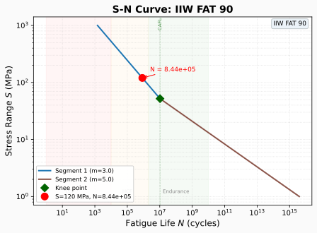</td>
<td width="50%">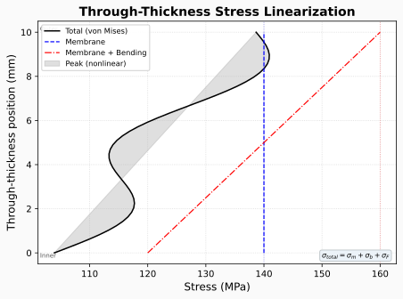</td>
</tr>
<tr>
<td><em>S-N fatigue curve with operating point, regime bands, and CAFL</em></td>
<td><em>Through-thickness stress linearization per ASME VIII</em></td>
</tr>
<tr>
<td width="50%">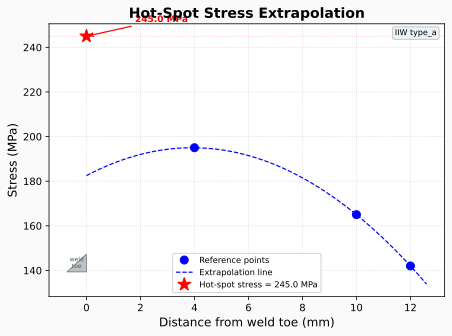</td>
<td width="50%">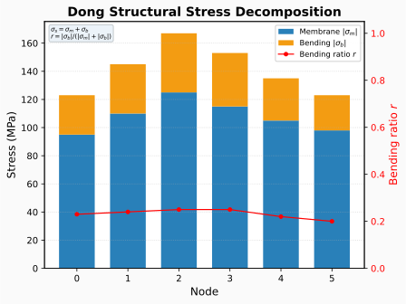</td>
</tr>
<tr>
<td><em>IIW hot-spot stress extrapolation with weld toe schematic</em></td>
<td><em>Dong structural stress decomposition (membrane + bending)</em></td>
</tr>
</table>

## How It Works

### Joint Types

feaweld supports five parametric weld joint geometries, each defined by plate thickness, weld leg size, and connection dimensions:

<p align="center">
  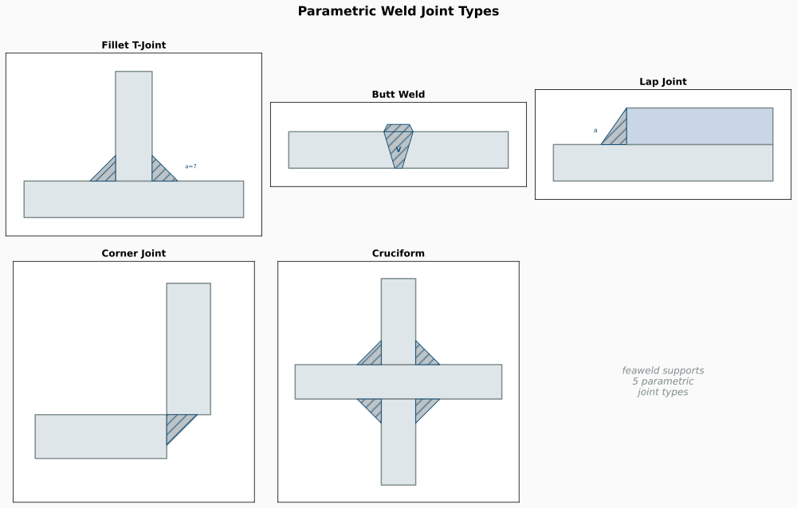
</p>

### Hot-Spot Stress Method

The IIW hot-spot method extracts structural stress at the weld toe by extrapolating from reference points away from the stress concentration zone:

<p align="center">
  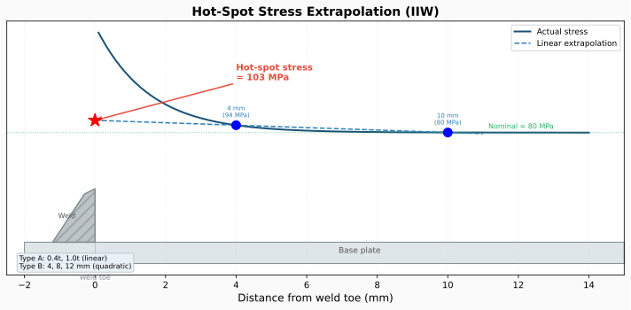
</p>

### Through-Thickness Linearization

ASME VIII Division 2 decomposes the actual stress distribution into membrane, bending, and peak components for comparison against code allowables:

<p align="center">
  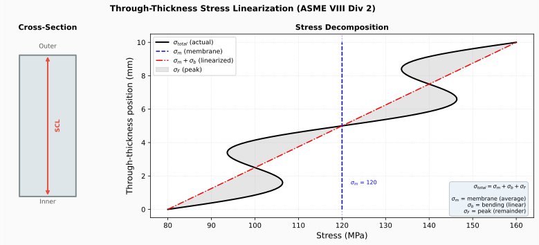
</p>

### S-N Fatigue Assessment

Fatigue life is predicted using S-N curves from IIW, DNV, or ASME standards with proper handling of the knee point (CAFL) and variable-amplitude loading via Miner's rule:

<p align="center">
  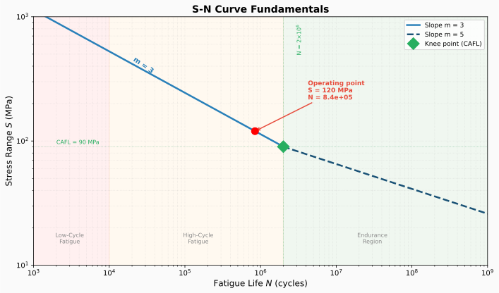
</p>

### Dong Mesh-Insensitive Structural Stress

The Battelle/Dong method uses nodal force equilibrium at the weld toe to compute structural stress, eliminating mesh sensitivity:

<p align="center">
  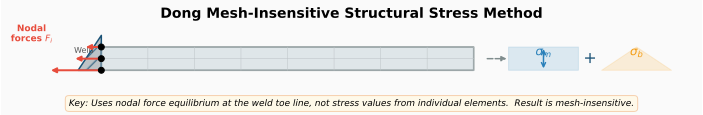
</p>

### Goldak Heat Source

Welding simulation uses the Goldak double-ellipsoid heat source model for accurate thermal cycle prediction:

<p align="center">
  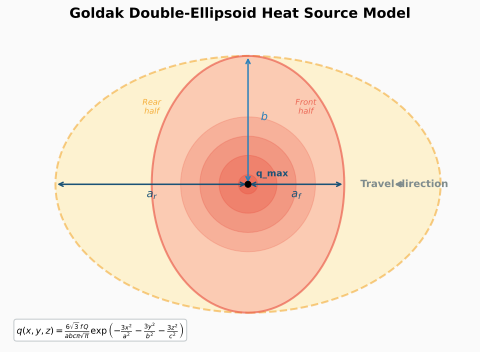
</p>

### Strain Energy Density (SED)

The Lazzarin SED method averages strain energy density over a control volume at the notch tip, providing a local damage parameter:

<p align="center">
  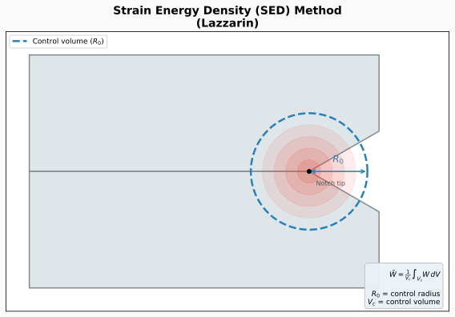
</p>

## Key Capabilities

**Structural Analysis**
- Dual FEA solver backend: FEniCSx (nonlinear thermomechanical) and CalculiX (standard linear/thermal)
- Five parametric joint types: fillet T-joint, butt weld, lap joint, corner joint, cruciform
- Goldak double-ellipsoid heat source for welding simulation with element birth-death
- J2 elastoplastic constitutive model with radial return mapping
- Norton-Bailey creep for post-weld heat treatment (PWHT) stress relaxation

**Fatigue Assessment**
- Eight post-processing methods: nominal (ASME VIII), hot-spot (IIW Type A/B), Battelle/Dong mesh-insensitive structural stress, effective notch stress (FAT225), strain energy density (Lazzarin), through-thickness linearization, Blodgett hand calculations
- S-N curves: 14 IIW FAT classes, 17 DNV-RP-C203 categories, ASME VIII ferritic/austenitic
- Rainflow cycle counting (ASTM E1049), Palmgren-Miner cumulative damage, Goodman/Gerber mean stress correction
- Fatigue knockdown factors for surface finish, size, environment

**Visualization**
- 3D stress contours, deformed shapes, clipping planes, threshold filtering, iso-surfaces, weld region highlighting (PyVista)
- 2D engineering plots: through-thickness linearization, hot-spot extrapolation, S-N curves, Dong decomposition, ASME stress check bars, weld group geometry (Matplotlib)
- Engineering dashboards combining multiple panels with critical point annotations and safety factor overlay
- HTML reports with embedded base64 figures

**Parametric Studies**
- Concurrent multi-case execution via ProcessPoolExecutor
- Parameter sweeps (grid or one-at-a-time) over loads, materials, mesh refinement
- Automated comparison reports with metric tables, delta computation, sensitivity plots

**Reference Data**
- 49 materials with temperature-dependent properties (carbon steel, stainless, high-strength, pipeline, aluminum, filler metals)
- Lazy-loading data cache with LRU eviction for on-demand access
- SCF parametric coefficients for 10 weld geometries
- 80 IIW weld detail-to-FAT class mappings
- CCT diagrams for 20 steel grades
- Residual stress profiles from BS 7910, API 579, R6, FITNET, DNV
- 82 AWS A5 filler metal classifications with base metal matching
- 25 weld joint efficiency factors (ASME, AWS, EN)

## Quick Start

```bash
# Install
python3 -m venv .venv && source .venv/bin/activate
pip install -e ".[viz]"    # core + matplotlib + pyvista

# Run an analysis from YAML
feaweld run examples/fillet_t_joint.yaml

# Blodgett hand calculation
feaweld blodgett -g box --d 100 --b 50 -t 5 -P 50000

# List available materials
feaweld materials

# Run a parametric study
feaweld study run study.yaml -j 4
```

**Programmatic usage:**

```python
from feaweld.pipeline.workflow import AnalysisCase, run_analysis
from feaweld.pipeline.report import generate_report

case = AnalysisCase(name="my_joint")
result = run_analysis(case)
generate_report(result, "output/")
```

## Weld Group Shapes (Blodgett)

All nine standard weld group shapes for hand calculations per the Blodgett method:

<p align="center">
  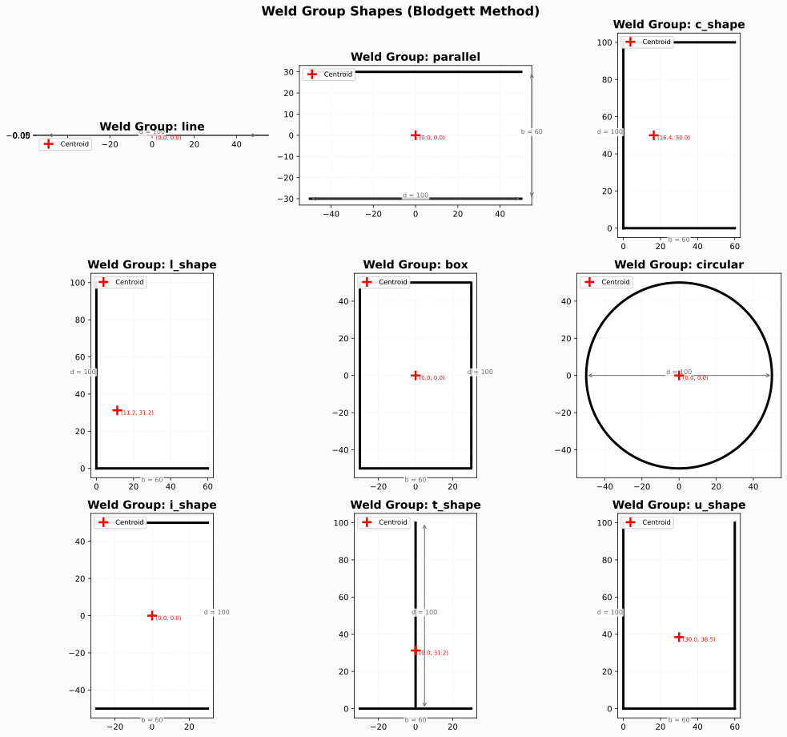
</p>

## ASME Stress Check

ASME VIII Division 2 stress categorization with gradient utilization display and limit equations:

<p align="center">
  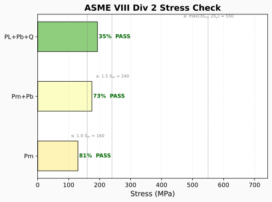
</p>

<!-- ADVANCED_CONCEPTS_START -->
## Advanced Concepts

feaweld extends well beyond the classical IIW / ASME / DNV workflow. The full
catalog of advanced concepts — differentiable FEA, phase-field fracture,
Bayesian surrogates, active learning, multi-pass welding, spline paths,
volumetric joints, defect populations, multi-axial fatigue, fracture mechanics
— lives in [docs/CONCEPTS.md](docs/CONCEPTS.md).

### Phase-field fracture (crack propagation)

<p align="center">
  
</p>

### Multi-pass welding thermal cycle

<p align="center">
  
</p>

### Active learning over parametric studies

<p align="center">
  
</p>

### EnKF crack-length assimilation

<p align="center">
  
</p>

### Solver backend hierarchy

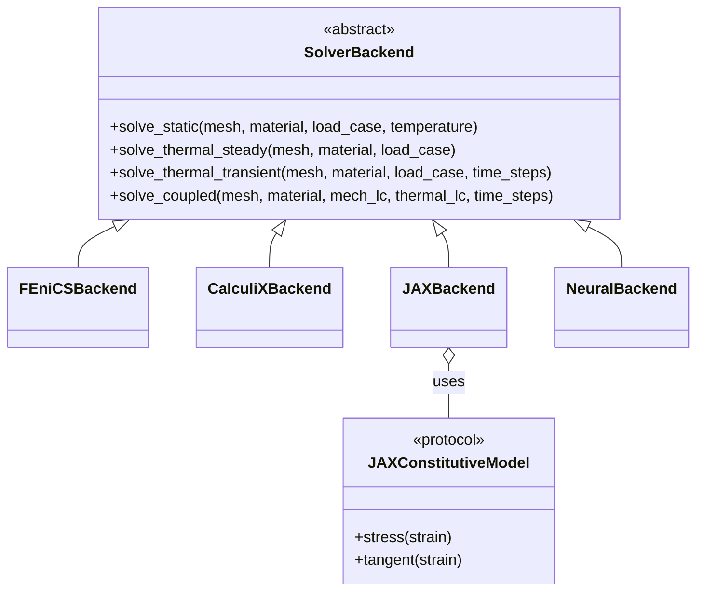

See [docs/CONCEPTS.md](docs/CONCEPTS.md) for the full index of 8 mermaid
architecture diagrams, 23 high-resolution concept images, and 9 animations
covering every advanced feature.
<!-- ADVANCED_CONCEPTS_END -->

## Standards Coverage

| Standard | Implementation |
|----------|---------------|
| ASME VIII Division 2 | Stress categorization, allowable checks, design fatigue curves |
| IIW-2006-09 / IIW-2008 | 14 FAT classes, 80 weld detail categories, hot-spot stress, effective notch stress |
| DNV-RP-C203 | 17 S-N curve categories (in-air and seawater) |
| ASME 2007 Annex 5-C | Battelle/Dong mesh-insensitive structural stress, master S-N curve |
| ASTM E1049 | Rainflow cycle counting |
| BS 7910 / API 579 | Residual stress through-thickness profiles (Level 1 and 2) |
| AWS D1.1 | Weld joint efficiency factors, filler metal matching |
| Lazzarin (2001) | Strain energy density method with control volume |

## Project Metrics

- 64 source modules, ~17,700 lines of code
- 332 passing tests across 18 test modules
- 49 material databases (7 categories) with temperature-dependent properties
- 6 JSON reference datasets (SCF, CCT, S-N details, residual stress, filler metals, weld efficiency)
- 5 joint geometry types, 2 solver backends, 8 post-processing methods
