# feaweld

Finite element analysis toolkit for weld joint stress, fatigue life, and structural integrity assessment.

<p align="center">
  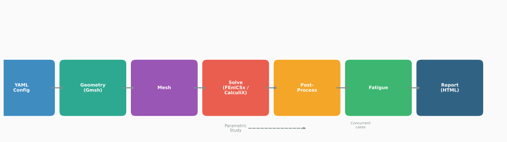
</p>

## Overview

feaweld is a Python package for engineers who need to evaluate welded connections in metal structures. It covers the full analysis workflow from parametric joint geometry and mesh generation through FEA solving, post-processing, fatigue assessment, and visualization — producing HTML reports with embedded engineering figures.

The package implements methods from major welding and pressure vessel codes (ASME VIII, IIW, DNV-RP-C203, AWS D1.1, BS 7910, API 579) and ships with a reference database of 49 materials, 100 IIW weld detail categories, S-N curves for six standards (IIW, DNV, ASME, Eurocode 3, BS 7608, AWS D1.1), CCT diagrams for 20 steel grades, and parametric SCF data for 10 weld geometries. Analysis cases are defined in YAML — as 2D sections or extruded 3D solids, with optional spectrum (variable-amplitude) fatigue loading — and can be run individually or as concurrent parametric studies with automated comparison reporting.

Beyond conventional deterministic methods, feaweld includes probabilistic fatigue assessment (Monte Carlo with Latin Hypercube Sampling), machine-learning fatigue predictors (Random Forest / XGBoost with transfer learning), multi-scale material modeling (Hall-Petch, dislocation density, phase transformation), and a digital twin framework for real-time sensor integration and Bayesian model updating.

<p align="center">
  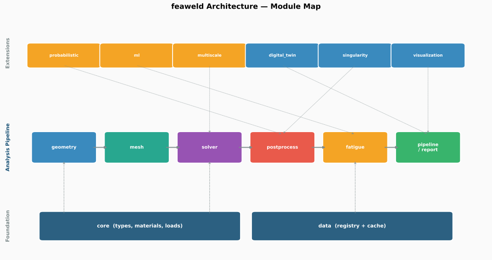
</p>

## Visual Overview

<table>
<tr>
<td width="50%">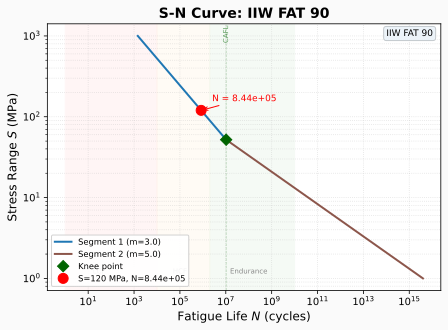</td>
<td width="50%">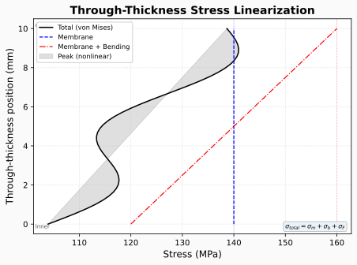</td>
</tr>
<tr>
<td><em>S-N fatigue curve with operating point, regime bands, and CAFL</em></td>
<td><em>Through-thickness stress linearization per ASME VIII</em></td>
</tr>
<tr>
<td width="50%">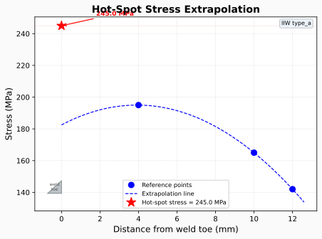</td>
<td width="50%">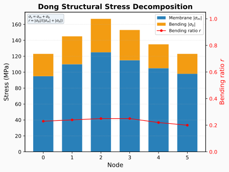</td>
</tr>
<tr>
<td><em>IIW hot-spot stress extrapolation with weld toe schematic</em></td>
<td><em>Dong structural stress decomposition (membrane + bending)</em></td>
</tr>
<tr>
<td width="50%">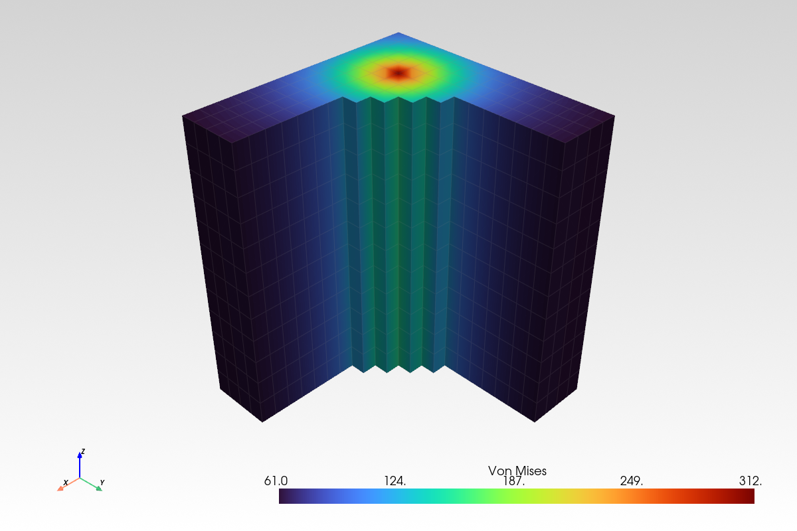</td>
<td width="50%">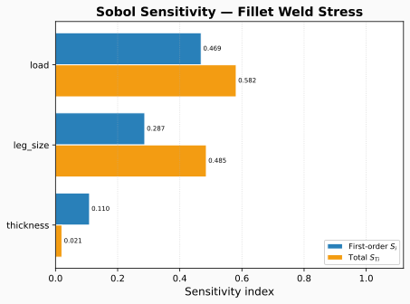</td>
</tr>
<tr>
<td><em>3D von Mises stress contour (PyVista, embedded in HTML reports)</em></td>
<td><em>Sobol global sensitivity indices from probabilistic analysis</em></td>
</tr>
<tr>
<td width="50%">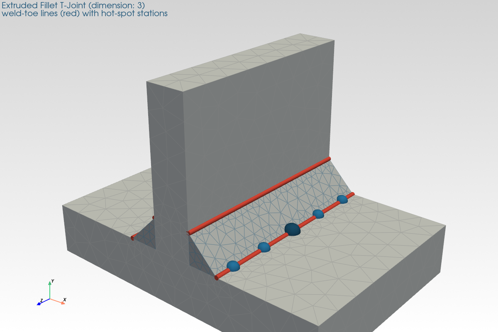</td>
<td width="50%">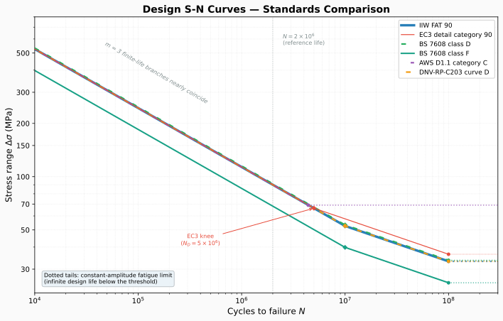</td>
</tr>
<tr>
<td><em>Extruded 3D fillet T-joint with weld toe line (geometry.dimension: 3)</em></td>
<td><em>Design S-N curves compared across the six supported standards</em></td>
</tr>
</table>

## How It Works

### Joint Types

feaweld supports five parametric weld joint geometries, each defined by plate thickness, weld leg size, and connection dimensions:

<p align="center">
  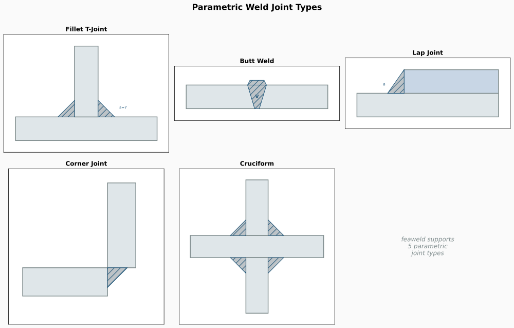
</p>

### 3D Analysis

Setting `geometry.dimension: 3` extrudes any of the five joint sections along its length into a solid model; hot-spot stress is then evaluated at stations along each weld toe line, and the governing line and station are reported:

<p align="center">
  
</p>

### Hot-Spot Stress Method

The IIW hot-spot method extracts structural stress at the weld toe by extrapolating from reference points away from the stress concentration zone:

<p align="center">
  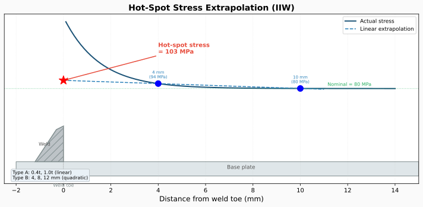
</p>

### Through-Thickness Linearization

ASME VIII Division 2 decomposes the actual stress distribution into membrane, bending, and peak components for comparison against code allowables:

<p align="center">
  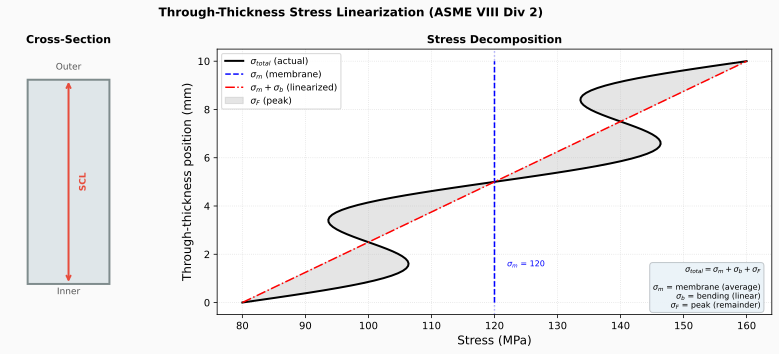
</p>

### S-N Fatigue Assessment

Fatigue life is predicted using S-N curves from six standards — IIW, DNV, ASME, Eurocode 3, BS 7608, and AWS D1.1 — with proper handling of the knee point (CAFL) and variable-amplitude loading via Miner's rule (the Visual Overview above compares the six design curves):

<p align="center">
  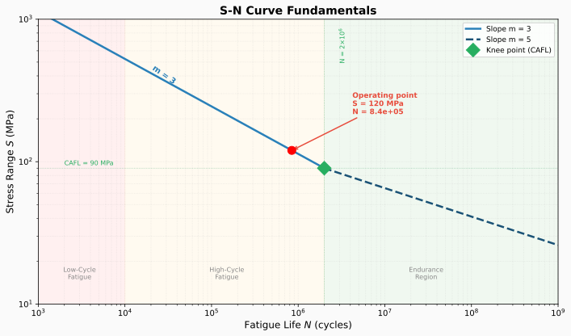
</p>

### Spectrum & Mean-Stress Fatigue

A top-level `fatigue:` block in the case YAML turns the one-shot check into a spectrum assessment — cyclic loading defined as an R-ratio, load blocks, or a stress history that is rainflow-counted (ASTM E1049) and Miner-summed on any of the six S-N standards, with optional Goodman/Gerber mean-stress correction (which can include a residual-stress mean) and thickness, surface-finish, and environment knockdowns:

<p align="center">
  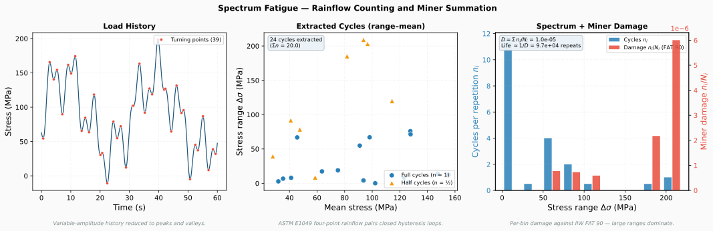
</p>

### Dong Mesh-Insensitive Structural Stress

The Battelle/Dong method uses nodal force equilibrium at the weld toe to compute structural stress, eliminating mesh sensitivity:

<p align="center">
  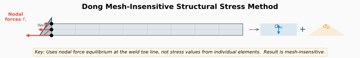
</p>

### Goldak Heat Source

Welding simulation uses the Goldak double-ellipsoid heat source model for accurate thermal cycle prediction:

<p align="center">
  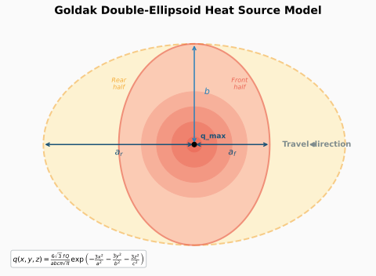
</p>

### Strain Energy Density (SED)

The Lazzarin SED method averages strain energy density over a control volume at the notch tip, providing a local damage parameter:

<p align="center">
  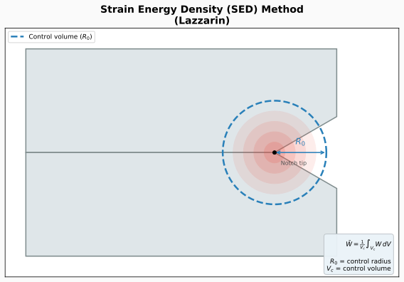
</p>

## Key Capabilities

**Structural Analysis**
- Dual FEA solver backend: FEniCSx (nonlinear thermomechanical) and CalculiX (standard linear/thermal)
- Six YAML-selectable solver types: linear elastic, elastoplastic (J2 radial return), steady/transient thermal, sequentially coupled thermomechanical, and creep relaxation
- Full load application from YAML: axial, shear, bending moment (self-equilibrating nodal couples), pressure, and thermal-expansion loading
- Five parametric joint types: fillet T-joint, butt weld (groove angle, root gap, penetration), lap joint, corner joint, cruciform
- 2D section models or extruded 3D solids (`geometry.dimension: 3`) with tetrahedral meshing and weld-toe-line refinement
- Goldak double-ellipsoid heat source for welding simulation with element birth-death
- Norton-Bailey creep for post-weld heat treatment (PWHT) stress relaxation, wired into the YAML pipeline
- Global-local submodeling: cut-boundary displacement transfer with a refined local FE re-solve
- Built-in mesh-sensitivity check: every static run can flag non-converging (singular) stress peaks

**Probabilistic & Reliability**
- Monte Carlo (Latin Hypercube) over material scatter and geometric tolerances (misalignment magnification, parametric toe SCF)
- Sobol global sensitivity indices (Saltelli scheme) and FORM reliability index (HL-RF)
- `feaweld reliability mc|form|sobol` CLI with sample export

**Fatigue Assessment**
- Eight post-processing methods: nominal (ASME VIII), hot-spot (IIW Type A/B), Battelle/Dong mesh-insensitive structural stress, effective notch stress (FAT225), strain energy density (Lazzarin), through-thickness linearization, Blodgett hand calculations
- S-N curves: 14 IIW FAT classes, 14 DNV-RP-C203 categories, ASME VIII ferritic/austenitic, 14 Eurocode 3 detail categories, BS 7608 classes B–W1, AWS D1.1 categories A–E'
- Rainflow cycle counting (ASTM E1049), Palmgren-Miner cumulative damage, Goodman/Gerber mean stress correction — spectrum loading defined directly in the case YAML (R-ratio, blocks, or a stress history file)
- Residual stress feeding the fatigue mean stress (bundled profiles, fixed value, or as-welded yield, with PWHT relaxation) and weld joint efficiency factors scaling the ASME allowable checks
- Fatigue knockdown factors for surface finish, size, environment

**Visualization**
- 3D stress contours, deformed shapes, clipping planes, threshold filtering, iso-surfaces, weld region highlighting (PyVista)
- 2D engineering plots: through-thickness linearization, hot-spot extrapolation, S-N curves, Dong decomposition, ASME stress check bars, weld group geometry (Matplotlib)
- Probabilistic plots (Monte Carlo distributions, Sobol indices, FORM design points) and metallurgy plots (CCT diagrams, residual-stress profiles, creep curves, Hall-Petch)
- Engineering dashboards combining multiple panels with critical point annotations and safety factor overlay
- Self-contained HTML reports embedding 3D renderings, spatial contours, fatigue-life/damage maps, rainflow histograms, and probabilistic charts — each included automatically when its data exists
- Optional interactive Plotly figures (`feaweld run --interactive`)

**Machine Learning & Digital Twin**
- Random Forest / XGBoost fatigue-life predictors with confidence intervals and transfer learning (`feaweld ml train|predict|transfer`)
- Live digital-twin web dashboard (sensor strip charts, weld state machine, alerts, predictions) served by `feaweld twin dashboard`, with an offline `--demo` mode
- MQTT / OPC-UA sensor ingestion and Bayesian model updating via emcee MCMC (`feaweld twin update`)

**Multiscale & Metallurgy**
- CCT-based phase prediction, HAZ zone property estimation, Hall-Petch and dislocation-density models (`feaweld multiscale`)
- Mesh convergence studies with Richardson extrapolation and Grid Convergence Index (`feaweld convergence`)

**Parametric Studies**
- Concurrent multi-case execution via ProcessPoolExecutor
- Parameter sweeps (grid or one-at-a-time) over loads, materials, mesh refinement
- Automated comparison reports with metric tables, delta computation, sensitivity plots

**Reference Data**
- 49 materials with temperature-dependent properties (carbon steel, stainless, high-strength, pipeline, aluminum, filler metals)
- Lazy-loading data cache with LRU eviction for on-demand access
- SCF parametric coefficients for 10 weld geometries
- 100 IIW weld detail-to-FAT class mappings
- S-N curve data files for Eurocode 3 (14 detail categories), BS 7608 (8 classes with mean and design constants), and AWS D1.1 (7 categories)
- CCT diagrams for 20 steel grades
- Residual stress profiles from BS 7910, API 579, R6, FITNET, DNV
- 82 AWS A5 filler metal classifications with base metal matching
- 25 weld joint efficiency factors (ASME, AWS, EN)

## Quick Start

```bash
# Install
python3 -m venv .venv && source .venv/bin/activate
pip install -e ".[viz]"    # core + matplotlib + pyvista

# Run an analysis from YAML
feaweld run examples/fillet_t_joint.yaml

# Spectrum (variable-amplitude) fatigue from a stress history
feaweld run examples/spectrum_fatigue.yaml

# Extruded 3D analysis with hot-spot stations along the weld toe
feaweld run examples/fillet_t_joint_3d.yaml

# Standalone S-N fatigue check, no FEA needed
feaweld fatigue --stress-range 90 -c EC3_90

# Blodgett hand calculation
feaweld blodgett -g box --d 100 --b 50 -t 5 -P 50000

# List available materials
feaweld materials

# Run a parametric study
feaweld study run examples/leg_sweep_study.yaml -j 4

# Probabilistic safety factor (Monte Carlo + Sobol)
feaweld reliability mc examples/fillet_t_joint.yaml -n 1000 --sobol

# Multiscale HAZ property estimation
feaweld multiscale -g S355 -r 30

# Live digital-twin dashboard with synthetic demo data
feaweld twin dashboard --demo
```

See [`examples/README.md`](examples/README.md) for all runnable examples and
which optional extras each one needs.

**Programmatic usage:**

```python
from feaweld.pipeline.workflow import AnalysisCase, run_analysis
from feaweld.pipeline.report import generate_report

case = AnalysisCase(name="my_joint")
result = run_analysis(case)
generate_report(result, "output/")
```

## Weld Group Shapes (Blodgett)

All nine standard weld group shapes for hand calculations per the Blodgett method:

<p align="center">
  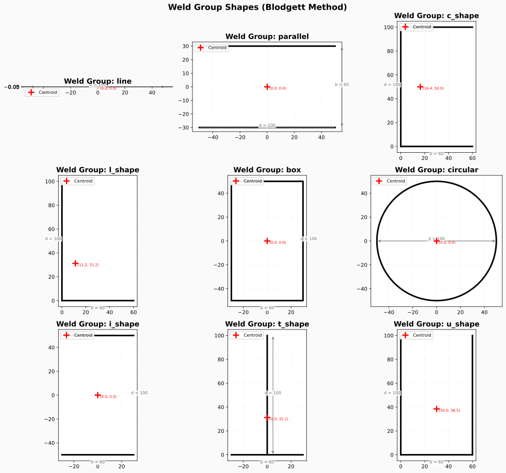
</p>

## ASME Stress Check

ASME VIII Division 2 stress categorization with gradient utilization display and limit equations:

<p align="center">
  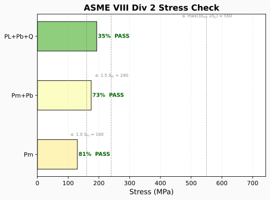
</p>

## Standards Coverage

| Standard | Implementation |
|----------|---------------|
| ASME VIII Division 2 | Stress categorization, allowable checks, design fatigue curves |
| IIW-2006-09 / IIW-2008 | 14 FAT classes, 100 weld detail categories, hot-spot stress, effective notch stress |
| DNV-RP-C203 | 14 S-N curve categories (in-air; seawater via environment knockdown) |
| Eurocode 3 (EN 1993-1-9) | S-N detail categories (14 categories, two-slope) |
| BS 7608 | S-N classes B–W1, mean and design curves |
| ASME 2007 Annex 5-C | Battelle/Dong mesh-insensitive structural stress, master S-N curve |
| ASTM E1049 | Rainflow cycle counting, spectrum fatigue via Palmgren-Miner |
| BS 7910 / API 579 | Residual stress through-thickness profiles (Level 1 and 2) |
| AWS D1.1 | S-N categories A–E', weld joint efficiency factors, filler metal matching |
| Lazzarin (2001) | Strain energy density method with control volume |

## Project Metrics

- 87 source modules, ~26,000 lines of code
- 1,089 tests across 38 test modules
- 49 material databases (7 categories) with temperature-dependent properties
- 6 JSON reference datasets (SCF, CCT, S-N details, residual stress, filler metals, weld efficiency)
- 5 joint geometry types, 2 solver backends, 6 solver types, 8 post-processing methods
- 30 documentation figures, 11 user guides, and a full mermaid-diagrammed architecture reference
