# Advanced Concepts — feaweld

This page is the single-source catalog for every advanced method implemented
in feaweld beyond the classical IIW / ASME / DNV / AWS workflow. It collects
mermaid architecture diagrams, high-resolution concept images (SVG + PNG),
and GIF + MP4 animations for 25 topics across differentiable FEA, machine
learning, fracture mechanics, defect modeling, multi-pass welding, and weld
path / volumetric geometry.

Every asset here is generated by scripts under `scripts/`:

- `scripts/generate_docs_mermaid.py` — 20 mermaid diagrams under `docs/diagrams/`
- `scripts/generate_docs_concept_images.py` — 23 concept images under `docs/images/`
- `scripts/generate_docs_animations.py` — 9 animations under `docs/animations/`
- `scripts/build_docs_assets.py` — rebuilds every asset in one command

Install the optional `[docs]` extras to regenerate locally:

```bash
pip install -e ".[docs]"
python scripts/build_docs_assets.py
```

---

## Table of contents

1. [Architecture & pipeline](#architecture--pipeline)
2. [Differentiable FEA](#differentiable-fea)
3. [Constitutive models](#constitutive-models)
4. [Fracture mechanics](#fracture-mechanics)
5. [Multi-scale material modeling](#multi-scale-material-modeling)
6. [Machine learning surrogates](#machine-learning-surrogates)
7. [Digital twin & assimilation](#digital-twin--assimilation)
8. [Weld geometry (spline + volumetric)](#weld-geometry-spline--volumetric)
9. [Defect modeling](#defect-modeling)
10. [Fatigue & post-processing](#fatigue--post-processing)
11. [Multi-pass welding](#multi-pass-welding)

---

## Architecture & pipeline

The top-level `run_analysis` orchestrator (`feaweld.pipeline.workflow`) composes
every module around a single `AnalysisCase` pydantic model. It walks through
geometry → defects → mesh → solver → postprocess → multiaxial → fatigue UQ →
fracture mechanics → report. Every new feature plugs in behind a config flag
so existing YAML cases continue to parse unchanged.

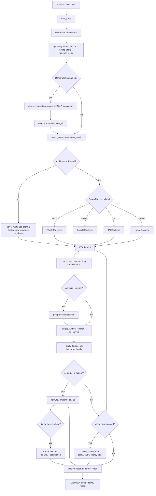
```mermaid
flowchart TD
    YAML[AnalysisCase YAML] --> LOAD[load_case]
    LOAD --> MAT[core.materials.Material]
    MAT --> GEO[geometry.joints / joints3d / spline_joints / fastener_welds]
    GEO --> DEFECT{DefectConfig.enabled?}
    DEFECT -- yes --> POP[defects.population.sample_iso5817_population]
    POP --> INSERT[defects.insertion.insert_all]
    DEFECT -- no --> MESH
    INSERT --> MESH[mesh.generator.generate_mesh]

    MESH --> MPCHECK{multipass + thermal?}
    MPCHECK -- yes --> MPSOLVE["solve_multipass_thermal\n(birth-death, interpass cooldown)"]
    MPSOLVE --> FEA[FEAResults]
    MPCHECK -- no --> BACKEND{SolverConfig.backend}

    BACKEND -->|fenics| FE[FEniCSBackend]
    BACKEND -->|calculix| CC[CalculiXBackend]
    BACKEND -->|jax| JB[JAXBackend]
    BACKEND -->|neural| NB[NeuralBackend]
    FE --> FEA
    CC --> FEA
    JB --> FEA
    NB --> FEA

    FEA --> POST[postprocess.hotspot / dong / linearization / ...]
    POST --> MA{multiaxial_criterion?}
    MA -- yes --> MAX[postprocess.multiaxial]
    MAX --> FATIGUE
    MA -- no --> FATIGUE[fatigue.rainflow + miner + sn_curves]
    FATIGUE --> UQ[_apply_fatigue_uq: lognormal bands]
    UQ --> K{compute_k_factors?}
    K -- yes --> JI[fracture.j_integral_2d / 3d]
    K -- no --> PF_CHECK

    FEA --> PF_CHECK{phase_field.enabled?}
    PF_CHECK -- yes --> PF["solve_phase_field\n(TRI3/TET4, energy split)"]

    JI --> DT{digital_twin.enabled?}
    DT -- yes --> SIFTAB["SIF table export\nfor EnKF assimilation"]

    PF --> REPORT[pipeline.report.generate_report]
    SIFTAB --> REPORT
    JI --> REPORT
    PF_CHECK -- no --> REPORT
    REPORT --> OUT[WorkflowResult + HTML report]
```

Source: `src/feaweld/pipeline/workflow.py`, tests in `tests/test_workflow_integration.py`.

---

## Differentiable FEA

### JAX backend (`feaweld.solver.jax_backend.JAXBackend`)

A pure-JAX finite element solver supporting linear-elastic static and
incremental elasto-plastic analyses on TRI3 / TET4 meshes. Because the
entire assembly + linear solve lives in `jax.numpy`, gradients of any
scalar QoI (compliance, displacement, stress peak) with respect to
material properties, loads, or geometry flow through via `jax.grad`.
The optional `constitutive` parameter accepts a batched
`JAXConstitutiveModel` so the backend can run J2 plasticity or FCC
crystal plasticity with autodiff-generated tangents.

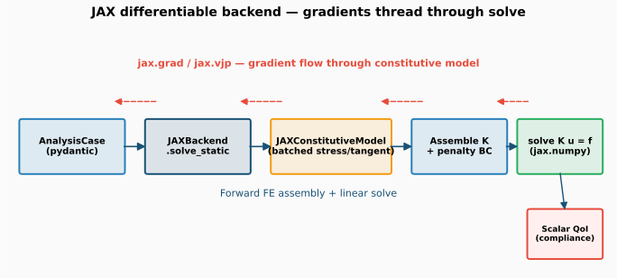

### Solver backend hierarchy

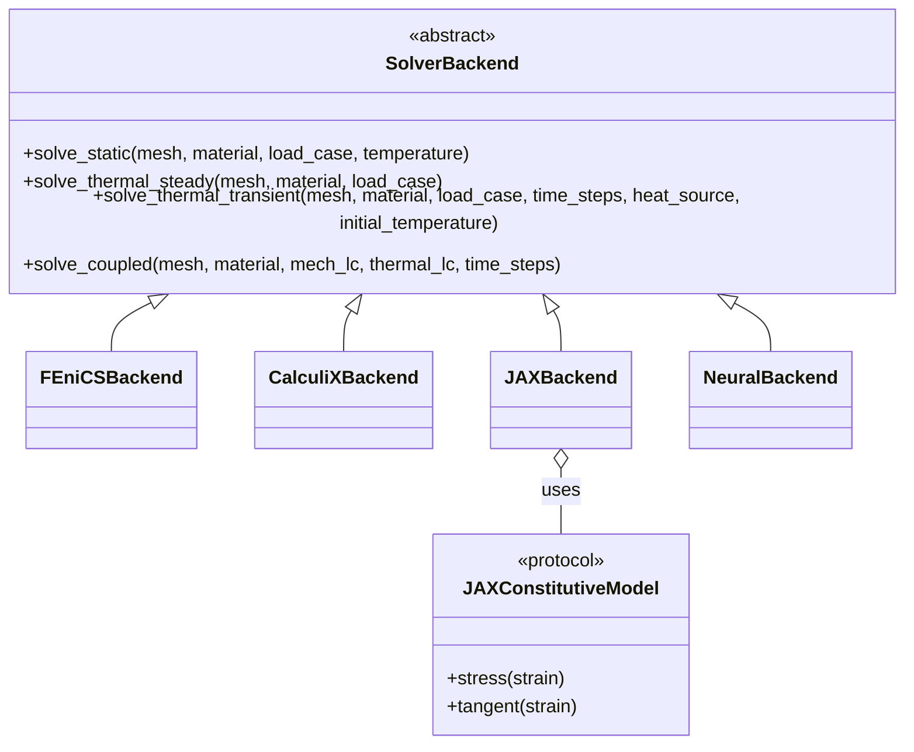
```mermaid
classDiagram
    class SolverBackend {
        <<abstract>>
        +solve_static(mesh, material, load_case, temperature)
        +solve_thermal_steady(mesh, material, load_case)
        +solve_thermal_transient(mesh, material, load_case, time_steps, heat_source, initial_temperature)
        +solve_coupled(mesh, material, mech_lc, thermal_lc, time_steps)
    }
    class FEniCSBackend
    class CalculiXBackend
    class JAXBackend
    class NeuralBackend
    SolverBackend <|-- FEniCSBackend
    SolverBackend <|-- CalculiXBackend
    SolverBackend <|-- JAXBackend
    SolverBackend <|-- NeuralBackend
    class JAXConstitutiveModel {
        <<protocol>>
        +stress(strain)
        +tangent(strain)
    }
    JAXBackend o-- JAXConstitutiveModel : uses
```

Sources: `src/feaweld/solver/backend.py`, `src/feaweld/solver/jax_backend.py`.
Tests: `tests/test_jax_backend.py`.

### Cyclic stress field animation

Under a sinusoidal load the JAX backend re-solves efficiently per load
amplitude. This is the foundation for the neural operator training
data pipeline.


MP4: [`cyclic_stress_field.mp4`](animations/cyclic_stress_field.mp4)

---

## Constitutive models

The dormant `ConstitutiveModel` ABC at `src/feaweld/solver/constitutive.py`
is finally wired into a backend via a parallel batched `JAXConstitutiveModel`
protocol at `src/feaweld/solver/jax_constitutive.py`. Three concrete models
ship today:

- `JAXLinearElastic` — hot path reuse of the elastic stiffness tensor
- `JAXJ2Plasticity` — radial-return J2 plasticity with isotropic linear hardening
- `JAXCrystalPlasticity` — rate-dependent Meric-Cailletaud FCC crystal plasticity on 12 slip systems

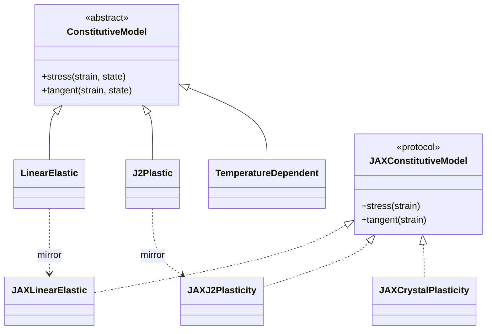
```mermaid
classDiagram
    class ConstitutiveModel {
        <<abstract>>
        +stress(strain, state)
        +tangent(strain, state)
    }
    class LinearElastic
    class J2Plastic
    class TemperatureDependent

    ConstitutiveModel <|-- LinearElastic
    ConstitutiveModel <|-- J2Plastic
    ConstitutiveModel <|-- TemperatureDependent

    class JAXConstitutiveModel {
        <<protocol>>
        +stress(strain)
        +tangent(strain)
    }
    class JAXLinearElastic
    class JAXJ2Plasticity
    class JAXCrystalPlasticity

    JAXConstitutiveModel <|.. JAXLinearElastic
    JAXConstitutiveModel <|.. JAXJ2Plasticity
    JAXConstitutiveModel <|.. JAXCrystalPlasticity

    LinearElastic ..> JAXLinearElastic : mirror
    J2Plastic ..> JAXJ2Plasticity : mirror
```

### J2 plasticity radial return

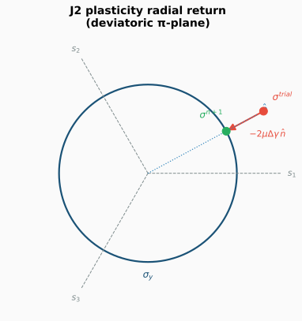

### Crystal plasticity — 12 FCC slip systems

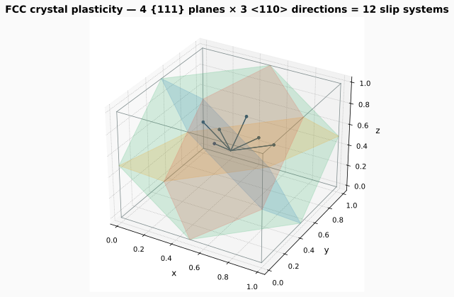

Sources: `src/feaweld/solver/jax_constitutive.py`,
`src/feaweld/solver/jax_crystal_plasticity.py`.
Tests: `tests/test_jax_backend.py::test_jax_j2_plasticity_*`,
`tests/test_jax_crystal_plasticity.py`.

---

## Fracture mechanics

### Phase-field fracture (Bourdin/Francfort AT2)

A variational phase-field solver built on the JAX backend. Damage d(x)
evolves in a staggered u-d scheme, with the elastic energy degraded by
`g(d) = (1 - d)^2 + eta`. The regularization length `l0` controls the
diffuse-crack width — the solver pre-checks that the mesh satisfies
`h <= l0 / min_mesh_ratio`.

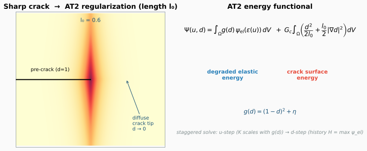

### Crack propagation animation


MP4: [`phase_field_crack_propagation.mp4`](animations/phase_field_crack_propagation.mp4)

Sources: `src/feaweld/fracture/phase_field.py`, `src/feaweld/fracture/types.py`.
Tests: `tests/test_phase_field.py`.

### Staggered solver algorithm

The phase-field solver uses a classic staggered alternating minimization
at each load step. The displacement sub-problem (u-step) solves with
the current damage-degraded stiffness; the damage sub-problem (d-step)
uses the updated elastic energy density as a driving force.

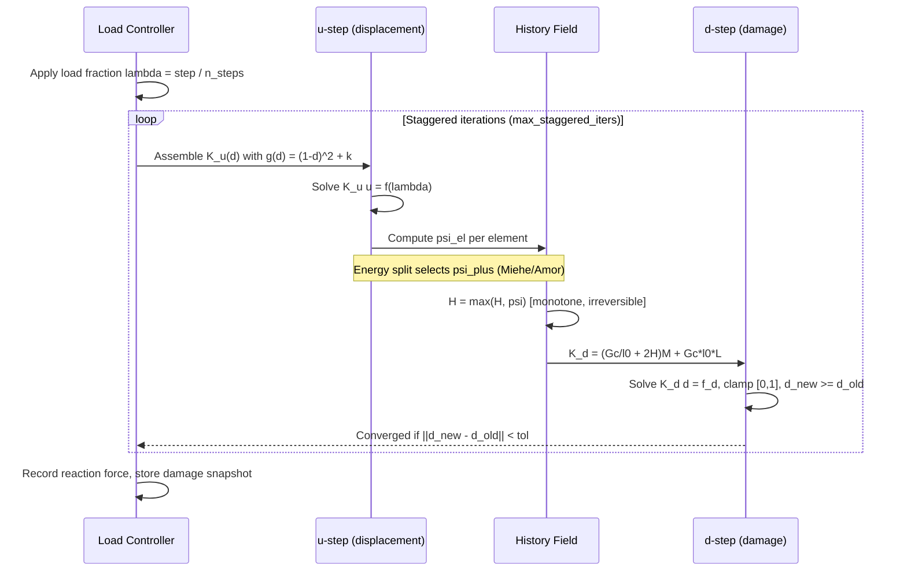
```mermaid
sequenceDiagram
    participant LC as Load Controller
    participant U as u-step (displacement)
    participant H as History Field
    participant D as d-step (damage)

    LC->>LC: Apply load fraction lambda = step / n_steps
    loop Staggered iterations (max_staggered_iters)
        LC->>U: Assemble K_u(d) with g(d) = (1-d)^2 + k
        U->>U: Solve K_u u = f(lambda)
        U->>H: Compute psi_el per element
        Note over U,H: Energy split selects psi_plus (Miehe/Amor)
        H->>H: H = max(H, psi) [monotone, irreversible]
        H->>D: K_d = (Gc/l0 + 2H)M + Gc*l0*L
        D->>D: Solve K_d d = f_d, clamp [0,1], d_new >= d_old
        D-->>LC: Converged if ||d_new - d_old|| < tol
    end
    LC->>LC: Record reaction force, store damage snapshot
```

### TRI3 / TET4 element dispatch

The solver supports both 2D plane-strain (TRI3) and 3D (TET4) meshes.
Element type determines the B-matrix layout, DOFs per node, constitutive
tensor dimension, and damage mass matrix pattern.

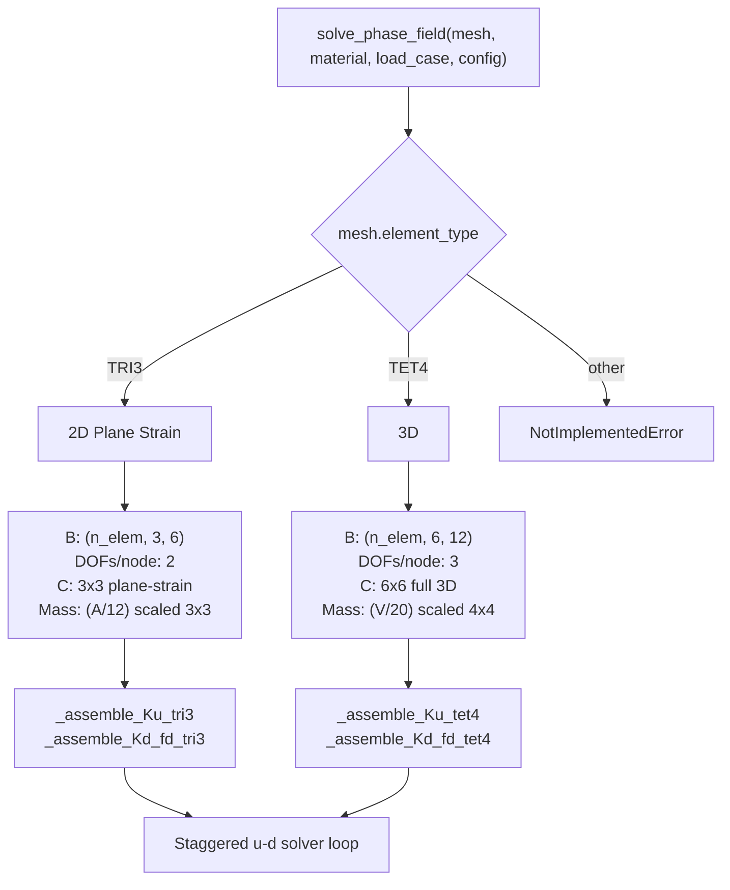
```mermaid
flowchart TD
    START["solve_phase_field(mesh, material, load_case, config)"]
    START --> CHECK{mesh.element_type}
    CHECK -->|TRI3| TRI["2D Plane Strain"]
    CHECK -->|TET4| TET["3D"]
    CHECK -->|other| ERR["NotImplementedError"]

    TRI --> T2["B: (n_elem, 3, 6)\nDOFs/node: 2\nC: 3x3 plane-strain\nMass: (A/12) scaled 3x3"]
    TET --> T3["B: (n_elem, 6, 12)\nDOFs/node: 3\nC: 6x6 full 3D\nMass: (V/20) scaled 4x4"]

    T2 --> ASM2["_assemble_Ku_tri3\n_assemble_Kd_fd_tri3"]
    T3 --> ASM3["_assemble_Ku_tet4\n_assemble_Kd_fd_tet4"]

    ASM2 --> STAG["Staggered u-d solver loop"]
    ASM3 --> STAG
```

### Energy decomposition

The `EnergyDecomposition` enum controls which elastic energy density
drives the damage evolution. The **spectral** split (Miehe et al. 2010)
decomposes the strain tensor via eigenvalues, driving damage only under
tension. The **volumetric-deviatoric** split (Amor et al. 2009) separates
bulk and deviatoric contributions. Both prevent spurious damage under
compression.

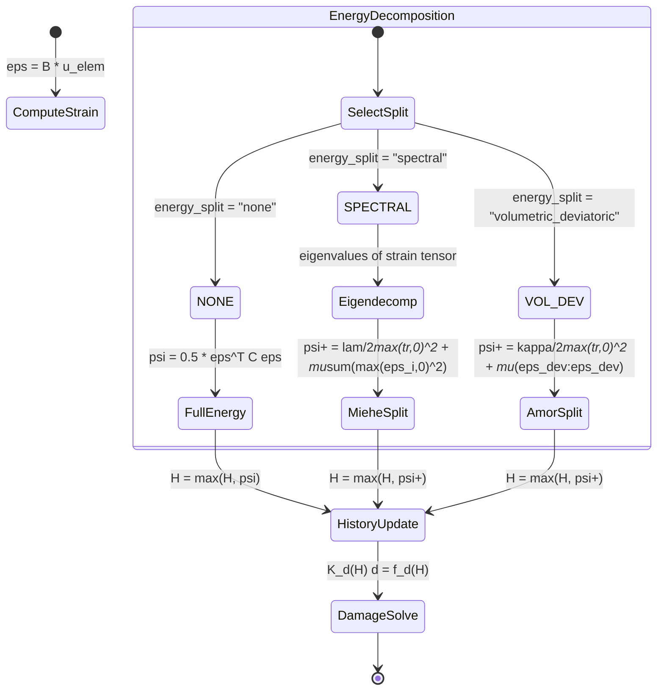
```mermaid
stateDiagram-v2
    [*] --> ComputeStrain : eps = B * u_elem

    state EnergyDecomposition {
        [*] --> SelectSplit
        SelectSplit --> NONE : energy_split = "none"
        SelectSplit --> SPECTRAL : energy_split = "spectral"
        SelectSplit --> VOL_DEV : energy_split = "volumetric_deviatoric"

        NONE --> FullEnergy : psi = 0.5 * eps^T C eps
        SPECTRAL --> Eigendecomp : eigenvalues of strain tensor
        Eigendecomp --> MieheSplit : psi+ = lam/2*max(tr,0)^2 + mu*sum(max(eps_i,0)^2)
        VOL_DEV --> AmorSplit : psi+ = kappa/2*max(tr,0)^2 + mu*(eps_dev:eps_dev)
    }

    FullEnergy --> HistoryUpdate : H = max(H, psi)
    MieheSplit --> HistoryUpdate : H = max(H, psi+)
    AmorSplit --> HistoryUpdate : H = max(H, psi+)

    HistoryUpdate --> DamageSolve : K_d(H) d = f_d(H)
    DamageSolve --> [*]
```

Sources: `src/feaweld/fracture/phase_field.py` (EnergyDecomposition, PhaseFieldConfig,
solve_phase_field with TRI3/TET4 dispatch),
`src/feaweld/pipeline/workflow.py` (PhaseFieldWorkflowConfig, _apply_phase_field).
Tests: `tests/test_phase_field.py` (TET4 and energy split tests).

### J-integral (2D + 3D) and interaction integral

Domain-form J-integral evaluated with a q-function weighting (inner
plateau → linear decay → zero cutoff). An interaction integral with
Williams-series auxiliary fields separates mixed-mode K_I / K_II
contributions. The 3D version slices the domain perpendicular to a
crack-front `WeldPath` at `n_front_samples` arc-length positions.

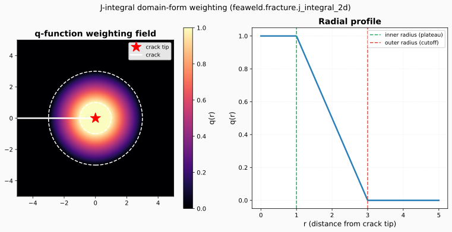

Source: `src/feaweld/fracture/j_integral.py`.
Tests: `tests/test_j_integral_2d.py`, `tests/test_j_integral_3d.py`.

### CTOD extraction

Two methods ship: displacement extrapolation at a fixed offset behind
the crack tip, and Rice's 90° intercept with the 45° rays from the tip.

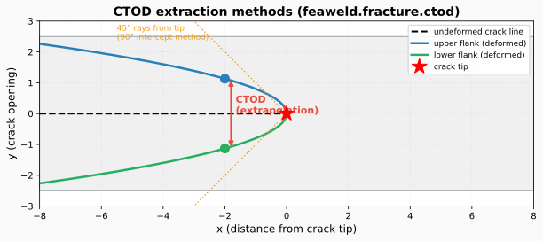

Source: `src/feaweld/fracture/ctod.py`. Tests: `tests/test_ctod.py`.

### Volumetric SED over arbitrary control volumes

Generalizes Lazzarin's spherical SED to arbitrary 3D control volumes via
Monte Carlo integration. Helpers `cylindrical_control_volume`,
`ellipsoidal_control_volume`, and `defect_wrapping_volume(defect)`
build ready-to-use predicates.

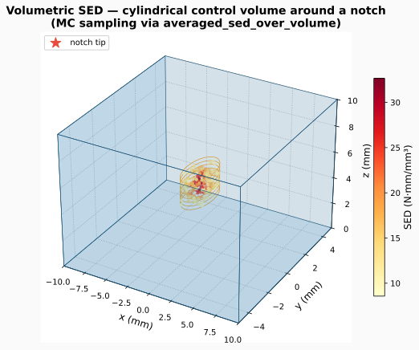

Source: `src/feaweld/postprocess/volumetric_sed.py`.
Tests: `tests/test_volumetric_sed.py`.

---

## Multi-scale material modeling

### FFT homogenization (Moulinec-Suquet)

Iterates the Lippmann-Schwinger equation in Fourier space on a voxel
RVE to compute the effective 6×6 Voigt stiffness. Used by
`multiscale.micro.homogenized_stiffness_from_rve` to replace the
closed-form Hall-Petch branch when an RVE `.npz` file is provided via
`MaterialConfig.rve_path`.

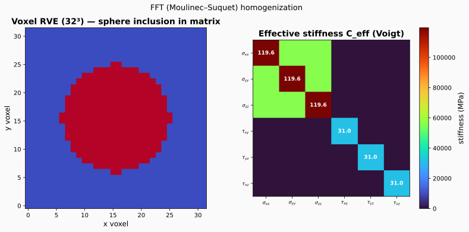

Source: `src/feaweld/multiscale/fft_homogenization.py`.
Tests: `tests/test_fft_homogenization.py`.

---

## Machine learning surrogates

### Bayesian deep-ensemble fatigue surrogate

Five Flax MLPs with a heteroscedastic `(mean, log_var)` head are trained
with different seeds. Predictions decompose uncertainty into epistemic
(ensemble disagreement) and aleatoric (learned noise) bands. OOD samples
show visibly widened epistemic uncertainty — the hallmark of working
deep ensembles.

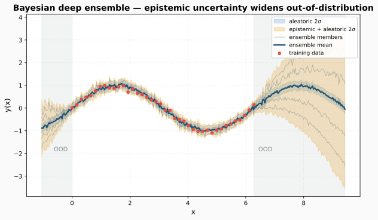

Source: `src/feaweld/ml/bayesian_surrogate.py`.
Tests: `tests/test_bayesian_surrogate.py`.

### Active learning over parametric studies

`ActiveLearningLoop` wraps `pipeline.study.Study` and picks the next
case via `max_variance` or `expected_improvement` on top of a Bayesian
surrogate. Epistemic-only std (not total) drives the acquisition — the
theoretically correct choice because aleatoric uncertainty is
irreducible.

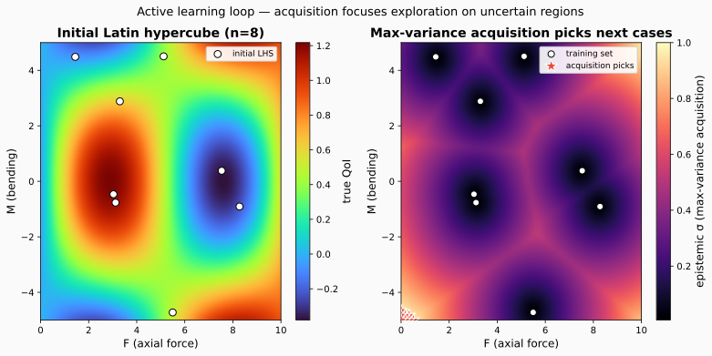

### Convergence animation


MP4: [`active_learning_convergence.mp4`](animations/active_learning_convergence.mp4)

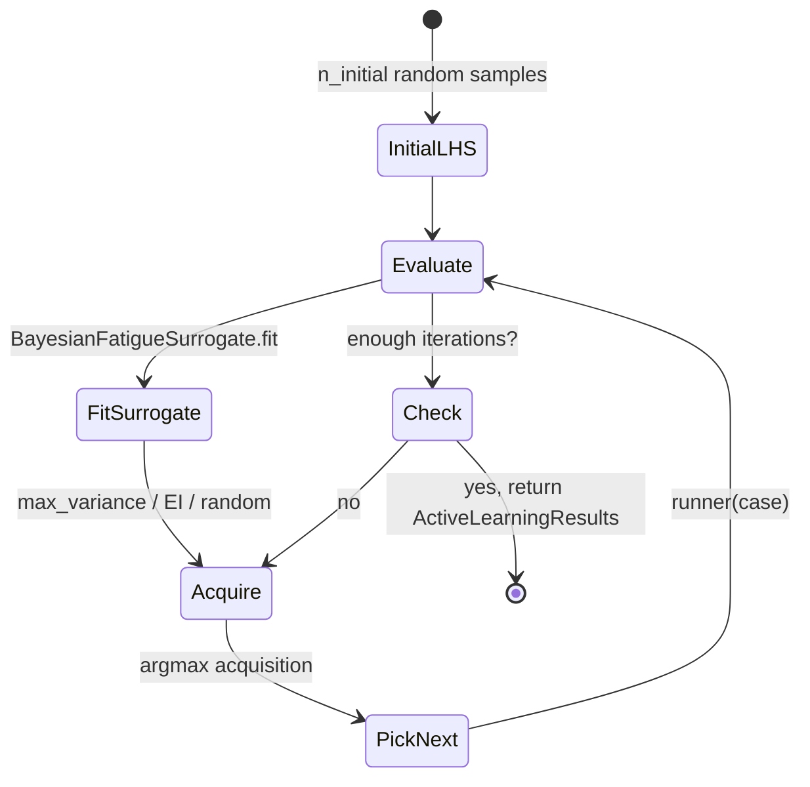
```mermaid
stateDiagram-v2
    [*] --> InitialLHS : n_initial random samples
    InitialLHS --> Evaluate
    Evaluate --> FitSurrogate : BayesianFatigueSurrogate.fit
    FitSurrogate --> Acquire : max_variance / EI / random
    Acquire --> PickNext : argmax acquisition
    PickNext --> Evaluate : runner(case)
    Evaluate --> Check : enough iterations?
    Check --> Acquire : no
    Check --> [*] : yes, return ActiveLearningResults
```

Source: `src/feaweld/pipeline/active_learning.py`.
Tests: `tests/test_active_learning.py`.

### Neural operator surrogate backend (`NeuralBackend`)

A fixed-mesh DeepONet loads trained parameters from a `.msgpack` file
and returns a displacement-field prediction in under 10 ms. A SHA-256
mesh hash guards against topology drift and raises with a clear
retrain message if the incoming mesh does not match the trained one.

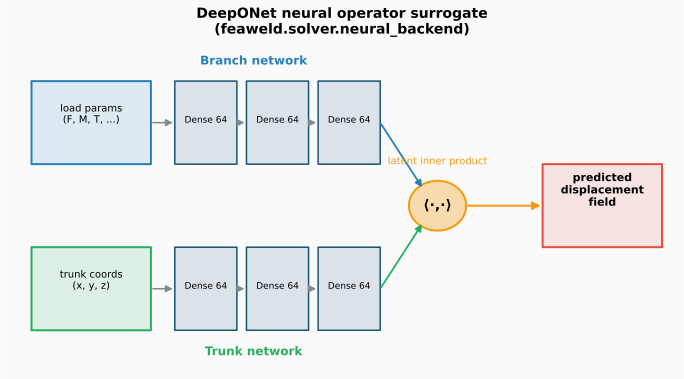

```mermaid
flowchart LR
    A[AnalysisCase template] --> S[pipeline.study.Study<br/>random parameter sweep]
    S --> GT{ground truth backend}
    GT --> JAX[JAXBackend]
    GT --> FE[FEniCSBackend]
    JAX --> DATA[(X, y) training set<br/>load params to displacement field]
    FE --> DATA
    DATA --> TR[Flax DeepONet<br/>branch + trunk networks]
    TR --> LOSS[MSE training<br/>optax.adam]
    LOSS --> SAVED[params.msgpack + meta.json<br/>mesh_hash stamped]
    SAVED --> NB[NeuralBackend.load_model]
    NB --> INFER[solve_static in ~10 ms<br/>mesh hash guard]
```

Sources: `src/feaweld/solver/neural_backend.py`, `src/feaweld/solver/neural_training.py`.
Tests: `tests/test_neural_backend.py`.

---

## Digital twin & assimilation

### EnKF crack-length assimilation

`CrackEnKF` is a stochastic Ensemble Kalman Filter driving a Paris-law
forward model. Given noisy strain-gauge observations, it tracks the
crack length distribution over 1000+ cycle blocks with < 10 % RMSE on
synthetic twins.

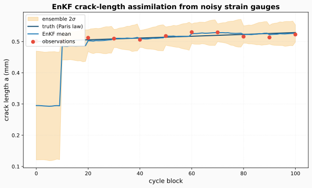


MP4: [`enkf_crack_tracking.mp4`](animations/enkf_crack_tracking.mp4)

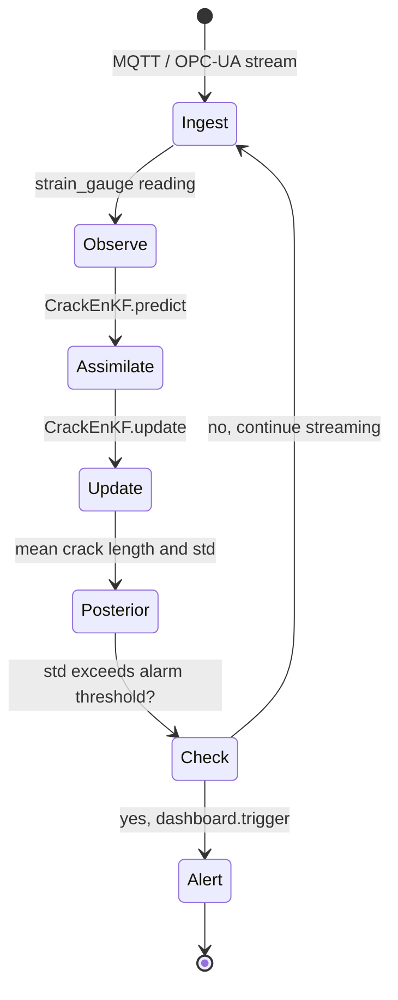
```mermaid
stateDiagram-v2
    [*] --> Ingest : MQTT / OPC-UA stream
    Ingest --> Observe : strain_gauge reading
    Observe --> Assimilate : CrackEnKF.predict
    Assimilate --> Update : CrackEnKF.update
    Update --> Posterior : mean crack length and std
    Posterior --> Check : std exceeds alarm threshold?
    Check --> Alert : yes, dashboard.trigger
    Check --> Ingest : no, continue streaming
    Alert --> [*]
```

Source: `src/feaweld/digital_twin/assimilation.py`.
Tests: `tests/test_enkf.py`.

### Normalizing flow posterior calibration

RealNVP normalizing flow trained on ensemble posterior samples over
`log N_f`. Used for rare-event quantile estimation; cross-checked
against the existing Hasofer-Lind FORM oracle for small problems.

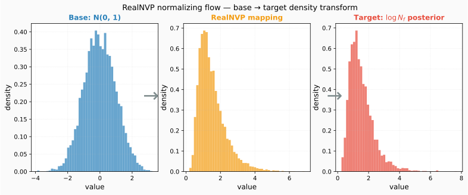

Source: `src/feaweld/digital_twin/flows.py`.
Tests: `tests/test_normalizing_flow.py`.

### Bayesian posterior update


MP4: [`bayesian_posterior_update.mp4`](animations/bayesian_posterior_update.mp4)

### Multi-state EnKF (joint crack + Paris parameter estimation)

The `MultiStateCrackEnKF` extends the scalar filter to jointly estimate
crack length `a`, Paris coefficient `log(C)`, and exponent `m`. The state
vector per ensemble member is `x = [a, log(C), m]`. During prediction,
only `a` evolves via `da/dN = exp(logC) * dK(a)^m`; `logC` and `m` are
static parameters refined through observations. Adaptive inflation
prevents ensemble collapse under strongly informative measurements.

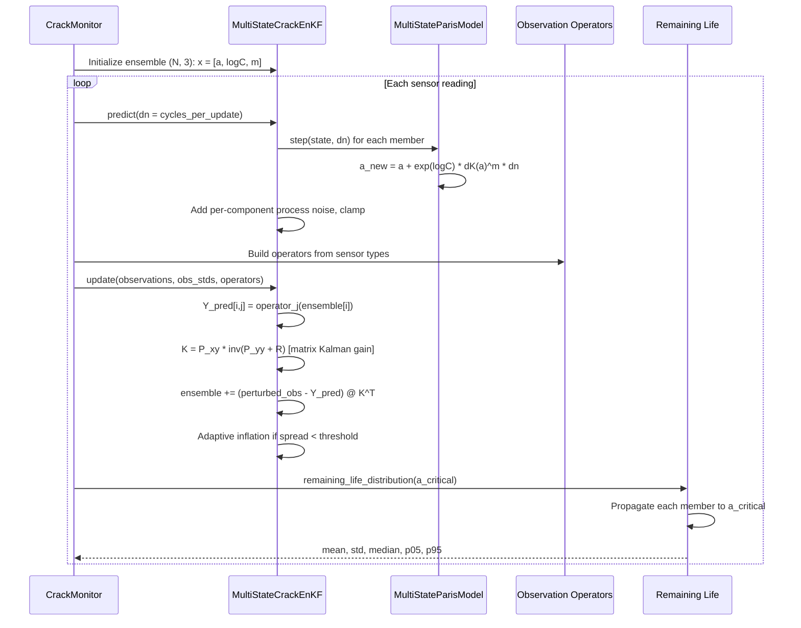
```mermaid
sequenceDiagram
    participant M as CrackMonitor
    participant MS as MultiStateCrackEnKF
    participant PM as MultiStateParisModel
    participant OPS as Observation Operators
    participant RUL as Remaining Life

    M->>MS: Initialize ensemble (N, 3): x = [a, logC, m]
    loop Each sensor reading
        M->>MS: predict(dn = cycles_per_update)
        MS->>PM: step(state, dn) for each member
        PM->>PM: a_new = a + exp(logC) * dK(a)^m * dn
        MS->>MS: Add per-component process noise, clamp

        M->>OPS: Build operators from sensor types
        M->>MS: update(observations, obs_stds, operators)
        MS->>MS: Y_pred[i,j] = operator_j(ensemble[i])
        MS->>MS: K = P_xy * inv(P_yy + R) [matrix Kalman gain]
        MS->>MS: ensemble += (perturbed_obs - Y_pred) @ K^T
        MS->>MS: Adaptive inflation if spread < threshold

        M->>RUL: remaining_life_distribution(a_critical)
        RUL->>RUL: Propagate each member to a_critical
        RUL-->>M: mean, std, median, p05, p95
    end
```

### SIF interpolation pipeline

The `SIFInterpolator` provides tabulated stress intensity factor lookup
from pre-computed FEA results (J-integral or phase-field) or analytical
handbook formulae. Three extrapolation modes handle queries outside the
tabulated range. Residual stress contributions are integrated via the
Bueckner weight function and combined with the applied SIF.

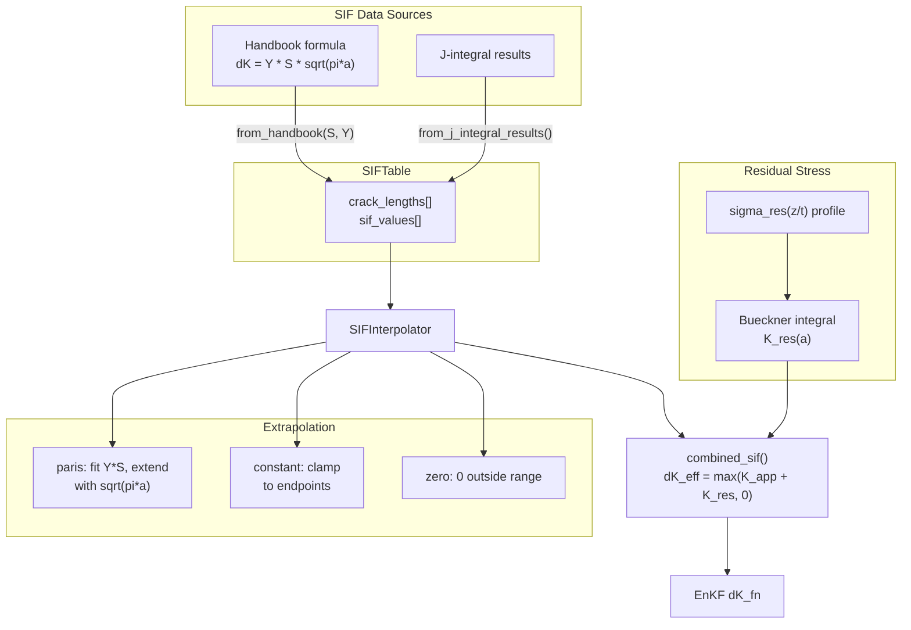
```mermaid
flowchart TD
    subgraph Sources["SIF Data Sources"]
        JI["J-integral results"]
        HB["Handbook formula\ndK = Y * S * sqrt(pi*a)"]
    end

    subgraph Table["SIFTable"]
        TAB["crack_lengths[]\nsif_values[]"]
    end

    JI -->|"from_j_integral_results()"| TAB
    HB -->|"from_handbook(S, Y)"| TAB
    TAB --> INTERP["SIFInterpolator"]

    subgraph Extrap["Extrapolation"]
        EP["paris: fit Y*S, extend\nwith sqrt(pi*a)"]
        EC["constant: clamp\nto endpoints"]
        EZ["zero: 0 outside range"]
    end
    INTERP --> EP & EC & EZ

    subgraph Residual["Residual Stress"]
        RSP["sigma_res(z/t) profile"]
        BWF["Bueckner integral\nK_res(a)"]
    end
    RSP --> BWF
    BWF --> COMB["combined_sif()\ndK_eff = max(K_app + K_res, 0)"]
    INTERP --> COMB
    COMB --> ENKF["EnKF dK_fn"]
```

### Multi-sensor observation operators

Three factory functions produce observation operators `H(state) -> observation`
for different sensor types. These are bundled into a `MultiObservation` for
vectorized EnKF updates with the full matrix Kalman gain.

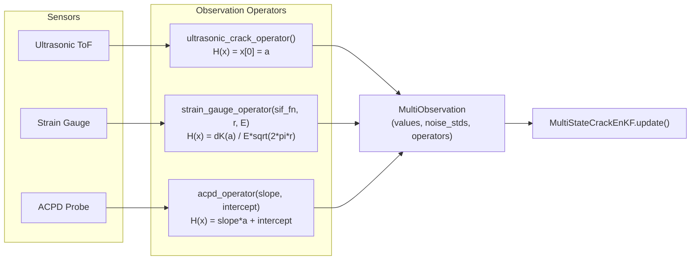
```mermaid
flowchart LR
    subgraph Physical["Sensors"]
        U["Ultrasonic ToF"]
        S["Strain Gauge"]
        A["ACPD Probe"]
    end

    subgraph Ops["Observation Operators"]
        UO["ultrasonic_crack_operator()\nH(x) = x[0] = a"]
        SO["strain_gauge_operator(sif_fn, r, E)\nH(x) = dK(a) / E*sqrt(2*pi*r)"]
        AO["acpd_operator(slope, intercept)\nH(x) = slope*a + intercept"]
    end

    U --> UO
    S --> SO
    A --> AO

    UO & SO & AO --> MO["MultiObservation\n(values, noise_stds, operators)"]
    MO --> ENKF["MultiStateCrackEnKF.update()"]
```

### Ensemble remaining useful life prediction

The `remaining_life_distribution` method propagates every ensemble member
forward under the Paris law until the crack reaches the critical length.
This produces a full distribution of remaining fatigue life, capturing
uncertainty in both the current crack state and the material parameters.

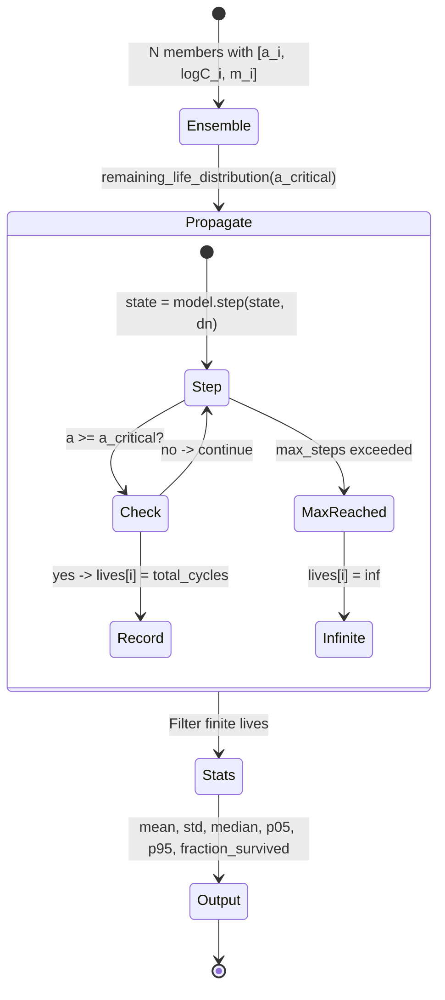
```mermaid
stateDiagram-v2
    [*] --> Ensemble : N members with [a_i, logC_i, m_i]

    Ensemble --> Propagate : remaining_life_distribution(a_critical)

    state Propagate {
        [*] --> Step : state = model.step(state, dn)
        Step --> Check : a >= a_critical?
        Check --> Record : yes -> lives[i] = total_cycles
        Check --> Step : no -> continue
        Step --> MaxReached : max_steps exceeded
        MaxReached --> Infinite : lives[i] = inf
    }

    Propagate --> Stats : Filter finite lives
    Stats --> Output : mean, std, median, p05, p95, fraction_survived
    Output --> [*]
```

Sources: `src/feaweld/digital_twin/assimilation.py` (MultiStateCrackEnKF, MultiStateParisModel),
`src/feaweld/digital_twin/sif_interpolator.py` (SIFTable, SIFInterpolator, residual_stress_sif, combined_sif),
`src/feaweld/digital_twin/observation_operators.py` (ObservationSpec, MultiObservation, operators),
`src/feaweld/digital_twin/crack_monitor.py` (CrackMonitor with joint_estimation mode).
Tests: `tests/test_enkf.py`, `tests/test_enkf_multidim.py`.

---

## Weld geometry (spline + volumetric)

### Spline weld paths

`WeldPath` supports linear / B-spline / Catmull-Rom parameterization
with arc-length reparameterization, Frenet-Serret frames (T, N, B),
and Gmsh wire export via `to_gmsh_wire`.

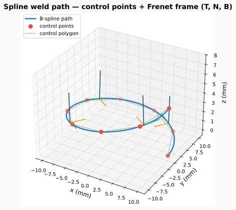

Source: `src/feaweld/geometry/weld_path.py`.
Tests: `tests/test_weld_path.py`.

### Groove profile gallery

Five standard preparation profiles: V, U, J, X (double-V), K
(single-bevel). Each returns a closed 2D polygon via
`cross_section_polygon()` and exposes an `area()` shoelace helper.

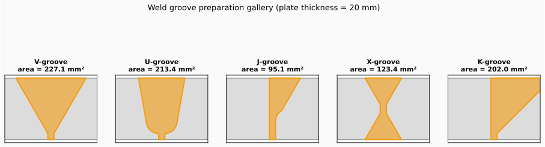

Source: `src/feaweld/geometry/groove.py`.
Tests: `tests/test_groove_profiles.py`.

### 3D volumetric butt & fillet joints

True 3D solids built from Gmsh OCC boolean operations. `VolumetricButtJoint`
sweeps a `GrooveProfile` cross-section between two plate boxes;
`VolumetricFilletTJoint` adds triangular fillet bead prisms at a T
intersection.

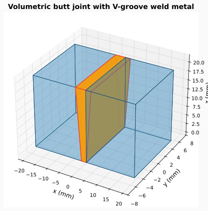

Source: `src/feaweld/geometry/joints3d.py`.
Tests: `tests/test_joints3d.py`.

### Spline butt weld (pipe sweep)

`SplineButtWeld` builds a curved weld by sweeping a groove cross-section
along a `WeldPath` via Gmsh OCC `addPipe`, with a curvature pre-check
that raises when the minimum radius of curvature is smaller than the
bead half-width × safety factor.

Source: `src/feaweld/geometry/spline_joints.py`.
Tests: `tests/test_spline_butt_weld.py`.

### Fastener welds

Four point-like welds that the `WeldType` enum already named but lacked
builders for: plug, slot, stud, and spot.

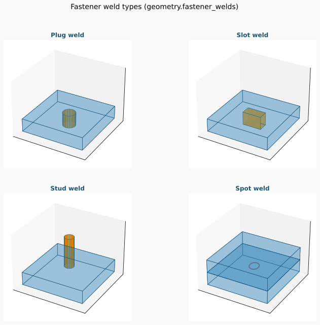

Source: `src/feaweld/geometry/fastener_welds.py`.
Tests: `tests/test_fastener_welds.py`.

---

## Defect modeling

### Defect types

Seven dataclasses covering the major weld defect families:
`PoreDefect`, `ClusterPorosity`, `SlagInclusion`, `UndercutDefect`,
`LackOfFusionDefect`, `RootGapDefect`, `SurfaceCrack`. Each implements
the `Defect` protocol (`volume`, `critical_dimension`, `description`).

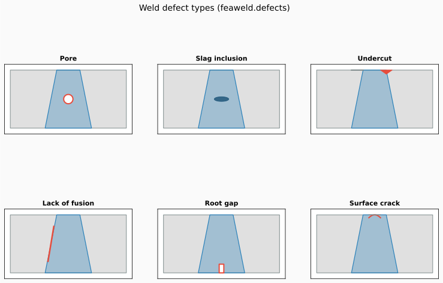

Source: `src/feaweld/defects/types.py`. Tests: `tests/test_defect_types.py`.

### Defect insertion workflow

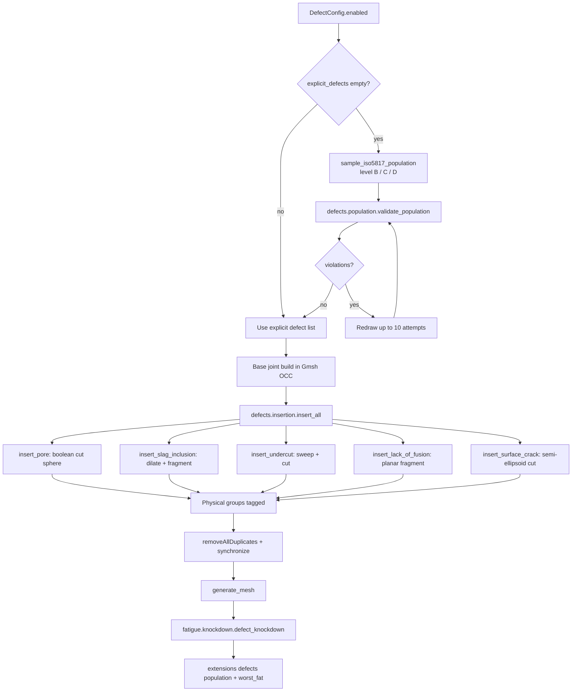
```mermaid
flowchart TD
    C[DefectConfig.enabled] --> S{explicit_defects empty?}
    S -- yes --> DRAW[sample_iso5817_population<br/>level B / C / D]
    S -- no --> LIST[Use explicit defect list]
    DRAW --> VAL[defects.population.validate_population]
    VAL --> BAD{violations?}
    BAD -- yes --> REDRAW[Redraw up to 10 attempts]
    REDRAW --> VAL
    BAD -- no --> LIST
    LIST --> JOINT[Base joint build in Gmsh OCC]
    JOINT --> INSERT[defects.insertion.insert_all]
    INSERT --> PORE[insert_pore: boolean cut sphere]
    INSERT --> SLAG[insert_slag_inclusion: dilate + fragment]
    INSERT --> UND[insert_undercut: sweep + cut]
    INSERT --> LOF[insert_lack_of_fusion: planar fragment]
    INSERT --> CRACK[insert_surface_crack: semi-ellipsoid cut]
    PORE --> TAG[Physical groups tagged]
    SLAG --> TAG
    UND --> TAG
    LOF --> TAG
    CRACK --> TAG
    TAG --> CLEAN[removeAllDuplicates + synchronize]
    CLEAN --> MESH[generate_mesh]
    MESH --> KD[fatigue.knockdown.defect_knockdown]
    KD --> OUT[extensions defects population + worst_fat]
```

Sources: `src/feaweld/defects/insertion.py`, `src/feaweld/defects/population.py`.
Tests: `tests/test_defect_insertion.py`, `tests/test_defect_population.py`.

### ISO 5817 stochastic populations

`sample_iso5817_population(level, weld_length, weld_width, ...)` draws
Poisson-distributed defect counts with sizes capped below the chosen
quality level's acceptance limits. Bundled acceptance data lives under
`src/feaweld/data/defect_acceptance/` (ISO 5817, ASME BPVC IX, AWS D1.1)
and `src/feaweld/data/defect_fat/` (BS 7910 Annex F).

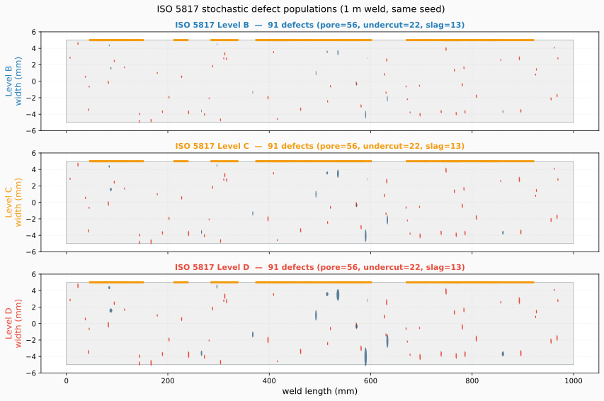

### FAT downgrade curves

BS 7910 / IIW analytical FAT downgrade rules for pores, undercut, lack
of fusion, and slag inclusions. The `defect_knockdown` helper in
`fatigue.knockdown` aggregates across an entire defect population and
returns the worst-case FAT class.

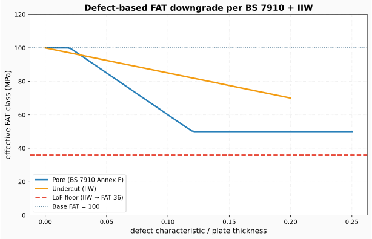

Sources: `src/feaweld/defects/knockdown.py`, `src/feaweld/fatigue/knockdown.py`.
Tests: `tests/test_defect_knockdown.py`, `tests/test_defect_knockdown_aggregate.py`.

---

## Fatigue & post-processing

### Multi-axial fatigue criteria

Six critical-plane and invariant-based criteria operating on full
stress-tensor histories: Findley, Dang Van, Sines, Crossland,
Fatemi-Socie, McDiarmid. Plane search uses a ~200-point Fibonacci
spherical grid on the upper hemisphere.

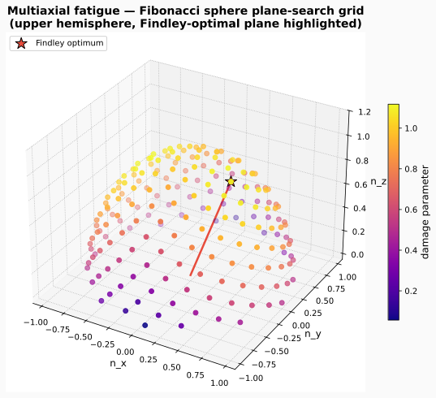

Source: `src/feaweld/postprocess/multiaxial.py`.
Tests: `tests/test_multiaxial_fatigue.py`.

### Rainflow multi-axial counting

Projects stress-tensor histories onto either a critical-plane normal
(via `n · σ · n`) or the signed maximum principal, then delegates
scalar cycle counting to the existing ASTM E1049 `rainflow_count`.

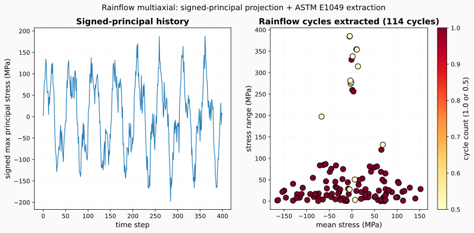


MP4: [`rainflow_cycle_counting.mp4`](animations/rainflow_cycle_counting.mp4)

Source: `src/feaweld/fatigue/rainflow.py`. Tests: `tests/test_rainflow_multiaxial.py`.

### Probabilistic Miner damage

`life_with_scatter_stress` + `miner_damage_with_uq` propagate
lognormal S-N scatter + Gaussian stress uncertainty through Palmgren-
Miner accumulation, returning mean / std / p05 / p95 fatigue-life
bands alongside the existing deterministic scalar keys. Wired into
`run_analysis` via `_apply_fatigue_uq`.

Sources: `src/feaweld/fatigue/sn_curves.py`, `src/feaweld/fatigue/miner.py`.
Tests: `tests/test_probabilistic_miner.py`.

### Monte Carlo convergence


MP4: [`monte_carlo_convergence.mp4`](animations/monte_carlo_convergence.mp4)

Source: `src/feaweld/probabilistic/monte_carlo.py`.

### Path extraction along splines

`extract_along_path(fea_results, path, n_samples)` uses a thin-plate-
spline RBF interpolator (reused from `singularity.submodeling`) to
sample a nodal field at arc-length positions along a curved weld toe.
Falls back to nearest-neighbor on ill-conditioned RBF systems and
records the fallback in the result metadata.

Source: `src/feaweld/postprocess/path_extraction.py`.
Tests: `tests/test_path_extraction.py`.

### Curved hotspot along a path

`hotspot_stress_along_path(fea_results, path, plate_thickness)` computes
IIW Type A / Type B hot-spot stresses at arc-length positions along
a curved weld path by sampling at `0.4t` and `1.0t` (Type A) or
`4 / 8 / 12 mm` (Type B) offsets along the Frenet principal normal.
On straight paths it reproduces the legacy discrete-node API to 1e-8.

Source: `src/feaweld/postprocess/hotspot.py`.
Tests: `tests/test_hotspot_along_path.py`.

---

## Multi-pass welding

### Weld sequence + thermal dispatch

`WeldSequence` composes multiple `WeldPass` entries with validated
monotone start times; `MultiPassHeatSource` dispatches to per-pass
`GoldakHeatSource` instances based on the current simulation time.
The existing single-source Goldak API is unchanged.

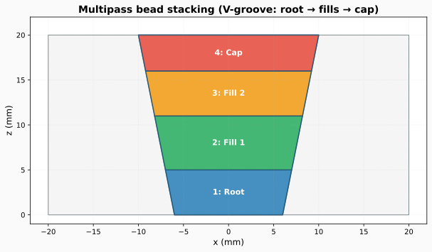


MP4: [`multipass_thermal_cycle.mp4`](animations/multipass_thermal_cycle.mp4)

### Goldak moving heat source


MP4: [`goldak_heat_source_sweep.mp4`](animations/goldak_heat_source_sweep.mp4)

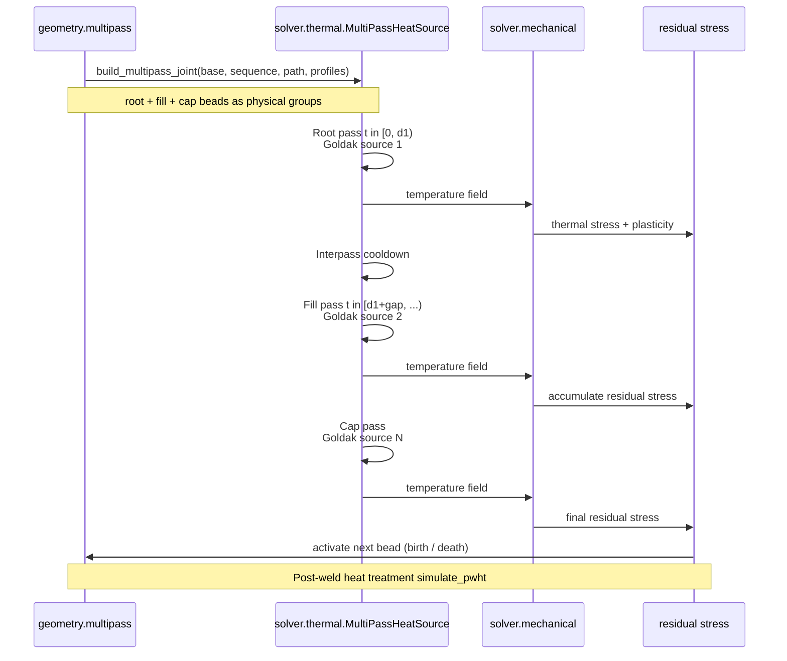
```mermaid
sequenceDiagram
    participant G as geometry.multipass
    participant T as solver.thermal.MultiPassHeatSource
    participant M as solver.mechanical
    participant R as residual stress

    G->>T: build_multipass_joint(base, sequence, path, profiles)
    Note over G,T: root + fill + cap beads as physical groups
    T->>T: Root pass t in [0, d1)<br/>Goldak source 1
    T->>M: temperature field
    M->>R: thermal stress + plasticity
    T->>T: Interpass cooldown
    T->>T: Fill pass t in [d1+gap, ...)<br/>Goldak source 2
    T->>M: temperature field
    M->>R: accumulate residual stress
    T->>T: Cap pass<br/>Goldak source N
    T->>M: temperature field
    M->>R: final residual stress
    R->>G: activate next bead (birth / death)
    Note over G,R: Post-weld heat treatment simulate_pwht
```

Sources: `src/feaweld/solver/thermal.py`, `src/feaweld/geometry/multipass.py`,
`src/feaweld/core/types.py::WeldPass`.
Tests: `tests/test_multipass_sequence.py`, `tests/test_multipass_geometry.py`.

### Multi-pass thermal solver (`solve_multipass_thermal`)

The full multi-pass thermal cycle solver orchestrates per-pass transient
solves with element birth-death activation and interpass cooldown monitoring.
Temperature state is explicitly carried between passes via the
`initial_temperature` parameter added to all `SolverBackend.solve_thermal_transient()`
implementations.

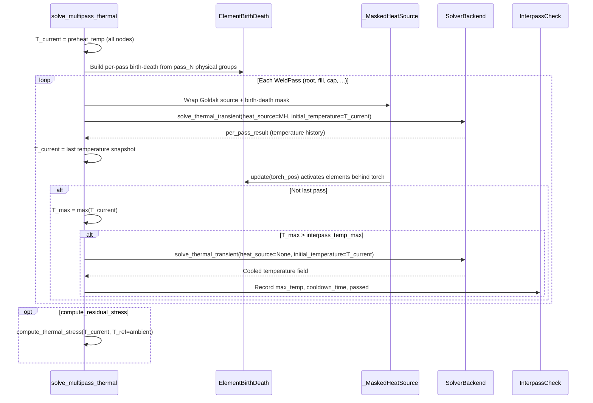
```mermaid
sequenceDiagram
    participant O as solve_multipass_thermal
    participant BD as ElementBirthDeath
    participant MH as _MaskedHeatSource
    participant BE as SolverBackend
    participant IC as InterpassCheck

    O->>O: T_current = preheat_temp (all nodes)
    O->>BD: Build per-pass birth-death from pass_N physical groups
    loop Each WeldPass (root, fill, cap, ...)
        O->>MH: Wrap Goldak source + birth-death mask
        O->>BE: solve_thermal_transient(heat_source=MH, initial_temperature=T_current)
        BE-->>O: per_pass_result (temperature history)
        O->>O: T_current = last temperature snapshot
        MH->>BD: update(torch_pos) activates elements behind torch
        alt Not last pass
            O->>O: T_max = max(T_current)
            alt T_max > interpass_temp_max
                O->>BE: solve_thermal_transient(heat_source=None, initial_temperature=T_current)
                BE-->>O: Cooled temperature field
                O->>IC: Record max_temp, cooldown_time, passed
            end
        end
    end
    opt compute_residual_stress
        O->>O: compute_thermal_stress(T_current, T_ref=ambient)
    end
```

### Element birth-death lifecycle

The `ElementBirthDeath` class manages activation of weld filler elements
as the torch passes. Dead elements receive zero heat via the `_MaskedHeatSource`
wrapper. Activation is based on signed distance from the torch along the
travel direction.

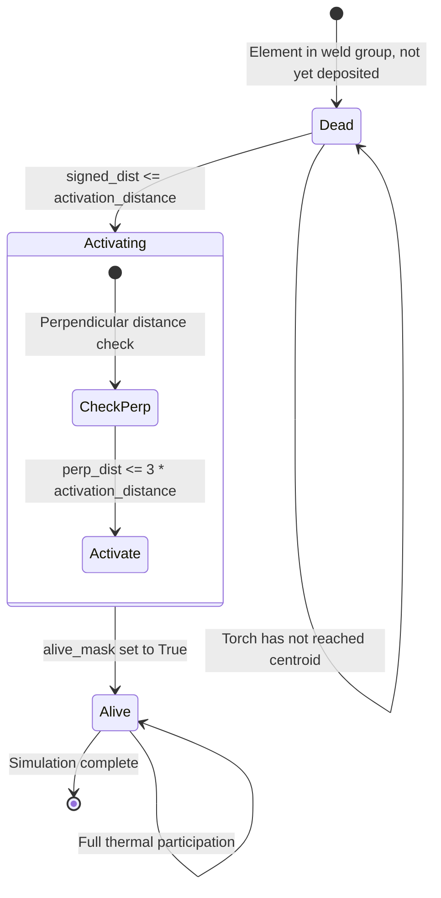
```mermaid
stateDiagram-v2
    [*] --> Dead : Element in weld group, not yet deposited

    Dead --> Dead : Torch has not reached centroid
    Dead --> Activating : signed_dist <= activation_distance

    state Activating {
        [*] --> CheckPerp : Perpendicular distance check
        CheckPerp --> Activate : perp_dist <= 3 * activation_distance
    }

    Activating --> Alive : alive_mask set to True

    Alive --> Alive : Full thermal participation
    Alive --> [*] : Simulation complete
```

### Temperature carry-forward between passes

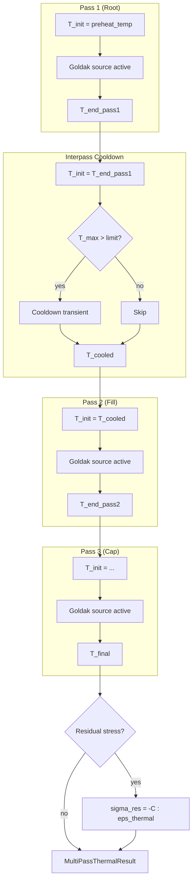
```mermaid
flowchart TD
    subgraph Pass1["Pass 1 (Root)"]
        P1S["T_init = preheat_temp"] --> P1H["Goldak source active"]
        P1H --> P1E["T_end_pass1"]
    end
    subgraph Cool1["Interpass Cooldown"]
        C1S["T_init = T_end_pass1"] --> C1M{"T_max > limit?"}
        C1M -- yes --> C1R["Cooldown transient"]
        C1M -- no --> C1P["Skip"]
        C1R --> C1E["T_cooled"]
        C1P --> C1E
    end
    subgraph Pass2["Pass 2 (Fill)"]
        P2S["T_init = T_cooled"] --> P2H["Goldak source active"]
        P2H --> P2E["T_end_pass2"]
    end
    subgraph Pass3["Pass 3 (Cap)"]
        P3S["T_init = ..."] --> P3H["Goldak source active"]
        P3H --> P3E["T_final"]
    end
    P1E --> C1S
    C1E --> P2S
    P2E --> P3S
    P3E --> RES{"Residual stress?"}
    RES -- yes --> STRESS["sigma_res = -C : eps_thermal"]
    RES -- no --> OUT["MultiPassThermalResult"]
    STRESS --> OUT
```

Sources: `src/feaweld/solver/multipass_thermal.py`,
`src/feaweld/solver/thermal.py` (ElementBirthDeath, GoldakHeatSource, MultiPassHeatSource),
`src/feaweld/solver/backend.py` (initial_temperature parameter).
Tests: `tests/test_multipass_thermal.py`, `tests/test_multipass_sequence.py`.

---

## Regenerating the docs

All assets on this page are reproducible from the feaweld code itself.
After a `pip install -e ".[docs]"` you can regenerate everything with:

```bash
python scripts/build_docs_assets.py
```

Individual groups:

```bash
python scripts/generate_docs_mermaid.py              # 20 mermaid diagrams
python scripts/generate_docs_concept_images.py       # 23 static images (svg + png)
python scripts/generate_docs_animations.py           # 9 animations (gif + mp4)
```

Smoke tests verifying that every generator produces non-empty output:

```bash
pytest tests/test_docs_assets.py -q
```
