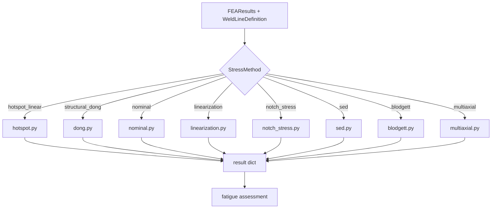

# Post-Processing Methods

feaweld implements 8 stress extraction and evaluation methods. Each method takes `FEAResults` and a `WeldLineDefinition` and returns its own result dataclass. The pipeline dispatches on the `StressMethod` enum in `core/types.py`.

## Methods Overview

| Method | Module | Description |
|--------|--------|-------------|
| **Hot-spot (structural stress)** | `feaweld.postprocess.hotspot` | IIW Type A and Type B hot-spot stress via surface extrapolation at prescribed reference points (0.4t/1.0t or 4/8/12 mm). Supports curved weld paths with Frenet-frame offsets. |
| **Dong (equilibrium)** | `feaweld.postprocess.dong` | Battelle structural stress method -- through-thickness equilibrium of membrane + bending stresses independent of mesh refinement. |
| **Nominal stress** | `feaweld.postprocess.nominal` | Classical nominal stress from section forces and weld group properties. Simplest method; appropriate for standard joint configurations with known SCFs. |
| **Through-thickness linearization** | `feaweld.postprocess.linearization` | Decomposes the stress distribution along a through-thickness path into membrane, bending, and peak (notch) components per ASME Section VIII Div. 2. |
| **Notch stress** | `feaweld.postprocess.notch_stress` | Effective notch stress with a fictitious rounding radius (typically 1 mm for steel, 0.05 mm for thin sheet). Requires fine mesh at the weld toe/root. |
| **Strain energy density (SED)** | `feaweld.postprocess.sed` | Averaged strain energy density over a control volume around the notch tip, following the Lazzarin-Berto approach. A volumetric variant (`volumetric_sed.py`) generalizes to arbitrary 3D control volumes. |
| **Blodgett (weld group)** | `feaweld.postprocess.blodgett` | Closed-form weld group property and stress calculations per Blodgett's *Design of Welded Structures*. Supports 8 group shapes. No FEA required. |
| **Multi-axial criteria** | `feaweld.postprocess.multiaxial` | Six critical-plane and invariant-based criteria: Findley, Dang Van, Sines, Crossland, Fatemi-Socie, McDiarmid. Plane search uses a Fibonacci spherical grid. |

## Dispatch Flow

The pipeline dispatches to the correct post-processing method based on the `StressMethod` enum. Multiple methods can run concurrently in the DAG executor.

## Adding a New Method

1. Create a new file in `src/feaweld/postprocess/`.
2. Add an enum entry to `StressMethod` in `src/feaweld/core/types.py`.
3. Add a dispatch branch in `_run_postprocess` in `src/feaweld/pipeline/workflow.py`.
4. Write tests using the fixtures from `tests/conftest.py`.
