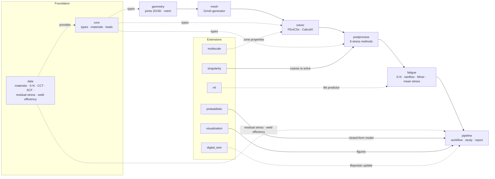
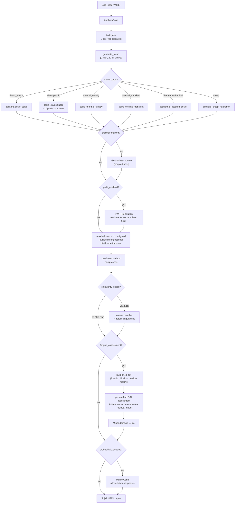
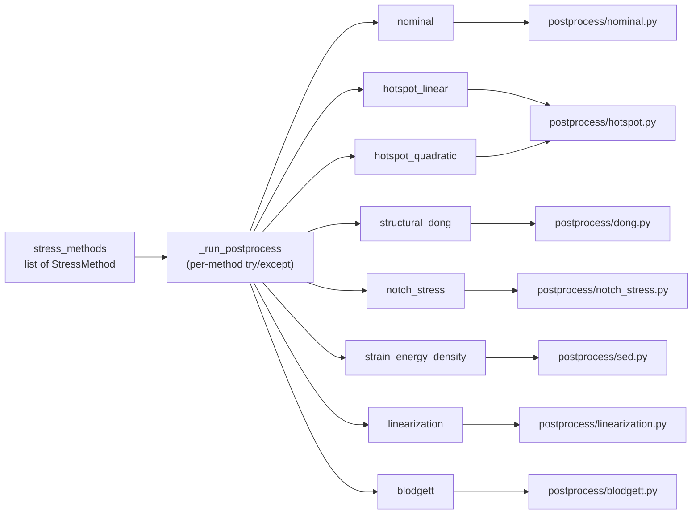
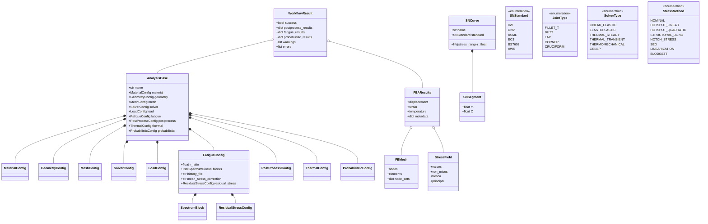
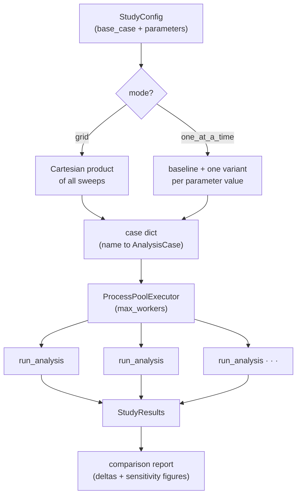

# Architecture

feaweld is organized as a **linear data pipeline** with a set of independent
extensions that hook into it at well-defined points:

```
YAML config → geometry → mesh → solve → postprocess → fatigue → visualize/report
```

Every stage consumes and produces the frozen data contracts in
`feaweld.core.types`, so stages can be swapped, skipped, or reused in isolation.
This page explains the design patterns that make that possible and maps the
module layout with a set of diagrams.


## Key design patterns

**Solver-agnostic results.** `FEAResults` (in `core/types.py`) contains no
solver-specific metadata. Both the FEniCSx and CalculiX backends serialize to the
same `FEMesh` + `StressField`. Post-processors only ever consume `FEAResults` —
they never call a backend method — so a solver can be replaced without touching a
single line of post-processing code.

**Solver auto-detection.** `solver/backend.py` defines the `SolverBackend` ABC.
`get_backend(preference="auto")` tries FEniCSx first (preferred for nonlinear and
coupled physics), falls back to CalculiX, and raises `ImportError` if neither is
installed. See the [Solvers guide](guides/solvers.md) for the full capability
matrix.

**Late-binding post-processing.** Each `StressMethod` enum value maps to an
independent module function through the dispatcher in `pipeline/workflow.py`
(`_run_postprocess`). There is no inheritance hierarchy — methods are standalone
modules that fail independently, so a broken notch-stress extraction never blocks
the hot-spot result. Adding a new method means adding a module under
`postprocess/` and a dispatch branch.

**Lazy conditional imports.** Heavy optional dependencies (solver backends,
visualization, ML, digital twin) are imported only when needed, inside command
handlers and workflow branches. Core FEA therefore works without installing any
optional package.

**Frozen data contract.** Core types in `core/types.py` are frozen dataclasses or
Pydantic `BaseModel`s. This prevents mid-pipeline mutation and enables clean YAML
round-tripping.

**Data registry singleton.** `data/registry.py` scans the bundled data
directories once at import time into a dict, so `get_dataset_path("category/name")`
lookups are O(1). Actual file loading goes through `data/cache.py` with LRU
eviction.

**Geometry builder dispatch.** The `JointType` enum maps to joint classes
(`FilletTJoint`, `ButtWeld`, …) in `geometry/joints.py`, all deriving from the
`JointGeometry` ABC. New joint types don't require modifying the orchestrator.

**Material interpolation.** Properties are stored as `{temperature_C: value}`
dicts. A `scipy.interpolate.interp1d` is created lazily on first access — a cubic
spline for four or more data points, linear otherwise.

## Module map

The foundation packages (`core`, `data`) underpin the main analysis chain. The
extension packages attach to specific stages of that chain rather than sitting in
the middle of it.



Package responsibilities:

| Package | Responsibility |
|---------|----------------|
| `core` | Shared dataclasses (`types.py`), temperature-dependent material DB (`materials.py`), load and heat-input definitions (`loads.py`) |
| `data` | Reference datasets (49 materials, S-N curves, CCT, SCF, residual stress, filler metals, weld efficiency) behind a registry singleton + LRU cache; the residual-stress profiles feed the fatigue stage and the weld-efficiency table the nominal ASME checks |
| `geometry` | Five joint types via the Gmsh API — 2D cross-sections or extruded 3D solids (`dimension: 3`) with per-toe edge groups; butt-weld groove parameters; fictitious 1 mm notch insertion for effective-notch stress (2D only) |
| `mesh` | Gmsh mesh generation with weld-toe refinement (point-based in 2D, toe-line distance fields in 3D; 3D is tet-only), plus format conversion and quality metrics |
| `solver` | `SolverBackend` ABC + auto-detect; J2 plasticity, Goldak thermal, Norton-Bailey creep, sequential thermomechanical coupling |
| `postprocess` | Eight stress methods across seven modules, each consuming `FEAResults` |
| `fatigue` | Six S-N standards (IIW / DNV / ASME / EC3 / BS 7608 / AWS), ASTM E1049 rainflow, Palmgren-Miner damage, spectrum assessment with mean-stress correction and thickness / surface / environment knockdowns |
| `pipeline` | `AnalysisCase` model + `run_analysis()` orchestrator, parametric `study`, HTML `report`, `comparison` |
| `probabilistic` | Monte Carlo (LHS), Sobol sensitivity, FORM reliability |
| `ml` | Random Forest / XGBoost fatigue predictor with transfer learning |
| `multiscale` | Hall-Petch, dislocation density, CCT interpolation, macro/meso/micro bridging |
| `digital_twin` | MQTT / OPC-UA ingestion, Bayesian updating (emcee), WebSocket dashboard |
| `singularity` | Richardson extrapolation, GCI, singular-point detection, submodeling |
| `visualization` | 2-D (Matplotlib) and 3-D (PyVista) plots, automatic report figures, interactive Plotly |

## Analysis pipeline

`run_analysis()` in `pipeline/workflow.py` is the orchestrator. It reads the
`AnalysisCase`, dispatches the solve on `SolverType`, applies any coupled
thermal, PWHT, or residual-stress step, runs each requested post-processing
method independently, and then layers optional mesh-sensitivity, fatigue, and
probabilistic passes before the report.



Two back-compatibility rules run before the dispatch: a case with
`thermal.enabled` and the default `linear_elastic` solver is promoted to
`thermomechanical`, and a `linear_elastic` case with `nonlinear: true` is promoted
to `elastoplastic`. The singularity check only runs for plain `linear_elastic`
solves — plasticity and a thermal or PWHT pass make its coarse baseline
incomparable — and is skipped with a warning for
`geometry.dimension: 3`, since it re-meshes and compares 2D sections. See the
[Solvers](guides/solvers.md) and [Convergence & submodeling](guides/convergence.md)
guides for the details.

Between the solve and post-processing, the orchestrator resolves any residual
stress configured under `fatigue.residual_stress` — a named through-thickness
profile's surface value, a direct value in MPa, or as-welded yield magnitude.
When PWHT is enabled and a residual stress is configured (with no welding thermal
pass), the relaxation applies to that *residual* stress through a Norton-Bailey
probe rather than to the solved load field; without a residual configuration the
legacy field-relaxation path is kept, with a warning. The (possibly relaxed)
residual always enters the fatigue assessment as a residual mean stress;
`superimpose: true` additionally adds its through-thickness field to the saved
stress output after post-processing, so it reaches exports and report field
figures without ever inflating a fatigue stress range.

The fatigue stage is itself a chain. With no cyclic definition in the `fatigue:`
block it keeps the legacy one-shot evaluation — each method's `max_stress` read
off the case S-N curve once. With `r_ratio`, `blocks`, or a rainflow-counted
`history` / `history_file` it builds a `(range, mean, count)` cycle set, scales
factor-space definitions by each method's reference stress (absolute MPa
definitions pass through as-is), applies the Goodman/Gerber mean-stress
correction plus the thickness / surface / environment knockdowns and the residual
mean, and sums Palmgren-Miner damage into a life per method. The governing
(highest-damage) method's cycles feed the rainflow and damage-map report figures.
See the [Fatigue assessment guide](guides/fatigue_assessment.md) for the full
chain.

## Post-processing dispatch

`case.postprocess.stress_methods` is a list of `StressMethod` values. Each is
dispatched to a standalone module inside a `try`/`except`, so one method failing
records an error but never stops the others. The eight enum values map onto seven
modules — `hotspot` serves both the linear and quadratic hot-spot methods.



The same dispatch serves both dimensions. For a `geometry.dimension: 3` case the
dispatcher receives one ordered weld line per `weld_toe_{i}` node set (built by
`_weld_lines_from_mesh`); the hot-spot methods evaluate stations along every toe
line and report the maximum over all stations plus `critical_line` /
`n_stations`, while the point-evaluation methods use the highest-stressed toe
node across the lines. `structural_dong` is 2D-only — in 3D it raises an
informative error that lands in `result.errors` without blocking the other
methods.

Methods that carry a mandated S-N curve — effective notch stress (IIW FAT225),
Dong's master curve, and the SED power law — return their own `fatigue_life`, and
the fatigue stage prefers those over the generic curve named in
`postprocess.sn_curve`. Under a spectrum the mandate is still honored: the
effective-notch cycles are assessed against FAT225 with the full mean-stress and
knockdown corrections, while Dong and SED — whose codes fix a single-slope life
law as-is — get an exact power-law spectrum life with no corrections, flagged
`corrections_applied: false` in the results. See
[Custom post-processing](tutorials/03_custom_postprocessing.md) to add a method.

## Core data contract

`AnalysisCase` composes nine configuration sub-models. `run_analysis()` returns a
`WorkflowResult` that aggregates the case, the mesh, the solver results, and the
post-processing / fatigue / probabilistic payload dicts. All solver output flows
through `FEAResults`, which owns a `FEMesh` and an optional `StressField`.



Because every stage speaks this contract, a `FEAResults` object produced by any
backend — or even hand-built in a test — is a valid input to every post-processor,
visualization function, and report builder.

## Study execution

A parametric study wraps `run_analysis()` in a `ProcessPoolExecutor`. The `Study`
builder expands its parameter sweeps into concrete `AnalysisCase` objects (a
Cartesian product in `grid` mode, or one variant per value in `one_at_a_time`
mode), runs them concurrently, and collects everything into `StudyResults` for the
comparison report.



Every case must be picklable to cross the process boundary — automatic for the
Pydantic `AnalysisCase`, but a reason not to attach live Gmsh handles or lambdas.
See the [Parametric study tutorial](tutorials/02_parametric_study.md) for worked
examples.
