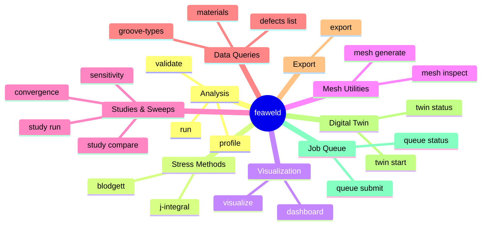
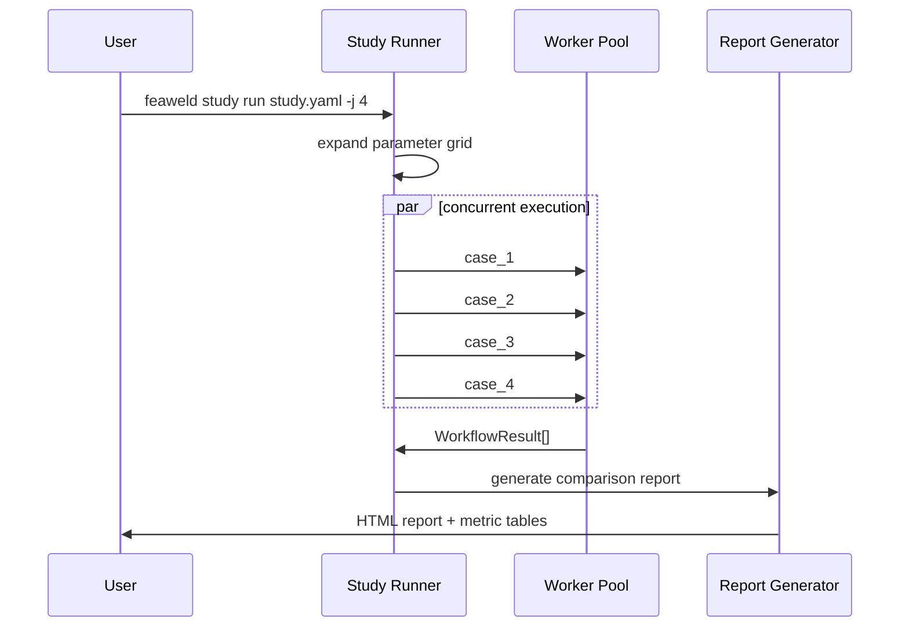
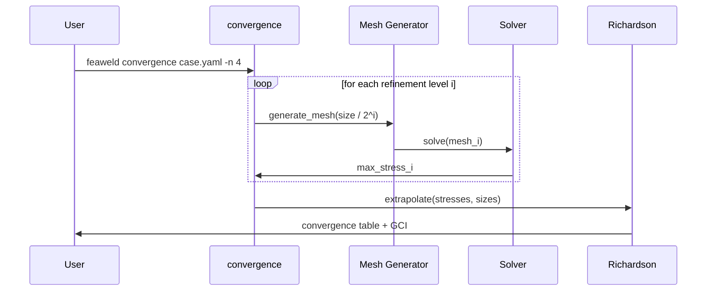

# CLI Reference

feaweld installs a `feaweld` console script. All commands accept `--verbose` / `-v` (repeatable) and `--log-format` (`text`, `json`, `journal`) as global options.

```bash
feaweld [--verbose] [--log-format text|json|journal] <command> [options]
```

## Command Overview



---

## Analysis

### `feaweld run`

Run a complete analysis from a YAML case file.

```
feaweld run <case.yaml> [OPTIONS]
```

| Option | Default | Description |
|--------|---------|-------------|
| `--output`, `-o` | current dir | Output directory for results |
| `--report` / `--no-report` | `--report` | Generate HTML report |

### `feaweld validate`

Validate a YAML case file without running the analysis. Checks schema, material availability, solver backend, and numeric ranges.

```
feaweld validate <case.yaml>
```

### `feaweld profile`

Run an analysis and report per-stage timing.

```
feaweld profile <case.yaml> [OPTIONS]
```

| Option | Default | Description |
|--------|---------|-------------|
| `--output`, `-o` | none | Output JSON file for timing data |

---

## Stress Methods

### `feaweld blodgett`

Blodgett hand calculations for weld groups. No FEA solver required.

```
feaweld blodgett [OPTIONS]
```

| Option | Default | Description |
|--------|---------|-------------|
| `--geometry`, `-g` | `line` | Weld group shape: `line`, `parallel`, `c_shape`, `l_shape`, `box`, `circular`, `i_shape`, `t_shape` |
| `--d` | (required) | Primary dimension d (mm) |
| `--b` | `0.0` | Secondary dimension b (mm) |
| `--throat`, `-t` | (required) | Weld throat thickness (mm) |
| `--axial`, `-P` | `0.0` | Axial force (N) |
| `--shear`, `-V` | `0.0` | Shear force (N) |
| `--moment`, `-M` | `0.0` | Bending moment (N-mm) |
| `--torsion`, `-T` | `0.0` | Torsion (N-mm) |
| `--fexx` | `483.0` | Electrode strength F_EXX (MPa) |

### `feaweld j-integral`

Run the 2D J-integral on a saved VTK FE result.

```
feaweld j-integral <results.vtk> [OPTIONS]
```

| Option | Default | Description |
|--------|---------|-------------|
| `--crack-tip` | (required) | Crack tip coordinates as `x,y[,z]` |
| `--radius` | `2.0` | q-function radius (mm) |

---

## Visualization

### `feaweld visualize`

Visualize FEA results from a VTK file with PyVista. Requires the `[viz]` extra.

```
feaweld visualize <results.vtk> [OPTIONS]
```

| Option | Default | Description |
|--------|---------|-------------|
| `--component`, `-c` | `von_mises` | Stress component: `von_mises`, `tresca`, `xx`, `yy`, `zz` |
| `--output`, `-o` | none | Save as PNG instead of interactive display |
| `--clip` | none | Clipping plane normal as `x,y,z` |
| `--threshold` | none | Stress threshold for element filtering |
| `--annotate` | off | Add critical point annotations |

### `feaweld dashboard`

Run an analysis and render an engineering visualization dashboard.

```
feaweld dashboard <case.yaml> [OPTIONS]
```

| Option | Default | Description |
|--------|---------|-------------|
| `--output`, `-o` | none | Save dashboard as PNG |

---

## Data Queries

### `feaweld materials`

List all bundled material databases.

```
feaweld materials
```

### `feaweld groove-types`

List available groove preparations (V, U, J, X, K) with class references.

```
feaweld groove-types
```

### `feaweld defects list`

List bundled defect acceptance criteria from weld quality standards.

```
feaweld defects list [OPTIONS]
```

| Option | Default | Description |
|--------|---------|-------------|
| `--standard` | `ISO 5817` | Standard: `ISO 5817`, `ASME BPVC IX`, `AWS D1.1`, `BS 7910` |
| `--level` | all | Quality level key (e.g. `B`, `C`, `D` or `normal`, `severe`) |

---

## Mesh Utilities

### `feaweld mesh generate`

Generate a mesh from a case file without running the full analysis.

```
feaweld mesh generate <case.yaml> [OPTIONS]
```

| Option | Default | Description |
|--------|---------|-------------|
| `--output`, `-o` | `mesh.vtk` | Output mesh file (VTK) |

### `feaweld mesh inspect`

Read a mesh file and report node/element counts, bounding box, and quality metrics.

```
feaweld mesh inspect <mesh_file>
```

---

## Studies and Sweeps

### `feaweld study run`

Run a parametric study from a YAML definition file.

```
feaweld study run <study.yaml> [OPTIONS]
```

| Option | Default | Description |
|--------|---------|-------------|
| `--max-workers`, `-j` | `4` | Number of parallel workers |
| `--output`, `-o` | none | Output directory for comparison report |
| `--report` / `--no-report` | `--report` | Generate HTML comparison report |



### `feaweld study compare`

Run multiple case files and generate a side-by-side comparison report.

```
feaweld study compare <case1.yaml> <case2.yaml> ... [OPTIONS]
```

| Option | Default | Description |
|--------|---------|-------------|
| `--baseline`, `-b` | none | Baseline case name for delta computation |
| `--output`, `-o` | `results` | Output directory |
| `--max-workers`, `-j` | `4` | Parallel workers for analysis |

### `feaweld convergence`

Run a mesh convergence study with successive refinements and Richardson extrapolation.

```
feaweld convergence <case.yaml> [OPTIONS]
```

| Option | Default | Description |
|--------|---------|-------------|
| `--refinements`, `-n` | `3` | Number of refinement levels |



### `feaweld sensitivity`

Run a single-parameter sensitivity sweep.

```
feaweld sensitivity <case.yaml> [OPTIONS]
```

| Option | Default | Description |
|--------|---------|-------------|
| `--param` | (required) | Parameter dot-path (e.g. `load.axial_force`) |
| `--range` | (required) | Values as `start:stop:n_points` (e.g. `10000:50000:5`) |

---

## Export

### `feaweld export`

Export FEA results from a VTK file to CSV or JSON.

```
feaweld export <results.vtk> [OPTIONS]
```

| Option | Default | Description |
|--------|---------|-------------|
| `--format` | `csv` | Export format: `csv` or `json` |
| `--output`, `-o` | `<stem>.<format>` | Output file path |

---

## Digital Twin

### `feaweld twin start`

Start the digital twin daemon in the foreground. Connects to an MQTT broker for sensor data ingestion.

```
feaweld twin start [OPTIONS]
```

| Option | Default | Description |
|--------|---------|-------------|
| `--host` | `localhost` | MQTT broker host |
| `--port` | `1883` | MQTT broker port |

### `feaweld twin status`

Check digital twin daemon health via systemd.

```
feaweld twin status
```

---

## Job Queue

### `feaweld queue submit`

Submit an analysis job to the SQLite-backed job queue.

```
feaweld queue submit <case.yaml> [OPTIONS]
```

| Option | Default | Description |
|--------|---------|-------------|
| `--priority`, `-p` | `0` | Job priority (lower number = higher priority) |

### `feaweld queue status`

Show the current state of the job queue.

```
feaweld queue status [OPTIONS]
```

| Option | Default | Description |
|--------|---------|-------------|
| `--job-id` | none | Check a specific job ID instead of listing all |
