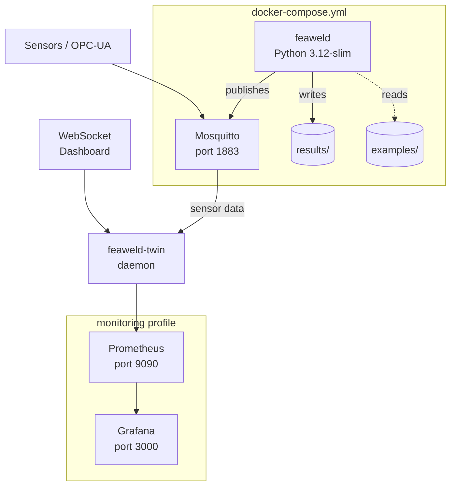
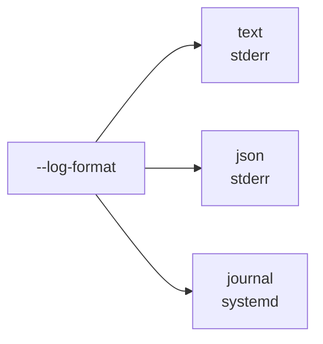

# Deployment

feaweld can be deployed as a local CLI tool, inside Docker containers, or as a systemd-managed service for continuous digital twin monitoring.

## Docker Deployment

The project ships with a multi-stage Dockerfile and a docker-compose stack.



### Building images

```bash
# Production image (minimal, ~200 MB)
docker build --target prod -t feaweld .

# Development image (includes test tools and viz)
docker build --target dev -t feaweld-dev .

# FEniCSx-enabled image (based on dolfinx)
docker build -f Dockerfile.fenics -t feaweld-fenics .
```

### Running with docker-compose

```bash
# Start feaweld + MQTT broker
docker compose up -d

# Run an analysis inside the container
docker compose run feaweld run examples/fillet_t_joint.yaml

# Start with monitoring (Grafana + Prometheus)
docker compose --profile monitoring up -d
```

## systemd Service

The digital twin daemon can run as a systemd service for production deployments. The service unit is at `deploy/feaweld-twin.service`.

### Installation

```bash
sudo cp deploy/feaweld-twin.service /etc/systemd/system/
sudo systemctl daemon-reload
sudo systemctl enable --now feaweld-twin
```

### Key service features

| Feature | Configuration |
|---------|--------------|
| Watchdog | `WatchdogSec=30` -- daemon pings systemd every 15s |
| Auto-restart | `Restart=on-failure`, `RestartSec=10` |
| Memory limit | `MemoryMax=4G` via cgroups v2 |
| CPU limit | `CPUQuota=200%` (2 cores) |
| Security | `DynamicUser=yes`, `ProtectSystem=strict`, `NoNewPrivileges=yes` |
| Logging | Stdout/stderr to journald (`StandardOutput=journal`) |

### Checking status

```bash
# Service status
sudo systemctl status feaweld-twin

# Live journal logs
journalctl -u feaweld-twin -f

# Or via CLI
feaweld twin status
```

## Environment Variables

| Variable | Default | Description |
|----------|---------|-------------|
| `FEAWELD_TMPDIR` | system temp | Scratch directory for solver intermediate files (set to tmpfs for speed) |
| `FEAWELD_MQTT_HOST` | `localhost` | MQTT broker hostname for digital twin |
| `FEAWELD_MQTT_PORT` | `1883` | MQTT broker port |
| `FEAWELD_MEMMAP_THRESHOLD_MB` | `100` | Arrays larger than this are memory-mapped to disk |
| `WATCHDOG_USEC` | (set by systemd) | Watchdog interval for sd_notify pings |

## Logging Configuration

feaweld uses Python's `logging` module with three output formats selectable via the `--log-format` CLI flag.



### Text format (default)

Human-readable, suitable for interactive use:

```bash
feaweld -v run case.yaml
# 2026-04-12 14:30:01 INFO     [feaweld.pipeline.workflow] Stage: materials
# 2026-04-12 14:30:01 INFO     [feaweld.pipeline.workflow] Stage: geometry (fillet_t)
```

### JSON format

Structured single-line JSON for container log aggregation (ELK, Loki, CloudWatch):

```bash
feaweld -v --log-format json run case.yaml
# {"ts": "2026-04-12 14:30:01", "level": "INFO", "logger": "feaweld.pipeline.workflow", "msg": "Stage: materials"}
```

### Journal format

Direct integration with systemd journald (used automatically by the daemon service):

```bash
feaweld -v --log-format journal run case.yaml

# Query structured fields
journalctl SYSLOG_IDENTIFIER=feaweld --since "5 min ago"
```

### Verbosity levels

| Flag | Level | What it shows |
|------|-------|---------------|
| (none) | WARNING | Errors and warnings only |
| `-v` | INFO | Stage entry, completion, mesh stats |
| `-vv` | DEBUG | Material lookups, element counts, BC details |
