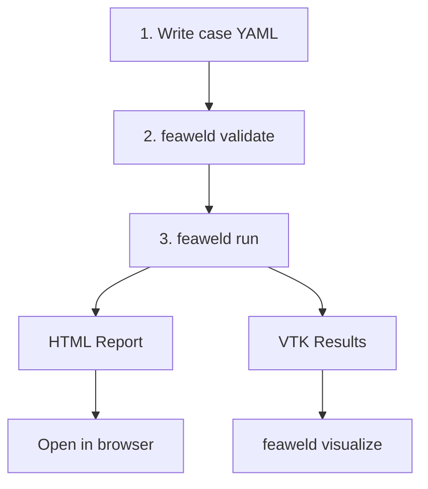
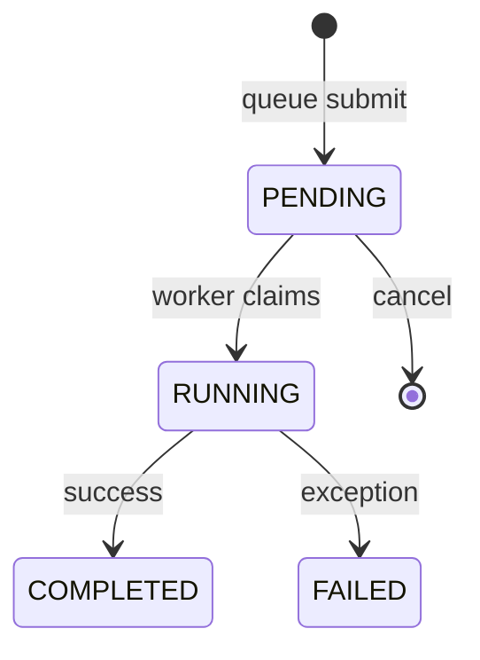

# Getting Started

## Installation

feaweld requires Python 3.10 or later. The core package installs with:

```bash
pip install feaweld
```

### Optional dependency groups

Heavy dependencies (FEniCSx, CalculiX bindings, PyVista, scikit-learn, emcee) are not pulled in by the base install. Pick the extras you need:

| Group | Install command | What it adds |
|-------|----------------|--------------|
| **viz** | `pip install feaweld[viz]` | PyVista 3D viewer, VTK, Matplotlib plots |
| **fenics** | `pip install feaweld[fenics]` | FEniCSx solver backend (system libs also required) |
| **calculix** | `pip install feaweld[calculix]` | CalculiX solver backend via pygccx |
| **ml** | `pip install feaweld[ml]` | Random Forest / XGBoost fatigue surrogates |
| **digital-twin** | `pip install feaweld[digital-twin]` | MQTT, OPC-UA, emcee Bayesian updating |
| **jax** | `pip install feaweld[jax]` | Differentiable JAX solver backend |
| **neural** | `pip install feaweld[neural]` | Neural operator surrogate (Flax DeepONet) |
| **docs** | `pip install feaweld[docs]` | MkDocs, mkdocstrings, asset generation |
| **dev** | `pip install feaweld[dev]` | pytest, ruff, mypy, pre-commit, hypothesis |
| **all** | `pip install feaweld[all]` | fenics + calculix + viz + ml + digital-twin |

For a full development setup:

```bash
python3 -m venv .venv && source .venv/bin/activate
pip install -e ".[all,dev]"
```

### Docker installation

You can also run feaweld inside Docker without any local Python setup:

```bash
# Build the production image
docker build --target prod -t feaweld .

# Run an analysis
docker compose run feaweld run examples/fillet_t_joint.yaml

# Start the full stack (feaweld + MQTT broker)
docker compose up -d
```

See the [Deployment guide](deployment.md) for details on multi-stage builds, docker-compose services, and FEniCSx images.

## Your First Analysis



### 1. Create a case YAML file

A case file defines geometry, material, loading, mesh, solver, and post-processing settings. Here is a minimal example for a fillet T-joint:

```yaml
name: fillet_t_joint
geometry:
  joint_type: fillet_t
  base_thickness: 10.0    # mm
  attachment_thickness: 8.0
  weld_throat: 5.0
  weld_angle: 45.0

material:
  base_metal: S355
  weld_metal: E70
  haz: S355_HAZ

load:
  axial_force: 25000.0    # N
  load_ratio: 0.1

mesh:
  global_size: 2.0        # mm
  weld_toe_size: 0.5
  element_order: 2
  element_type: quad

solver:
  solver_type: static
  backend: auto

postprocess:
  stress_method: hotspot

fatigue:
  code: IIW
  detail_category: 80
```

### 2. Validate the case

Before running, check that the YAML parses and all referenced materials and solvers are available:

```bash
feaweld validate my_joint.yaml
```

### 3. Run the analysis

```bash
feaweld run my_joint.yaml -o results/
```

This executes the full pipeline -- geometry construction, mesh generation, finite element solve, stress extraction, and fatigue assessment -- and writes an HTML report to the output directory.

### 4. Inspect results

The HTML report includes stress contour plots, fatigue life estimates, and a summary table. You can also visualize the raw VTK results interactively:

```bash
feaweld visualize results/stress.vtk --component von_mises --annotate
```

## Your First Parametric Study

A study sweeps one or more parameters over a range of values and runs each combination concurrently.

### 1. Create a study YAML file

```yaml
name: throat_sensitivity
base_case: my_joint.yaml
mode: grid

parameters:
  - name: geometry.weld_throat
    values: [3.0, 4.0, 5.0, 6.0, 8.0]
  - name: load.axial_force
    values: [15000, 25000, 35000]
```

### 2. Run the study

```bash
feaweld study run throat_study.yaml -j 4
```

The `-j` flag sets the number of parallel workers. Results include a comparison report showing how each parameter affects stress and fatigue life.

### 3. Quick single-parameter sensitivity

For a quick sweep of one parameter without writing a study file:

```bash
feaweld sensitivity my_joint.yaml --param load.axial_force --range 10000:50000:5
```

## Creating a Case YAML File

The case file maps directly to the `AnalysisCase` pydantic model in `feaweld.pipeline.workflow`. Every section is optional except `geometry` and `material` -- the pipeline fills in sensible defaults for the rest.

### Sections

- **`geometry`** -- joint type, plate dimensions, weld dimensions, groove profile
- **`material`** -- base metal, weld metal, and HAZ material names (looked up from bundled databases)
- **`load`** -- forces, moments, thermal loads, load ratio for fatigue
- **`mesh`** -- element sizes, order, type (tri/quad/tet/hex)
- **`solver`** -- backend selection (auto/fenics/calculix/jax/neural), analysis type (static/thermal/coupled)
- **`postprocess`** -- stress extraction method (hotspot, dong, nominal, blodgett, sed, linearization, notch_stress, multiaxial)
- **`fatigue`** -- design code (IIW/DNV/ASME), FAT detail category, S-N curve parameters
- **`probabilistic`** -- Monte Carlo sample count, LHS flag, distribution parameters
- **`defects`** -- enable stochastic defect populations (ISO 5817 levels B/C/D)

Use `feaweld materials` to list all bundled material names and `feaweld groove-types` to see available groove preparations.

## Logging Configuration

feaweld logs pipeline stages to stderr. Control verbosity and format with global CLI flags:

```bash
# Info-level logging (stage entry/exit)
feaweld -v run case.yaml

# Debug-level logging (material lookups, element counts)
feaweld -vv run case.yaml

# JSON output for container log aggregation
feaweld -v --log-format json run case.yaml

# systemd journal integration
feaweld -v --log-format journal run case.yaml
```

See the [Deployment guide](deployment.md#logging-configuration) for details on each format.

## Job Queue

For batch processing, submit cases to a persistent SQLite-backed queue and process them with a worker loop:



```bash
# Submit jobs with priorities (lower number = higher priority)
feaweld queue submit urgent_case.yaml -p 0
feaweld queue submit normal_case.yaml -p 5

# Check queue status
feaweld queue status
```

See the [Orchestration guide](orchestration.md#job-queue) for the full job queue API.
