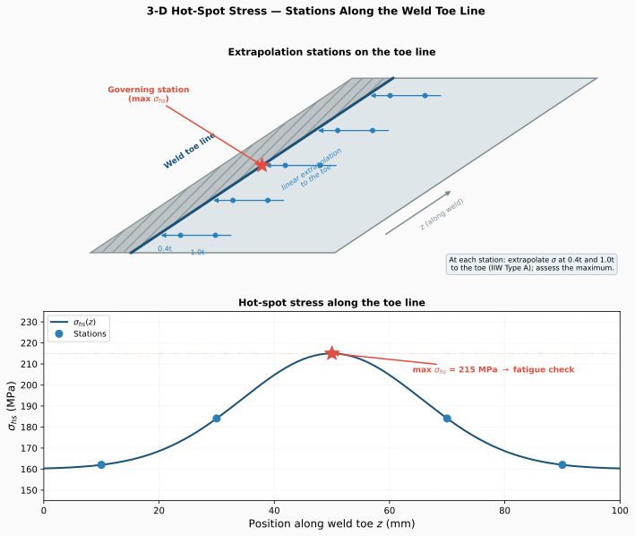

# 3D analysis

Every feaweld joint is, by default, a 2D cross-section in the XY plane — fast to
mesh, fast to solve, and sufficient whenever the stress state is uniform along
the weld. Setting `geometry.dimension: 3` extrudes that same section along Z
into a solid: the weld becomes a real line, the hot-spot method runs
**per station along each weld-toe line**, and end effects (weld starts/stops,
short attachments) become representable.


## Quasi-2D vs. 3D: what `dimension` and `length` mean

3D is an **explicit opt-in**. The default stays `dimension: 2`, and nothing
about a 2D case changes when you upgrade feaweld:

```yaml
geometry:
  joint_type: fillet_t
  dimension: 3          # 2 = cross-section model (default), 3 = extruded solid
  length: 40.0          # mm — extrusion depth, i.e. the weld length
```

| `dimension` | `length` means | Model |
|-------------|----------------|-------|
| `2` (default) | Nothing — a quasi-2D marker (existing cases carry `length: 1.0` harmlessly) | Planar section, TRI/QUAD elements |
| `3` | The true extrusion depth along Z, in mm | Extruded solid, TET elements |

Any other value fails validation (`geometry.dimension must be 2 or 3`).
`dimension` is passed through to the joint builders, so the same switch works
programmatically: `FilletTJoint(..., length=40.0, dimension=3)`.

!!! note "`length` alone does nothing"
    A large `length` with the default `dimension: 2` still builds a 2D section.
    Only `dimension: 3` activates the extrusion — deliberately, so that
    existing YAML cases (which already carry `length: 1.0`) keep their exact
    behavior.

## Geometry and meshing in 3D

All five joint types (`fillet_t`, `butt`, `lap`, `corner`, `cruciform`)
extrude: the fragmented 2D section is swept along +Z by `length`, and the butt
weld's groove parameters (`groove_angle`, `root_gap`, `penetration`) shape the
extruded groove exactly as they shape the 2D section.

The extrusion registers physical groups that arrive on the `FEMesh` as element
groups and node sets:

| Group | Kind | Contents |
|-------|------|----------|
| region names (`base_plate`, `web`, `weld_left`, …) | volume → element group | Same names as the 2D section regions |
| `bottom`, `top` | face → node set | The joint's 2D boundary edges swept over Z (`lap` and `corner` have no `top`) |
| `front`, `back` | face → node set | The section faces at z = 0 and z = `length` |
| `weld_toe_0` … `weld_toe_{n-1}` | edge → node set | One swept toe line per analytic toe point |
| `weld_toe` | edge → node set | All toe lines combined |

The per-toe sets drive the 3D hot-spot stations (below); the combined
`weld_toe` set keeps every 2D-era consumer working unchanged.

Meshing is **tet-only** in this release. `mesh.element_type_3d` defaults to
`"tet"`; `element_order: 1` produces TET4, `element_order: 2` produces TET10,
and `"hex"` raises `NotImplementedError` (`hex meshing not yet supported for
extruded joints; use 'tet'`). The mesh dimension is inferred from the joint —
an explicit `generate_mesh(..., dim=...)` that contradicts `joint.dimension`
raises `ValueError`.

Weld-toe refinement follows the toe **lines**, not just the section's toe
points: each swept toe segment becomes a Gmsh `Distance` field sampled finely
enough to resolve `weld_toe_size` along its whole length, transitioning to
`global_size` over `refinement_distance`. So the refinement band is a tube
around each toe line, which is exactly where the hot-spot stations sample.

```yaml
mesh:
  global_size: 8.0          # mm — background size
  weld_toe_size: 2.0        # mm — size inside the toe-line refinement band
  refinement_distance: 5.0  # mm — band width (omit for the default)
  element_order: 1          # 1 = TET4, 2 = TET10
  element_type_3d: tet      # tet only; hex raises NotImplementedError
```

## Mesh sizing: 3D costs are cubic

Do **not** reuse 2D mesh sizes in 3D. The 2D defaults (`global_size: 2.0`,
`weld_toe_size: 0.2`) are excellent for a planar section but explode into
hundreds of thousands of tetrahedra on even a short extrusion — element count
scales with the cube of refinement in 3D, not the square. `run_analysis()`
warns about the two classic mistakes:

- **Toe size too fine** — if `weld_toe_size < base_thickness / 20`, the run
  warns that it is *"finer than base_thickness/20 in a 3D model; expect
  O(10^5+) tetrahedra. For hot-spot work a toe size of ~0.2\*t is usually
  sufficient."*
- **Extrusion too thin** — if `length < 2 × global_size`, the run warns that
  *"the extruded solid is a sliver with barely one element through the weld
  direction"* — either shorten `global_size` or model the joint in 2D.

Good starting values, proven fast in the test suite and the shipped example:

| Field | 2D default | 3D starting point |
|-------|-----------|-------------------|
| `global_size` | 2.0 | 8–10 mm |
| `weld_toe_size` | 0.2 | ≈ 0.2·t (2–2.5 mm for a 20 mm plate) |
| `refinement_distance` | 5.0 | 5–8 mm |
| `element_order` | 2 | 1 (TET4 — required by FEniCS in 3D) |

The shipped `examples/fillet_t_joint_3d.yaml` (100 × 20 mm base plate,
40 mm weld length, `global_size: 8`, `weld_toe_size: 2`) meshes to ~2 300 TET4
elements in well under a second. The hot-spot method extrapolates from 0.4·t
and 1.0·t — resolving far below ~0.2·t at the toe buys nothing for a hot-spot
assessment, it only inflates the solve.

## Solver support in 3D

| Backend | 3D elements | Status |
|---------|-------------|--------|
| FEniCSx | TET4 (`element_order: 1`) | Fully supported — the solve path is dimension-agnostic |
| FEniCSx | TET10 (`element_order: 2`) | `NotImplementedError` — gmsh/basix mid-node ordering unverified; *"use element_order=1 or the CalculiX backend"* |
| CalculiX | C3D4 (TET4) | `.inp` deck generation supported |
| CalculiX | C3D10 (TET10) | `.inp` deck generation supported, with the gmsh → ccx mid-edge node permutation applied |

Gmsh and CalculiX disagree on TET10 mid-edge node order (positions 8 and 9
swap), so the CalculiX writer permutes the connectivity when writing
`*ELEMENT, TYPE=C3D10` cards. The permutation is pinned by a text-level test
of the generated deck.

!!! warning "CalculiX 3D decks are not yet numerically validated"
    The C3D4/C3D10 deck generation is exercised at the text level, but no
    result comparison against a live `ccx` run has been performed yet. Treat
    3D CalculiX results as unvalidated until you have cross-checked a case of
    your own; the FEniCSx TET4 path is the recommended 3D solve.

## Hot spot along the weld toe line

In 2D there is one weld toe per section point. In 3D each toe sweeps into a
**line**, and the hot-spot method runs at every mesh node of that line — the
stations:



Per `weld_toe_{i}` line, the workflow:

1. orders the line's nodes spatially along the toe (principal-axis
   projection),
2. takes the plate thickness *of the plate that toe lies on* — a toe on the
   base-plate surface uses `base_thickness`, a toe on the web face uses
   `web_thickness` — and the outward plate-surface normal from the joint,
3. extrapolates the surface stress at each station: 0.4·t and 1.0·t reference
   points for `hotspot_linear` (σ_hs = 1.67·σ(0.4t) − 0.67·σ(1.0t)), three
   points for `hotspot_quadratic`,
4. reports the **maximum over all lines and stations**.

The result dict gains two 3D-only keys alongside the usual `results` /
`max_stress`:

```python
result.postprocess_results["hotspot_linear"]
# {"results": [...],            # every station on every line
#  "max_stress": 187.4,
#  "critical_line": "weld_toe_0",   # the governing toe line
#  "n_stations": 42}                # total stations evaluated
```

Each station carries a `well_resolved` flag: when the mesh is too coarse for
the 0.4·t / 1.0·t reference points to land on distinct nearby nodes, the flag
drops and the run warns, e.g. *"hotspot_linear: 3/14 station(s) on
'weld_toe_1' not well resolved (mesh too coarse for surface extrapolation at
the toe)"*. If you see that warning, reduce `weld_toe_size` toward 0.2·t —
the extrapolation, not the peak, needs the resolution.

The single-point methods (`linearization`, `nominal`, `notch_stress`,
`strain_energy_density`) evaluate at the **critical station**: the
highest-von-Mises toe node over every line, whose line supplies the plate
thickness and surface normal.

## Method support in 3D

| Stress method | 3D | Notes |
|---------------|----|-------|
| `hotspot_linear` / `hotspot_quadratic` | ✓ | Per-station along each toe line, max over stations |
| `linearization` | ✓ | Through-thickness at the critical station |
| `nominal` | ✓ | ASME categorization at the critical station |
| `notch_stress` | ✓ | Parametric SCF × structural stress; the *fictitiously-rounded FE model* (`create_notched_model`) is 2D-only |
| `strain_energy_density` | ✓ | Control volume centred at the critical toe node |
| `blodgett` | ✓ | Hand calculation — never touches the mesh |
| `structural_dong` | ✗ | Raises *"structural_dong currently supports 2D cross-section models only"* — recorded in `result.errors`, other methods unaffected |

The **singularity check** (coarse re-solve comparison) re-meshes and compares
2D sections, so it auto-skips in 3D with the warning *"singularity check is
2D-only; skipped for dimension == 3."* — leaving `singularity_check: true` in
a 3D case is harmless.

## Loads and boundary conditions in 3D

The `load:` block needs no changes: the same named sets exist, they are just
faces now.

- The `bottom` face node set is fixed; `axial_force` (+Y) and `shear_force`
  (+X) are split evenly over the `top` face node set, and `bending_moment`
  becomes a self-equilibrating nodal couple — exact totals regardless of node
  count, exactly as in 2D.
- `lap` and `corner` joints register no `top` group (in 2D or 3D), so
  force-type loads — which target `top` — are skipped for them; drive those
  joints with `pressure` or a custom `LoadCase`.
- `pressure` remains approximate: the FEniCSx backend integrates it over the
  *entire* exterior boundary, and the CalculiX writer emits `*DLOAD` without
  the element-face labels (`P1..P6`) that solid elements require, with a
  warning. Prefer nodal forces for quantitative 3D work.
- With `thermal.enabled: true`, the Goldak heat source starts at the minimum-z
  end of the first weld-toe line and travels along +Z — the torch runs down
  the real weld instead of the 2D section's +X convention.

The `front`/`back` node sets are registered for your own programmatic
constraints (e.g. symmetry at z = 0), though the built-in `load:` block does
not use them.

## Visualization

Nothing new to learn: the PyVista functions (`plot_stress_field`,
`plot_deformed`, `plot_stress_with_clipping`, …) accept the extruded-joint
`FEMesh` unchanged — they were always 3D renderers, previously fed quasi-2D
sections. `feaweld visualize results.vtu --clip 0,0,1` — `--clip` takes the
clipping-plane normal, here cutting a cross-section normal to the weld
direction — is the quickest way to look inside a solid mesh. See the
[Visualization guide](visualization.md).

## Worked example: `examples/fillet_t_joint_3d.yaml`

The shipped example is the 2D quickstart joint gone 3D — a fillet T-joint with
a 40 mm weld length under 50 kN axial tension:

```yaml
geometry:
  joint_type: fillet_t
  dimension: 3             # the explicit 3D opt-in
  base_width: 100.0
  base_thickness: 20.0
  web_height: 50.0
  web_thickness: 10.0
  weld_leg_size: 8.0
  length: 40.0             # extrusion depth = weld length
mesh:
  global_size: 8.0         # coarse 3D sizes: ~2 300 TET4, meshes in ~0.1 s
  weld_toe_size: 2.0       # 0.1·t — comfortably inside the ~0.2·t guidance
  element_order: 1         # TET4, required by the FEniCS backend in 3D
load:
  axial_force: 50000.0
fatigue:
  r_ratio: 0.1             # composes with 3D: the spectrum assessment scales
  cycles: 2.0e6            # the per-station hot-spot maximum
postprocess:
  stress_methods: [hotspot_linear, linearization, nominal]
  sn_curve: IIW_FAT90
```

```bash
feaweld run examples/fillet_t_joint_3d.yaml
```

The run produces four toe lines (`weld_toe_0` … `weld_toe_3` — two toes per
fillet on the base plate, two on the web), hot-spot stations along each, and a
`critical_line` telling you which toe governs. The `fatigue:` block then
assesses the R = 0.1 cycling of that governing hot-spot stress against IIW
FAT90 with the Miner machinery from the
[fatigue assessment guide](fatigue_assessment.md) — 3D stress extraction and
spectrum fatigue compose with no extra configuration.

## See also

- [Solvers](solvers.md) — backend selection and the 3D element support table.
- [Fatigue assessment](fatigue_assessment.md) — the `fatigue:` block the 3D
  hot-spot maximum feeds into.
- [Loads & boundary conditions](loads_and_bcs.md) — how the `load:` block is
  applied to the named node sets.
- [Visualization](visualization.md) — rendering solid meshes and clipped
  sections.
