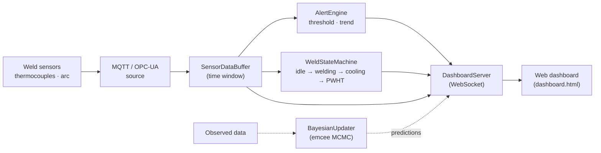

# Digital twin

The digital-twin package streams live weld-sensor data into a monitoring dashboard
and uses observed data to Bayesian-update model parameters. It has two independent
entry points: a live **dashboard** (`feaweld twin dashboard`) and a batch
**Bayesian update** (`feaweld twin update`).

!!! note "Install the digital-twin extra"
    These commands need `websockets`, `emcee`, and optionally `paho-mqtt` /
    `asyncua`: `pip install -e ".[digital-twin]"`.

## Architecture



Sensor readings arrive over MQTT or OPC-UA, land in a time-windowed
`SensorDataBuffer`, and drive an `AlertEngine` (threshold and rate-of-change rules)
and a `WeldStateMachine` (idle → welding → cooling → PWHT → monitoring). The
`DashboardServer` broadcasts buffer, alert, and state updates over a WebSocket to
the browser UI. Separately, `BayesianUpdater` refines model parameters from
observations and can feed remaining-life predictions to the same dashboard.

## Live dashboard

```bash
feaweld twin dashboard --demo
```

`--demo` streams a synthetic weld lifecycle so you can see the dashboard without
real hardware. The command prints the URLs and blocks until Ctrl-C:

```
Dashboard: http://localhost:8766/dashboard.html (WebSocket ws://localhost:8765)
Demo mode: streaming synthetic weld sensor data. Ctrl-C to stop.
```

| Option | Default | Meaning |
|--------|---------|---------|
| `--host` | `localhost` | WebSocket host |
| `--port` | `8765` | WebSocket port |
| `--http-port` | `8766` | HTTP port for the web UI |
| `--demo` | off | Feed synthetic sensor data |
| `--open/--no-open` | `--open` | Open the dashboard in a browser |

The page reads two URL query parameters:

- `?ws=ws://host:port` — the WebSocket URL to connect to (the launcher sets this
  automatically when it opens the browser).
- `?demo=1` — run a client-side demo without a server.

So to point the shipped UI at a remote twin you would open
`http://localhost:8766/dashboard.html?ws=ws://plant-host:8765`.

## WebSocket message schema

The server broadcasts JSON messages distinguished by a `type` field. The browser
dispatches on `type` and updates the matching panel:

| `type` | Fields | Meaning |
|--------|--------|---------|
| `state` | `state`, `timestamp` | Current `WeldLifecycleState` value (`idle`, `welding`, `cooling`, `pwht`, `monitoring`, `alert`) |
| `sensor` | `sensor_id`, `channel`, `value`, `timestamp` | One sensor reading; `value` is a float (or a list if the reading was an array) |
| `alert` | `severity`, `alert_type`, `message`, `timestamp` | An alert: `severity` ∈ info/warning/critical, `alert_type` ∈ threshold/trend/anomaly |
| `predictions` | `data`, `timestamp` | A dict of named prediction values (e.g. remaining life), rendered as tiles |

The client also sends `{"type": "get_state"}` and `{"type": "get_predictions"}`
commands to poll the current state and predictions.

## Bayesian model updating

`feaweld twin update` runs an emcee MCMC to update parameter posteriors from
observed data:

```bash
feaweld twin update --priors priors.yaml --data observations.csv --walkers 16 --steps 200 --burnin 50
```

```
Running MCMC: 16 walkers x 200 steps (12 observations)

Posterior summary:
            weld_toe_radius = 0.94 +/- 0.11
               yield_strength = 268.4 +/- 9.2
  max R-hat = 1.04 (converged)
```

| Option | Default | Meaning |
|--------|---------|---------|
| `--priors` | required | YAML list of prior specs |
| `--data` | required | CSV of observations |
| `--walkers` | `16` | MCMC walkers |
| `--steps` | `200` | MCMC steps |
| `--burnin` | `50` | Burn-in steps discarded |

### Priors YAML format

A list of prior specs. Each has a `name`, a `distribution`
(`normal`, `lognormal`, or `uniform`), and its `params`. Normal and lognormal take
`mean` / `std`; uniform takes `low` / `high`:

```yaml
- name: weld_toe_radius
  distribution: lognormal
  params: {mean: 1.0, std: 0.4}
- name: yield_strength
  distribution: normal
  params: {mean: 275.0, std: 15.0}
```

### Observations CSV format

A headed CSV with a `value` column and an optional `noise_std` column (the
measurement noise standard deviation; defaults to 0.05 if absent):

```csv
value,noise_std
0.91,0.05
0.97,0.05
1.02,0.05
```

The command's built-in forward model predicts each observation as the mean of the
sampled parameters — suitable for direct parameter observation. For a custom
physics forward model, use the Python API
(`feaweld.digital_twin.bayesian.BayesianUpdater`), which returns a
`PosteriorSummary` with `means`, `stds`, `medians`, `ci_95`, `r_hat`, and the full
MCMC `samples`.

## Python API

```python
from feaweld.digital_twin.bayesian import BayesianUpdater, PriorSpec, ObservedData
import numpy as np

priors = [PriorSpec("toe_radius", "lognormal", {"mean": 1.0, "std": 0.4})]
updater = BayesianUpdater(priors, forward_model, n_walkers=16, n_steps=200, n_burnin=50)
summary = updater.update(ObservedData(
    measurement_type="parameter",
    positions=np.zeros((3, 3)),
    values=np.array([0.91, 0.97, 1.02]),
    uncertainty=0.05,
))
print(summary.means, summary.r_hat)
```

The shipped example `examples/digital_twin_update.py` demonstrates the full update
workflow with a physical forward model.

## See also

- [API reference](../api/digital_twin.md) — full `digital_twin` package docs.
- [Probabilistic & reliability](probabilistic.md) — the priors mirror the
  probabilistic random variables.
