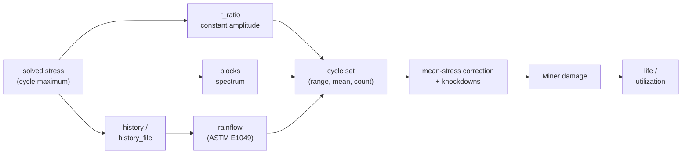
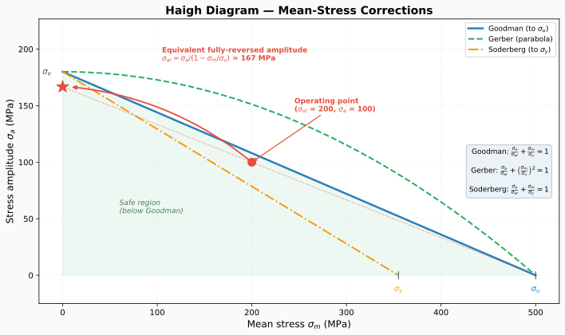
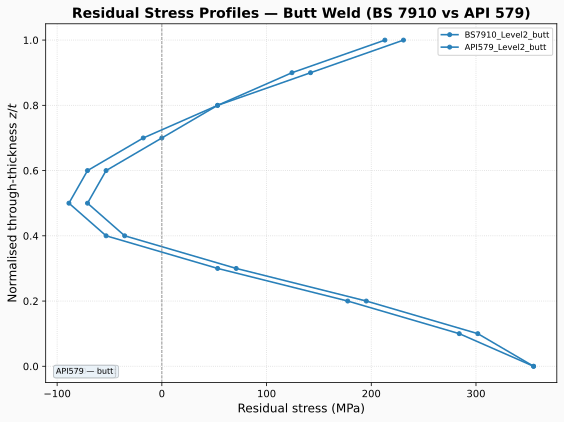
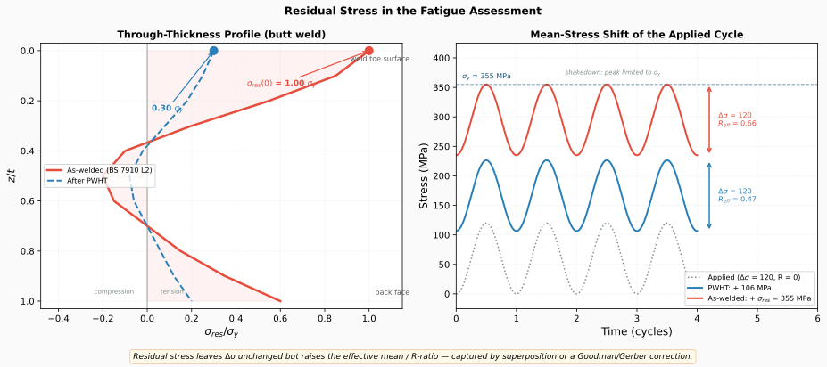

# Fatigue assessment

feaweld's fatigue stage turns the stress each post-processing method extracts into
a life prediction. With no cyclic-loading definition it reads a single stress range
off an S-N curve (the classic one-shot check). With a `fatigue:` block on the case
it becomes a full **spectrum assessment**: rainflow counting, Palmgren-Miner damage
summation, mean-stress correction, strength knockdowns, and residual-stress
handling — per stress method, against any of six S-N standards.

## The fatigue chain



The key idea is **linear-elastic scaling**: the static case you solve represents
the *maximum load* of the cycle, and each method's extracted stress (`max_stress`)
is the reference stress at that maximum. Cyclic definitions live in *factor space*
— fractions of that reference — and are scaled per method before assessment, so
one solve serves every stress method. Absolute definitions (MPa) skip the scaling.


!!! warning "One global scale factor"
    All load components scale together: a spectrum factor of 0.5 halves the axial
    force *and* the bending moment simultaneously. Independently-varying load
    components (e.g. constant pressure plus cyclic bending) are not representable
    — solve the governing combination as the maximum, or use absolute stress
    definitions from a separate analysis.

## Constant-amplitude assessment (no `fatigue:` block)

Without a cyclic definition the fatigue stage keeps its legacy single-evaluation
behavior: each method's `max_stress` is treated as the stress range and read off
the case S-N curve once,

```yaml
postprocess:
  sn_curve: IIW_FAT90
  fatigue_assessment: true
```

producing `{stress_range, life}` per method. Methods that mandate their own curve
override the named one:

| Method | Mandated curve |
|--------|----------------|
| `notch_stress` | IIW FAT225 (effective notch) |
| `structural_dong` | ASME master S-N curve (Dong), m = 3.13 |
| `strain_energy_density` | SED power law (Lazzarin), when `sed_w_ref` is set |

These methods return their own `fatigue_life`, and the assessment reports it with
the mandated curve name instead of recomputing on `sn_curve`.

The mandated curves are honored under a spectrum too: the effective-notch cycles
are assessed against FAT225 with the full corrections, while Dong and SED — whose
codes mandate a single-slope life law as-is — get an exact power-law spectrum
life with no mean-stress correction or knockdowns, flagged
`corrections_applied: false` in the results.

## Cyclic loading: the `fatigue:` block

A top-level `fatigue:` block on the analysis case defines the cyclic loading and
the corrections. Exactly **one cyclic style** may be given — `r_ratio`, `blocks`,
`history`, or `history_file` — mixing styles is rejected at validation:

```yaml
fatigue:
  r_ratio: 0.1             # constant amplitude: R = sigma_min / sigma_max
  cycles: 2.0e6            # design cycle count
  mean_stress_correction: none
  thickness_correction: true
```

| Field | Default | Meaning |
|-------|---------|---------|
| `r_ratio` | `null` | Stress ratio $R = \sigma_{min}/\sigma_{max}$ (< 1). One factor-space cycle with range $1-R$ and mean $(1+R)/2$ |
| `cycles` | `null` | Cycle count for the `r_ratio` style; when set, each method's `damage` is also reported as `utilization` |
| `blocks` | `[]` | Spectrum blocks (table below) |
| `history` | `[]` | Inline load signal, rainflow-counted |
| `history_file` | `null` | Signal file, rainflow-counted; relative paths resolve against the YAML file's directory |
| `history_units` | `load_factor` | `load_factor` (fractions of the reference stress) or `stress` (absolute MPa); applies to `history`/`history_file` |
| `mean_stress_correction` | `none` | `none`, `goodman`, or `gerber` |
| `thickness_correction` | `true` | IIW plate-thickness factor $f(t) = (25/t)^n$ for $t > 25$ mm |
| `thickness_exponent` | `0.3` | Exponent $n$ of $f(t)$ (0.1–0.3 depending on detail) |
| `surface_roughness` | `null` | $R_a$ in µm; enables the Marin surface factor (needs $\sigma_u$) |
| `environment` | `air` | `air` (1.0), `corrosive` (0.6), or `seawater` (0.4) knockdown |
| `residual_stress` | inactive | Residual-stress source (section below) |

The thickness, surface, and environment factors multiply into one strength factor
`k_total`; the effective stress range of every cycle is divided by it before the
damage summation, so a factor below 1 shortens life. Goodman/Gerber and the
surface factor need ultimate-strength data on the base metal — a material without
$\sigma_u$ raises an error.

### Spectrum blocks

Each `blocks` entry is one constant-amplitude block, in **either** factor space
**or** absolute space — mixing the two styles within a block, or across blocks,
is rejected:

```yaml
fatigue:
  blocks:
    - {range_factor: 1.0, cycles: 1000}            # full range of the solved max
    - {range_factor: 0.5, mean_factor: 0.25, cycles: 1.0e5}
```

| Field | Default | Meaning |
|-------|---------|---------|
| `range_factor` | — | Stress range as a fraction of the reference stress |
| `stress_range` | — | Stress range in MPa (absolute style) |
| `mean_factor` | `0.0` | Mean stress as a fraction of the reference stress |
| `mean_stress` | `0.0` | Mean stress in MPa (absolute style) |
| `cycles` | `1.0` | Cycle count of the block |

Every block needs `range_factor` or `stress_range`.

### Load histories

`history` (inline list) and `history_file` provide a raw load signal that is
rainflow-counted into the cycle set. The file loader accepts comma- **or**
whitespace-delimited text, skips `#` comment lines, and takes the first column of
multi-column files:

```yaml
fatigue:
  history_file: load_history.csv
  history_units: stress        # values are MPa; omit for load factors
```

With `history_units: load_factor` (the default) the signal values are fractions
of each method's reference stress — `1.0` means "the solved maximum". With
`stress` they are absolute MPa and are assessed as-is, unscaled.

!!! note "The load block defines the cycle maximum"
    With a factor-space definition (`r_ratio`, `range_factor` blocks, or a
    `load_factor` history), the `load:` block magnitudes are the **maxima of the
    cycle**, not static loads — the solve at that maximum provides the reference
    stress that factors multiply.

## Rainflow counting and Miner summation

Histories are cycle-counted with the ASTM E1049 rainflow algorithm
(`feaweld.fatigue.rainflow`), producing `(range, mean, count)` triples —
unmatched reversals count as half cycles. Damage is then the Palmgren-Miner sum

$$D = \sum_i \frac{n_i}{N_i}$$

per repeat of the cycle set; cycles below the curve's cutoff contribute zero.
Each method's entry reports `damage`, `life_repeats` ($1/D$), `life` (in cycles),
and an `equivalent_stress_range` — the Miner-equivalent constant-amplitude range
at the curve's first-segment slope.

The governing (highest-damage) method's MPa-scaled cycles are stashed into
`postprocess_results["rainflow"]`, which automatically lights up the rainflow
range–mean matrix and damage-map report figures and feeds
[`feaweld animate`](../reference/cli.md#animate).

## Mean-stress corrections

`mean_stress_correction` converts each cycle's (amplitude, mean) pair into an
equivalent fully-reversed amplitude before the S-N lookup:

- **Goodman** (linear): $S_{eq} = S_a / (1 - \sigma_m/\sigma_u)$ — conservative,
  the usual choice for welded steel. Compressive means take no credit.
- **Gerber** (parabolic): $S_{eq} = S_a / (1 - (\sigma_m/\sigma_u)^2)$ — less
  conservative, better for ductile materials under moderate means.



The default is `none` — deliberately. Design S-N curves for welded joints (IIW,
EC3, BS 7608 …) already assume high tensile residual stress at the weld, which is
why they show little R-ratio sensitivity: the mean-stress effect is baked in.
Apply Goodman/Gerber only when that assumption does not hold — stress-relieved
(PWHT) joints, or base-metal details away from the weld.

!!! warning "Double-counting the residual mean"
    Combining `mean_stress_correction: goodman` (or `gerber`) with
    `residual_stress: {as_welded: true}` penalizes the life twice: the design
    curve already embeds yield-magnitude residuals, and the correction adds them
    again. `run_analysis()` emits a warning for this combination. The sound
    pairing is Goodman **plus a PWHT-relaxed residual** (see below).

A cycle whose corrected amplitude diverges (mean at or above $\sigma_u$) implies
static failure — the damage is reported as infinite.

## Residual stress

The `fatigue.residual_stress` block introduces welding residual stress into the
assessment. At most one source may be given:

```yaml
fatigue:
  residual_stress:
    profile: BS7910_Level2_butt   # a bundled through-thickness profile
    # value: 120.0                # ... or a direct surface value (MPa)
    # as_welded: true             # ... or yield-magnitude tensile residual
    superimpose: false
```

| Field | Default | Meaning |
|-------|---------|---------|
| `profile` | `null` | Named through-thickness profile; its **surface value** (scaled by $\sigma_y$ at the case temperature) becomes the residual stress |
| `value` | `null` | Direct surface residual stress in MPa |
| `as_welded` | `false` | Shorthand for $\sigma_{res} = \sigma_y$ |
| `superimpose` | `false` | Additionally add the residual **field** to the *saved* stress values (after post-processing and fatigue); the assessment treats the residual as a mean stress either way |

The 19 bundled profiles come from BS 7910, API 579, R6, FITNET, and DNV-RP-C203
(e.g. `BS7910_Level2_butt`, `API579_Level2_fillet`, `R6_upper_bound`,
`PWHT_butt`); list them with
`python -c "from feaweld.data.residual_stress import list_residual_profiles; print([p.name for p in list_residual_profiles()])"`.



**Two integration modes:**

In **both** modes the assessment treats the resolved (possibly PWHT-relaxed)
surface value as a **residual mean stress**, added to every cycle mean before
the Goodman/Gerber correction — a static residual can shift the effective
R-ratio of a cycle, but it can never contribute to the stress *range*, so it
never enters any method's reference stress. With
`mean_stress_correction: none` the residual does not enter the assessment at
all, and `run_analysis()` warns that the configuration is inert (or, with
`superimpose: true`, that only the saved field is affected). `superimpose`
controls what happens to the **saved stress field**:

- `superimpose: false` (default) — the solved stress field is left untouched;
  the residual acts only as the mean stress described above.
- `superimpose: true` — the residual **field** is added to the saved stress
  values *after* post-processing and the fatigue assessment (a profile maps
  through the welded plate's thickness, anchored at the plate surface — nodes
  outside the plate, such as an attachment web, get zero; a direct value
  applies uniformly to $\sigma_{yy}$). The superimposed field reaches the
  saved results, VTK export, and the report's field figures only. The
  pre-superposition peak is kept as
  `metadata["residual_stress"]["load_only_max_von_mises"]`, and the profile
  anchor as `metadata["residual_stress"]["field_surface_coordinate"]`.

!!! note "Static-strength checks see the load-only field"
    Because superposition happens after post-processing, every stress method
    — including the `nominal` method's ASME allowable checks and
    `linearization` — evaluates the **load-only** field: a superimposed
    residual is not reflected in static-strength margins. This is a known
    limitation of the superimpose mode.



**PWHT interplay:** with `thermal.pwht_enabled: true` and a configured residual
stress (and no welding thermal pass), the PWHT relaxation applies to the
*residual* stress rather than the solved load field: a Norton-Bailey probe
computes a relaxation factor (recorded as
`metadata["pwht_residual_relaxation"]`), and the fatigue assessment consumes the
relaxed value. See the [PWHT guide](pwht.md#residual-stress-in-the-fatigue-assessment).

## S-N standards

`postprocess.sn_curve` accepts a `<standard>_<name>` spec parsed by
`parse_sn_spec()` (a bare `FAT90` or `90` means IIW):

| Standard | Spec example | Names | Shape |
|----------|--------------|-------|-------|
| IIW | `IIW_FAT90` | FAT 36–160 (14 classes) | m = 3, knee at 10⁷ to m = 5, cutoff 10⁸ |
| DNV-RP-C203 | `DNV_D` | B1, B2, C, C1, C2, D, E, F, F1, F3, G, W1, W2, W3 | m = 3 / m = 5, knee 10⁷, cutoff 10⁸ |
| ASME VIII Div 2 | `ASME_ferritic` | `ferritic`, `austenitic` | m = 3.13 / m = 5 (structural stress basis) |
| EN 1993-1-9 (EC3) | `EC3_90` | Detail categories 36–160 | m = 3 to CAFL at 5·10⁶, m = 5 to cutoff 10⁸ |
| BS 7608 | `BS7608_F2` | Classes B, C, D, E, F, F2, G, W1 | Design = mean − 2 SD; Haibach m + 2 knee at 10⁷ |
| AWS D1.1 | `AWS_C` | Categories A, B, B′, C, D, E, E′ | Single slope m = 3 with threshold F_TH (infinite life below) |


Run `feaweld fatigue --list-curves` for the same list from the CLI. The primed
AWS categories are also accepted as `BP` / `EP`; BS 7608 mean curves are
available programmatically via `bs7608_curve(cls, mean_curve=True)`.

## Weld joint efficiency

For the `nominal` method's ASME allowable checks, `postprocess.weld_efficiency`
introduces the code joint-efficiency factor $E$ — either a table lookup or a
direct value (not both):

```yaml
postprocess:
  stress_methods: [nominal]
  weld_efficiency:
    standard: ASME_VIII_Div1     # ASME_VIII_Div1 | AWS_D1.1 | EN_13445
    joint_type: Type_1           # e.g. Type_1..Type_6, CJP, PJP, Butt_full_pen
    examination: Spot_RT         # e.g. Full_RT, Spot_RT, None, Visual
    # value: 0.85                # ... or bypass the table
```

The resolved efficiency scales **all four allowable limits** of the ASME check
($E \cdot S_m$, $E \cdot 1.5 S_m$, …) — an efficiency of 0.85 tightens every
margin by 15 % — and is echoed as `weld_efficiency` in the nominal method's
results. The bundled table covers 25 combinations from ASME VIII Div 1
(joint Types 1–6 × RT level), AWS D1.1 (CJP/PJP/fillet), and EN 13445.

## The standalone CLI: `feaweld fatigue`

The whole assessment engine is available without any FEA — like `blodgett`, it is
a pure computation:

```bash
feaweld fatigue --stress-range 120 -n 2e6 -c EC3_90
```

```
S-N curve: EC3 detail category 90 (EC3_90)

Constant-amplitude loading:
  stress range = 120.00 MPa
  mean stress  = 0.00 MPa
  cycles       = 2e+06

Assessment:
  equivalent stress range = 120.00 MPa
  damage                  = 2.3704e+00
  life                    = 8.438e+05 cycles
```

(Hand check: $N = 90^3 \cdot 2\times10^6 / 120^3 = 843\,750$; the damage
$2\times10^6/843\,750 = 2.37$ says this detail fails the 2-million-cycle design
by a factor of 2.4.)

Key options: `--curve/-c` (any spec above), `--history` for a CSV to
rainflow-count (`--column` picks the column), `--stress-range`/`-n`/`--r-ratio`
for constant amplitude, `--mean-correction` + `--sigma-u`, `--thickness`,
`--roughness`, `--environment`, and `--residual-profile` + `--sigma-y`. See the
[CLI reference](../reference/cli.md#fatigue).

## Worked example: `examples/spectrum_fatigue.yaml`

The shipped example assesses a PWHT'd butt weld under the 200-point
variable-amplitude history in `examples/load_history.csv`:

```yaml
geometry:
  joint_type: butt
  base_width: 200.0
  base_thickness: 20.0
  groove_angle: 60.0           # butt-weld groove parameters
  root_gap: 2.0
load:
  axial_force: 640000.0        # the 160 MPa history peak over 200 x 20 mm
fatigue:
  history_file: load_history.csv
  history_units: stress        # the history is already in MPa
  mean_stress_correction: goodman
  residual_stress:
    profile: PWHT_butt         # 0.3 sigma_y at the surface — relaxed residual
postprocess:
  stress_methods: [hotspot_linear, nominal]
  sn_curve: EC3_90
```

The choices tie the sections above together: an *absolute* history (no factor
scaling), Goodman correction — justified because the `PWHT_butt` profile models a
stress-relieved joint (0.3 σ_y ≈ 106 MPa residual mean) rather than as-welded
yield-magnitude residuals — and the EC3 category 90 curve for a transverse butt
weld. Run it with `feaweld run examples/spectrum_fatigue.yaml`, or sanity-check
the spectrum without any FEA:

```bash
feaweld fatigue --history examples/load_history.csv -c EC3_90 \
    --mean-correction goodman --sigma-u 490 \
    --residual-profile PWHT_butt --sigma-y 355
```

```
S-N curve: EC3 detail category 90 (EC3_90)

Rainflow counting (examples/load_history.csv, column 0):
  cycles counted = 95 (102 distinct)

Corrections:
  residual mean      = 106.5 MPa  (PWHT_butt at surface)
  mean correction    = goodman (sigma_u = 490 MPa)

Assessment:
  equivalent stress range = 161.43 MPa
  life                    = 3.469e+05 cycles
  spectrum repeats        = 3.652e+03
```

The 200-point history survives ~3 650 repeats — if one repeat represents a day of
service, that is a ten-year life. In the full `feaweld run`, the same numbers
appear per stress method in `fatigue_results`, together with the `loading` and
`corrections` sub-dicts and the automatic rainflow/damage-map report figures.

## See also

- [Loads & boundary conditions](loads_and_bcs.md) — how the `load:` block (the
  cycle maximum) is applied to the model.
- [PWHT](pwht.md) — the relaxation model behind the residual-stress interplay.
- [Probabilistic & reliability](probabilistic.md) — treating fatigue inputs as
  random variables.
