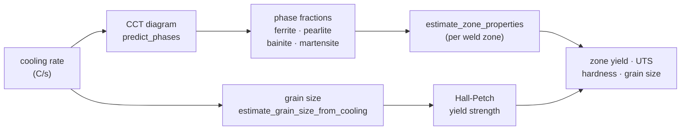
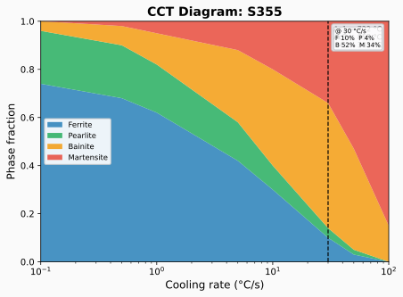
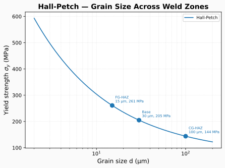

# Multiscale modeling

The heat of welding changes the microstructure across the weld and heat-affected
zone, and that microstructure sets the local mechanical properties. feaweld bridges
these scales in three steps: a CCT diagram predicts the **phase fractions** from the
cooling rate, a mixture rule turns phases into **zone properties**, and Hall-Petch
relates **grain size** to yield strength.



## Phases from cooling rate

A continuous-cooling-transformation (CCT) diagram maps the cooling rate through the
transformation range onto the resulting phase composition — ferrite, pearlite,
bainite, and martensite fractions. Faster cooling suppresses the diffusional phases
and favours bainite and martensite (harder, more crack-sensitive). feaweld ships
CCT data for 20 steel grades; look them up with `get_cct_diagram(grade)` and call
`predict_phases(cooling_rate)`.



## Grain size and Hall-Petch

Grain size follows from the cooling rate
(`estimate_grain_size_from_cooling`), and the Hall-Petch relation converts grain
size $d$ into a yield strength:

$$\sigma_y = \sigma_0 + k_y\, d^{-1/2}$$

with $\sigma_0$ the friction stress and $k_y$ the Hall-Petch slope. The bundled
`HALL_PETCH_LOW_CARBON_STEEL` constant provides typical low-carbon-steel
parameters; several other calibrations (`HALL_PETCH_MILD_STEEL`,
`HALL_PETCH_304_STAINLESS`, …) live in `multiscale/micro.py`.

## Zone properties

Each weld zone has a distinct thermal history, hence distinct phases and grain
size. The `WeldZone` enum names the five zones:

| `WeldZone` | Value | Region |
|------------|-------|--------|
| `WELD_METAL` | `weld_metal` | Deposited filler |
| `COARSE_GRAIN_HAZ` | `cg_haz` | Coarse-grained HAZ (nearest the fusion line) |
| `FINE_GRAIN_HAZ` | `fg_haz` | Fine-grained HAZ |
| `INTERCRITICAL_HAZ` | `ic_haz` | Partially transformed HAZ |
| `BASE_METAL` | `base_metal` | Unaffected parent metal |

`estimate_zone_properties(zone, phases, base_yield, base_uts)` returns a
`MesoZoneProperties` with `yield_strength`, `ultimate_strength`, `hardness_hv`, and
`grain_size_um`, combining the phase mixture with the zone's characteristic grain
size.

## The `feaweld multiscale` command

```bash
feaweld multiscale --grade A36 --cooling-rate 30 --base-yield 250 --base-uts 400
```

```
CCT phase prediction for A36 at 30.0 C/s:
  ferrite    = 0.412
  pearlite   = 0.233
  bainite    = 0.301
  martensite = 0.054

Grain size (Hall-Petch): 8.4 um -> sigma_y ~ 325 MPa

Zone properties (base: sigma_y=250, sigma_u=400 MPa):
                  zone    yield      UTS     HV    grain
            weld_metal      298      452    148     80 um
                cg_haz      412      560    201    100 um
                fg_haz      356      498    172     15 um
                ic_haz      289      430    142     25 um
            base_metal      250      400    128     30 um
```

| Option | Default | Meaning |
|--------|---------|---------|
| `-g/--grade` | `A36` | CCT database key (steel grade) |
| `-r/--cooling-rate` | `30.0` | Cooling rate at 700 °C (°C/s) |
| `--base-yield` | `250.0` | Base-metal yield strength (MPa) |
| `--base-uts` | `400.0` | Base-metal ultimate strength (MPa) |

If the grade is not in the CCT database the command lists the available grades.



## Python API

```python
from feaweld.data.cct import get_cct_diagram, list_cct_grades
from feaweld.multiscale.meso import WeldZone, estimate_zone_properties
from feaweld.multiscale.micro import (
    HALL_PETCH_LOW_CARBON_STEEL, estimate_grain_size_from_cooling,
)

diagram = get_cct_diagram("A36")
phases = diagram.predict_phases(cooling_rate=30.0)

grain = estimate_grain_size_from_cooling(30.0)
sigma_y = HALL_PETCH_LOW_CARBON_STEEL.yield_strength(grain)

for zone in WeldZone:
    props = estimate_zone_properties(zone, phases, base_yield=250, base_uts=400)
    print(zone.value, props.yield_strength, props.hardness_hv)
```

## See also

- [API reference](../api/multiscale.md) — full `multiscale` package documentation.
- [Solvers](solvers.md) — zone properties can feed a heterogeneous mechanical
  solve.
