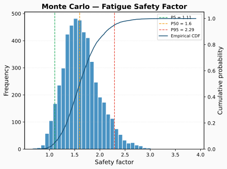
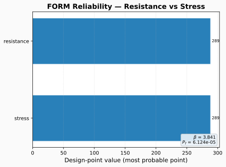

# Probabilistic & reliability

feaweld treats material scatter and geometric tolerance as random variables and
propagates them to a **safety factor against yield**. Because it uses a closed-form
structural response rather than re-running FEA per sample, a thousand-sample study
runs in a fraction of a second — so Monte Carlo, Sobol sensitivity, and FORM
reliability are all cheap enough to run routinely.

## The response model

`build_probabilistic_model()` (in `pipeline/workflow.py`) constructs the random
variables and a response function. The response is the safety factor

$$\text{SF} = \frac{\sigma_y}{\sigma}, \qquad
\sigma = \sigma_{nom}\cdot k_m \cdot \text{SCF}_{toe}$$

built from:

- **Nominal stress** — membrane + bending from the case loads,
  $\sigma_{nom} = |F|/(w t) + 6|M|/(w t^2)$.
- **Axial misalignment** magnifies bending through $k_m = 1 + 3e/t$, with $e$ the
  sampled `misalignment`.
- **Weld-toe SCF** — a parametric stress concentration from the sampled toe radius
  and angle (`notch_stress_scf_parametric`), applied only when those variables are
  in play.

The yield strength $\sigma_y$ is itself a random variable when material scatter is
enabled.

## `ProbabilisticConfig` reference

```yaml
probabilistic:
  enabled: true
  n_samples: 1000               # Monte Carlo sample count
  method: lhs                   # lhs (Latin Hypercube) | random
  include_material_scatter: true
  include_geometric_tolerance: true
  seed: 42                      # int for reproducibility, or omit for random
  sobol: false                  # also compute Sobol indices during the MC run
  sobol_n_base: 256             # base sample size; evaluations = n_base*(2k+2)
```

The enabled scatter groups determine the random variables:

| Group | Variables produced |
|-------|--------------------|
| `include_material_scatter` | `yield_strength`, `uts`, `elastic_modulus`, `fatigue_life_scatter` |
| `include_geometric_tolerance` | `weld_toe_angle`, `weld_toe_radius`, `misalignment`, and `weld_leg_size` (fillet joints only) |

At least one group must be enabled, or the model raises a `ValueError`.

## Monte Carlo

With `probabilistic.enabled: true`, `run_analysis()` runs the Monte Carlo pass
automatically and attaches the result to `WorkflowResult.probabilistic_results`.
You can also run it directly on a case file:

```bash
feaweld reliability mc case.yaml -n 5000 --seed 42 --sobol
```

Sample output:

```
Monte Carlo (lhs, n=5000) on: fillet_t_joint_example

Response: safety_factor
  mean = 2.13
  std  = 0.31
  cov  = 0.146
  percentiles:
    P5   = 1.67
    P50  = 2.11
    P95  = 2.68
  converged: True (n_effective=4821)
```

Options: `-n/--samples` overrides the sample count, `--seed` sets the RNG,
`--sobol` adds sensitivity indices, and `--save-samples out.npz` writes the raw
`samples` / `results` arrays for your own plotting.



## Sobol sensitivity

Sobol indices apportion the response variance to each input variable, using a
Saltelli sampling scheme (`n_base*(2k+2)` model evaluations for `k` variables):

```bash
feaweld reliability sobol case.yaml --n-base 512 --seed 42
```

```
Sobol (Saltelli) analysis on: fillet_t_joint_example (7168 evaluations, 6 variables)

  variable                first-order    total
          weld_toe_radius       0.4123    0.4501
             misalignment       0.2911    0.3202
           weld_toe_angle       0.1502    0.1740
            yield_strength       0.0987    0.1055
```

- **First-order** ($S_i$) — the fraction of output variance explained by that
  variable alone.
- **Total** ($S_{T_i}$) — including all interactions; the gap between total and
  first-order measures how much a variable acts through interactions.


## FORM reliability

The First-Order Reliability Method finds the most-probable failure point and
returns the reliability index $\beta$, with failure defined as safety factor below
1:

```bash
feaweld reliability form case.yaml
```

```
FORM (HL-RF) reliability analysis on: fillet_t_joint_example

  beta = 3.24
  P_f  = 5.98e-04
  design point:
          weld_toe_radius = 0.62
             misalignment = 1.41
            yield_strength = 251.3
```

$\beta$ is the distance from the mean to the failure surface in standard-normal
space; the probability of failure is $P_f = \Phi(-\beta)$. The **design point** is
the most-probable combination of inputs at failure — the values to scrutinize in
design review.



## Report figures appear automatically

When a workflow result carries probabilistic output, the report figure registry
adds the matching figures with no extra configuration:

| Figure | Appears when |
|--------|--------------|
| Monte Carlo response distribution | `probabilistic_results["results"]` is an array (any MC run) |
| Sobol sensitivity indices | `sobol: true` populated `probabilistic_results["sobol"]` |
| FORM reliability (design point) | a FORM result with a `beta` is attached to the workflow result |

See the [Visualization guide](visualization.md#report-figures-are-automatic) for
the full registry.

## Python API

```python
from feaweld.pipeline.workflow import load_case, run_probabilistic_case, build_probabilistic_model
from feaweld.probabilistic.sensitivity import reliability_index_form

case = load_case("case.yaml")
mc = run_probabilistic_case(case)          # dict: mean, std, cov, percentiles, samples, ...

variables, response = build_probabilistic_model(case)
form = reliability_index_form(variables, lambda p: response(p) - 1.0)
print(form["beta"], form["probability_of_failure"])
```

The shipped example `examples/probabilistic_life.py` walks through a full
Monte Carlo + Sobol + FORM assessment.

## See also

- [Loads & boundary conditions](loads_and_bcs.md) — the nominal-stress model the
  response is built on.
- [ML fatigue prediction](ml.md) — a data-driven alternative to the closed-form
  response.
