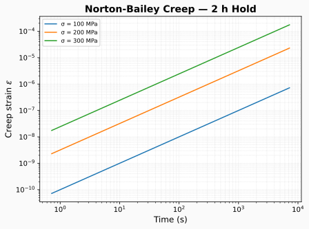

# Post-weld heat treatment (PWHT)

Post-weld heat treatment relaxes weld residual stress by holding the assembly at an
elevated temperature. feaweld models this as a **creep relaxation** of an already
solved stress field, using the same Norton-Bailey law as the creep solver but
driven by a heat-up / hold / cool-down schedule.

## The physics

At the hold temperature the material creeps, and creep strain relaxes the elastic
stress. feaweld uses a time-hardening Norton-Bailey model for the creep rate:

$$\dot{\varepsilon}_{cr} = A\,\sigma^{n}\,t^{m}$$

with $A$, $n$, $m$ the material's `creep_A`, `creep_n`, `creep_m` parameters. Over
each time step the creep strain increment eats into the elastic strain, lowering
the stress. The schedule's temperature profile (heat-up ramp, isothermal hold,
cool-down ramp) sets the temperature at each step; steps below 100 °C or with
`creep_A <= 0` contribute no relaxation.



## Configuration

PWHT is enabled inside the `thermal:` block, independently of whether a welding
thermal simulation ran:

```yaml
thermal:
  pwht_enabled: true
  pwht_temperature: 620.0    # C   — holding temperature
  pwht_time_hours: 2.0       # h   — holding time
  pwht_heating_rate: 55.0    # C/h — ramp up to the hold
  pwht_cooling_rate: 55.0    # C/h — ramp down after the hold
```

| Field | Unit | Default | Meaning |
|-------|------|---------|---------|
| `pwht_enabled` | bool | `false` | Run the PWHT relaxation step |
| `pwht_temperature` | C | `620.0` | Isothermal hold temperature |
| `pwht_time_hours` | h | `2.0` | Hold duration |
| `pwht_heating_rate` | C/h | `55.0` | Heat-up ramp rate |
| `pwht_cooling_rate` | C/h | `55.0` | Cool-down ramp rate |

These feed a `PWHTSchedule`, whose `temperature_profile()` generates the time /
temperature arrays that the relaxation integrates over.

## Where it runs in the pipeline

PWHT is applied to the solved stress field, after the solve and before
post-processing:

1. The solver produces a stress field (residual stress from a welding pass, or a
   load-induced field).
2. If `thermal.pwht_enabled` and a stress field exists, `simulate_pwht()` relaxes
   it using the schedule and the material's creep parameters.
3. The relaxed field flows into post-processing and the report.

## As-welded peak is preserved

Before relaxing, the workflow records the as-welded peak von Mises stress into the
result metadata so you can quote both states:

- `metadata["as_welded_max_von_mises"]` — peak von Mises **before** PWHT.
- `metadata["pwht_schedule"]` — the holding temperature, hold time, and ramp rates
  actually applied.
- `metadata["pwht_creep_strain"]` — the accumulated creep strain field.

## Full worked example

A residual-stress case (thermomechanical welding pass) followed by PWHT:

```yaml
name: fillet_t_pwht
material:
  base_metal: A387_Gr91     # a creep-capable material (defines creep_A/n/m)
geometry:
  joint_type: fillet_t
  base_thickness: 20.0
solver:
  solver_type: thermomechanical
  time_end: 60.0
  n_time_steps: 60
thermal:
  enabled: true             # welding pass -> residual stress field
  voltage: 28.0
  current: 300.0
  travel_speed: 4.0
  pwht_enabled: true        # then relax it
  pwht_temperature: 620.0
  pwht_time_hours: 2.0
  pwht_heating_rate: 55.0
  pwht_cooling_rate: 55.0
postprocess:
  stress_methods: [linearization]
  fatigue_assessment: false
```

## Applying PWHT without a welding simulation

You can enable PWHT on a purely mechanical case, but then it relaxes a
**load-induced** stress field rather than a residual-stress field, which is usually
not what PWHT is meant to represent:

!!! warning "PWHT without `thermal.enabled`"
    If `pwht_enabled: true` but `thermal.enabled: false`, `run_analysis()` records
    a warning: *"PWHT relaxation applied to a load-stress field, not a
    residual-stress field."* The relaxation still runs, but interpret the result
    accordingly.

!!! note "No creep parameters means no relaxation"
    If the material has `creep_A <= 0`, `simulate_pwht()` leaves the stress field
    unchanged. Choose a material grade with creep data (or set the parameters on a
    custom material) for a meaningful relaxation.

## Comparing as-welded vs. PWHT

The shipped example `examples/pwht_comparison.py` runs a case with and without PWHT
and reports the stress reduction — a good template for quantifying the benefit of a
given schedule.

## See also

- [Solvers](solvers.md) — the `creep` solver type and the shared Norton-Bailey
  relaxation.
- [Loads & boundary conditions](loads_and_bcs.md) — how the welding thermal
  boundary and heat input are built.
