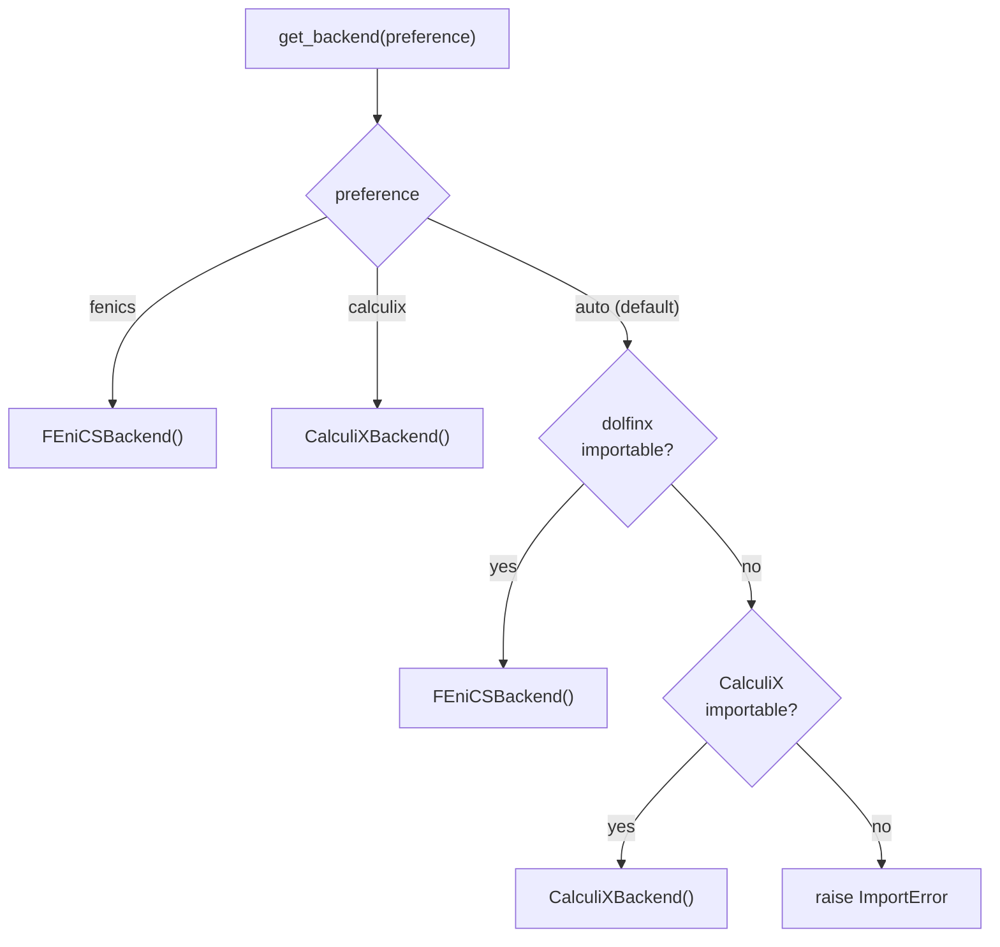

# Solvers

feaweld separates *what* you solve (the `SolverType`) from *which* engine solves
it (the backend). The workflow dispatches on `solver.solver_type`, and the backend
is resolved once by `get_backend()`. Because every backend returns the same
`FEAResults`, post-processing never depends on which engine ran.

## Choosing a solver type

`SolverConfig.solver_type` takes one of six values:

| `solver_type` | Physics | When to use |
|---------------|---------|-------------|
| `linear_elastic` | Static linear elasticity | Default. Fatigue assessment, hot-spot / structural stress, most weld work. |
| `elastoplastic` | J2 plasticity (post-correction) | Bounding the local plastic response at a notch. See the caveat below. |
| `thermal_steady` | Steady-state conduction | Equilibrium temperature field under a fixed thermal boundary. |
| `thermal_transient` | Transient conduction + moving source | Weld thermal cycle / cooling history with a Goldak source. |
| `thermomechanical` | Sequential thermal → mechanical | Residual stress from a welding pass (thermal drives mechanical). |
| `creep` | Norton-Bailey relaxation | Long-hold stress relaxation at temperature. |

Two convenience promotions happen automatically in `run_analysis()`:

- A case with `thermal.enabled: true` and the default `linear_elastic` type is
  promoted to `thermomechanical`.
- A `linear_elastic` case with `solver.nonlinear: true` is promoted to
  `elastoplastic`.

## `SolverConfig` field reference

```yaml
solver:
  solver_type: linear_elastic   # one of the six values above
  backend: auto                 # auto | fenics | calculix
  nonlinear: false              # true promotes linear_elastic -> elastoplastic
  max_iterations: 50            # elastoplastic increment cap (see caveat)
  tolerance: 1.0e-8             # elastoplastic convergence-flag tolerance
  time_end: 100.0               # s — end time for transient / coupled analyses
  n_time_steps: 50              # number of steps over [0, time_end]
  creep_temperature: 550.0      # C — hold temperature for solver_type: creep
  creep_time_hours: 10.0        # h — hold duration for solver_type: creep
```

`time_end` and `n_time_steps` build the `time_steps` array
(`np.linspace(0, time_end, n_time_steps)`) used by the transient, thermomechanical
solves. `creep_temperature` and `creep_time_hours` are only read by
`solver_type: creep`.

## Backend selection and auto-detection

`get_backend(preference)` accepts `"auto"`, `"fenics"`, or `"calculix"`. In
`"auto"` mode it prefers FEniCSx (better suited to nonlinear and coupled physics)
and falls back to CalculiX:



!!! note "Explicit preference does not fall back"
    `backend: fenics` or `backend: calculix` instantiates that backend directly;
    if its import fails the error propagates. Only `auto` tries the second engine.

Every backend implements the four abstract methods of `SolverBackend`, and this
is the contract post-processing relies on:

| Method | Used by `solver_type` |
|--------|-----------------------|
| `solve_static(mesh, material, load_case, temperature=20.0)` | `linear_elastic`, and as the elastic predictor for `elastoplastic` / `creep` |
| `solve_thermal_steady(mesh, material, load_case)` | `thermal_steady` |
| `solve_thermal_transient(mesh, material, load_case, time_steps, heat_source=None)` | `thermal_transient`, `thermomechanical` |
| `solve_coupled(mesh, material, mechanical_lc, thermal_lc, time_steps)` | available for direct coupled solves |

The `elastoplastic`, `thermomechanical`, `creep`, and PWHT paths are built *on top
of* these four methods in dedicated modules (`solver/mechanical.py`,
`solver/thermomechanical.py`, `solver/creep.py`), so they work with either backend.

## Elastoplastic: an honest caveat

!!! warning "`elastoplastic` is a stress post-correction, not a nonlinear FE solve"
    `solve_elastoplastic()` runs a single linear-elastic solve and then applies the
    J2 radial-return mapping point-by-point, ramping the total strain over load
    increments and capping stress at the yield surface with linear isotropic
    hardening. **Global equilibrium is not re-established — there is no stress
    redistribution.** This bounds the local plastic response at a notch, but for
    large-scale yielding you need a natively nonlinear solve (e.g. CalculiX
    `*PLASTIC`). The number of increments is capped at 10 regardless of
    `max_iterations`, and `tolerance` only sets the reported `converged` flag. The
    result's `metadata["plasticity"]` records the model as
    `j2_radial_return_postcorrection`, the yielded-point count, and the maximum
    equivalent plastic strain.

## Creep and relaxation

`solver_type: creep` runs a static solve, then relaxes the stress field with a
Norton-Bailey time-hardening law:

$$\dot{\varepsilon}_{cr} = A\,\sigma^{n}\,t^{m}$$

where $A$, $n$, $m$ are the material's `creep_A`, `creep_n`, `creep_m` parameters.

!!! note "Creep is gated on material data and temperature"
    Each time step is skipped if `creep_A <= 0` **or** the temperature is below
    100 °C — so a material without creep parameters makes the relaxation a no-op
    (and `run_analysis()` records a warning). The per-step creep strain increment
    is clamped to 1 % for stability.

PWHT relaxation reuses the same integration over a heat-up / hold / cool-down
schedule; it is documented in the [PWHT guide](pwht.md).

## Worked examples

### Linear elastic (default)

```yaml
solver:
  solver_type: linear_elastic
  backend: auto
```

### Elastoplastic bounding

```yaml
solver:
  solver_type: elastoplastic
  max_iterations: 10       # increment count (capped at 10)
  tolerance: 1.0e-6
```

### Transient welding thermal history

```yaml
solver:
  solver_type: thermal_transient
  time_end: 40.0
  n_time_steps: 80
thermal:
  enabled: true
  voltage: 25.0
  current: 250.0
  travel_speed: 5.0
  efficiency: 0.8
  ambient_temperature: 20.0
  film_coefficient: 15.0
```

### Sequentially-coupled residual stress

```yaml
solver:
  solver_type: thermomechanical
  time_end: 60.0
  n_time_steps: 60
thermal:
  enabled: true
  voltage: 28.0
  current: 300.0
  travel_speed: 4.0
```

The thermal pass drives per-step temperatures into the mechanical solve; the final
step's stress is reported. See [Loads & boundary conditions](loads_and_bcs.md) for
how the mechanical load and thermal boundary are built.

### Creep relaxation

```yaml
solver:
  solver_type: creep
  creep_temperature: 550.0
  creep_time_hours: 100.0
material:
  base_metal: A387_Gr91   # must define creep_A / creep_n / creep_m
```

## See also

- [Loads & boundary conditions](loads_and_bcs.md) — how each `load` field becomes
  a nodal force, pressure, or temperature BC.
- [PWHT](pwht.md) — post-weld heat treatment stress relaxation.
- [Convergence & submodeling](convergence.md) — mesh-sensitivity and the
  singularity check that runs after linear/elastoplastic solves.
