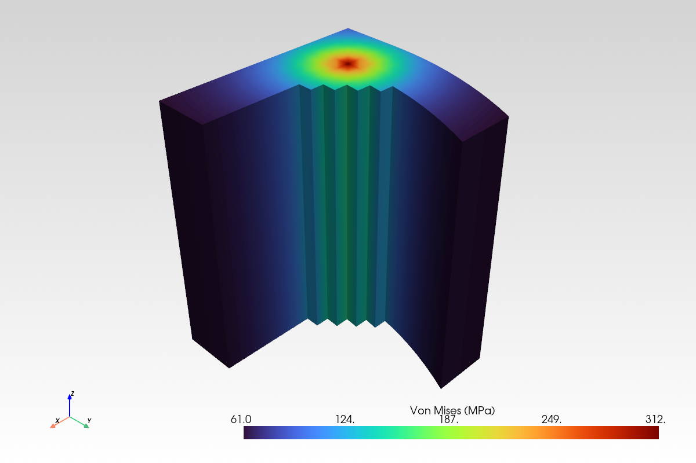

# Visualization Guide

This guide covers all visualization capabilities in feaweld, with examples and usage patterns.

## Installation

All visualization functions require optional dependencies:

```bash
pip install feaweld[viz]   # matplotlib + pyvista + vtk
```

Functions are safe to import even without these packages — they raise a helpful error only when called.

## 2D Plots (Matplotlib)

All 2D functions live in `feaweld.visualization.plots_2d` and follow a consistent signature:

```python
def plot_*(result, title="...", show=True, ax=None) -> Figure
```

- `show=False` for non-interactive/headless use
- Pass `ax` to embed in an existing subplot (e.g., dashboards)

### Through-Thickness Linearization

Decomposes stress into membrane, bending, and peak per ASME VIII Div 2.

```python
from feaweld.visualization.plots_2d import plot_through_thickness
fig = plot_through_thickness(linearization_result, show=False)
```


Features: Reference lines at membrane/MB scalar values, decomposition equation box, inner/outer surface labels.

### Hot-Spot Stress Extrapolation

Extrapolates structural stress to the weld toe from reference points per IIW.

```python
from feaweld.visualization.plots_2d import plot_hotspot_extrapolation
fig = plot_hotspot_extrapolation(hotspot_result, show=False)
```


Features: Schematic weld toe profile, horizontal hot-spot reference line, IIW type annotation (Type A/B).

### Dong Structural Stress Decomposition

Stacked bars for membrane/bending with bending ratio overlay.

```python
from feaweld.visualization.plots_2d import plot_dong_decomposition
fig = plot_dong_decomposition(dong_result, show=False)
```


Features: Dual-axis (stress + bending ratio), formula box with structural stress equation.

### S-N Curve

Log-log fatigue curve with operating point and regime bands.

```python
from feaweld.visualization.plots_2d import plot_sn_curve
fig = plot_sn_curve(curve, stress_range=120.0, show=False)
```


Features: LCF/HCF/endurance regime bands, CAFL vertical line, knee point markers, standard name badge.

### Stress Along Path

Line plot of stress vs. distance with reference lines.

```python
from feaweld.visualization.plots_2d import plot_stress_along_path
fig = plot_stress_along_path(distances, stresses, labels={"Toe": 4.0}, show=False)
```

Features: Min/mean/max horizontal reference lines with value labels, optional labeled points.

### Weld Group Geometry

Draws weld group outlines for the Blodgett method with dimensions and centroid.

```python
from feaweld.visualization.plots_2d import plot_weld_group_geometry
fig = plot_weld_group_geometry(WeldGroupShape.BOX, d=100, b=60, props=props, show=False)
```


Supports 9 shapes: LINE, PARALLEL, C_SHAPE, L_SHAPE, BOX, CIRCULAR, I_SHAPE, T_SHAPE, U_SHAPE. Features: Dimension arrows, centroid with coordinates, section properties box.

### ASME VIII Stress Check

Horizontal bars comparing Pm, Pm+Pb, PL+Pb+Q against allowables.

```python
from feaweld.visualization.plots_2d import plot_asme_check
fig = plot_asme_check(categorization, S_m=160, S_y=275, show=False)
```


Features: Gradient utilization coloring (green-yellow-red), PASS/FAIL badges, limit equations next to each bar.

### Cross-Section Stress Contour

2D contour at a y-level slice through the mesh.

```python
from feaweld.visualization.plots_2d import plot_cross_section_stress
fig = plot_cross_section_stress(mesh, stress, y_level=5.0, show=False)
```

Features: Filled contour with labeled contour line overlay, uses perceptually uniform `turbo` colormap.

### Full Section Stress Contour

`plot_stress_contour_2d` draws a filled contour over an entire planar (2-D)
section — the quasi-2D meshes feaweld generates at `length: 1.0`. It accepts a
`FEMesh` and `StressField` directly:

```python
from feaweld.visualization.plots_2d import plot_stress_contour_2d
fig = plot_stress_contour_2d(mesh, stress, component="von_mises", show=False)
```

`component` accepts the same names as the 3-D functions (`von_mises`, `tresca`,
`xx`, `yy`, `zz`, `xy`, `yz`, `xz`). Triangular meshes are drawn with
`tricontourf`; other element types fall back to a scatter. This is the Matplotlib
counterpart to `plot_stress_field` and is what the report's
`stress_contour_2d` figure uses for planar sections.

## 3D Plots (PyVista)

All 3D functions return a `pyvista.Plotter` and share:

```python
def plot_*(mesh, stress, component="von_mises", show=True, **kwargs) -> Plotter
```

!!! tip "3-D functions accept a raw PyVista grid too"
    Every 3-D function resolves its input through `resolve_grid(mesh, stress)`,
    which passes an already-built PyVista grid straight through and only converts
    an `FEMesh` when needed. So you can hand `plot_stress_field`, `plot_deformed`,
    or `plot_temperature_field` a grid you loaded with `pyvista.read(...)` — this is
    exactly how the `feaweld visualize` CLI renders `.vtu` files. Use
    `resolve_component(name)` to map a friendly component name to the grid's array
    key.

### Stress Field

```python
from feaweld.visualization.stress_plots import plot_stress_field
plotter = plot_stress_field(mesh, stress, component="von_mises", show=False)
```

13 selectable components: `von_mises`, `tresca`, `xx`, `yy`, `zz`, `xy`, `yz`, `xz`, `principal_1`, `principal_2`, `principal_3`. Mesh edges shown automatically for meshes under 50k elements.


### Deformed Shape

```python
from feaweld.visualization.stress_plots import plot_deformed
plotter = plot_deformed(mesh, displacement, scale=10.0, stress=stress, show=False)
```



### Temperature Field

```python
from feaweld.visualization.stress_plots import plot_temperature_field
plotter = plot_temperature_field(mesh, temperature, show=False)
```

Uses `inferno` colormap (dark-to-bright, heat-intuitive).

### Enhanced 3D (feaweld.visualization.enhanced_3d)

| Function | Purpose |
|----------|---------|
| `plot_stress_with_clipping()` | Stress on a clipped cross-section |
| `plot_stress_threshold()` | Highlight regions above/below a threshold |
| `plot_iso_surface()` | Iso-surfaces of constant stress |
| `plot_force_vectors()` | Arrow glyphs for force/displacement vectors |
| `plot_weld_region_highlight()` | Highlight weld element group |
| `plot_sed_control_volume()` | SED averaging sphere visualization |
| `plot_mesh_preview()` | Mesh-only view with element/node set highlighting |
| `plot_annotated_stress()` | Stress contour with auto-detected critical points |

### Fatigue Maps (feaweld.visualization.fatigue_maps)

| Function | Purpose | Colormap |
|----------|---------|----------|
| `plot_fatigue_life()` | Fatigue life contour (log10 or linear) | `RdYlBu` (red=short, blue=long) |
| `plot_damage()` | Miner's cumulative damage | `YlOrRd` (yellow=safe, red=critical) |

Both include text annotations: life plot shows color interpretation guide; damage plot shows failure warning when D >= 1.0.

## Thermal Plots (feaweld.visualization.thermal_plots)

```python
from feaweld.visualization.thermal_plots import plot_temperature_history, render_goldak_source

# Matplotlib: peak-node temperature vs. time from a transient result
fig = plot_temperature_history(times, temperatures, node_label="weld toe", show=False)

# PyVista: 3-D iso-surface of a Goldak double-ellipsoid heat source
plotter = render_goldak_source(source, t=2.0, iso_fraction=0.1, show=False)
```

`plot_temperature_history` accepts a 1-D temperature history or a 2-D
`(n_steps, n_nodes)` array (it auto-selects the hottest node). `render_goldak_source`
backs the `feaweld goldak` CLI command.

## Probabilistic Plots (feaweld.visualization.probabilistic_plots)

Three functions visualize the outputs of the [probabilistic
analysis](probabilistic.md):

| Function | Input | Purpose |
|----------|-------|---------|
| `plot_sobol_indices(indices, kind="bar")` | `{"first_order": {...}, "total": {...}}` | First-order vs. total Sobol indices (`kind="bar"` or `"tornado"`) |
| `plot_mc_histogram(results, percentiles=..., bins=40)` | array of MC responses | Response histogram with optional CDF overlay |
| `plot_form_reliability(form_result)` | `{"beta", "probability_of_failure", "design_point"}` | FORM reliability index and design point |

```python
from feaweld.visualization.probabilistic_plots import plot_sobol_indices, plot_mc_histogram

fig = plot_sobol_indices(mc["sobol"], kind="tornado", show=False)
fig = plot_mc_histogram(mc["results"], percentiles=[5, 50, 95], show=False)
```

## Material & Multiscale Plots (feaweld.visualization.material_plots)

| Function | Purpose |
|----------|---------|
| `plot_cct_diagram(diagram, grade=..., cooling_rate=...)` | CCT phase fractions vs. cooling rate |
| `plot_residual_stress_profile(profile, yield_strength=...)` | Through-thickness residual stress |
| `plot_creep_curve(A, n, m, stress_levels=..., t_end=...)` | Norton-Bailey creep strain over time |
| `plot_hall_petch(params, grain_size_range=(1, 100), markers=...)` | Hall-Petch yield vs. grain size |

```python
from feaweld.visualization.material_plots import plot_cct_diagram, plot_hall_petch
fig = plot_cct_diagram("A36", cooling_rate=30.0, show=False)
fig = plot_hall_petch(HALL_PETCH_LOW_CARBON_STEEL, markers={"HAZ": 8.4}, show=False)
```

## Dashboards

Multi-panel composite views in `feaweld.visualization.dashboard`:

```python
from feaweld.visualization.dashboard import engineering_dashboard, fatigue_dashboard
fig = engineering_dashboard(workflow_result, show=False)   # 2x3 grid
fig = fatigue_dashboard(workflow_result, show=False)        # 2x2 grid
```

### Engineering Dashboard (2x3)

| Panel | Content |
|-------|---------|
| [1] Stress distribution | von Mises histogram with max/mean lines |
| [2] Linearization | Through-thickness profile or stress scatter |
| [3] S-N curve | With operating point from fatigue results |
| [4] Post-process method | Dong decomposition, hot-spot, or ASME check |
| [5] Weld geometry | Blodgett weld group or joint dimensions |
| [6] Summary text | Status, stresses, displacement, safety factor |

### Comparison Dashboard

```python
from feaweld.visualization.comparison import comparison_dashboard
fig = comparison_dashboard(study_results, show=False)
```

Auto-detects swept parameters and shows metric bars, sensitivity plot, stress envelope overlay, and summary.

## Annotations

The `feaweld.visualization.annotations` module provides critical point detection and severity-coded markers:

```python
from feaweld.visualization.annotations import find_critical_points, annotate_2d, annotate_3d

points = find_critical_points(mesh, stress, n_max=5, weld_line=weld_line)
annotate_2d(ax, points)       # for matplotlib
annotate_3d(plotter, points)  # for pyvista
```

Severity colors: green (#27ae60) = info, orange (#f39c12) = warning, red (#e74c3c) = critical.

## Theme Customization

The centralized theme module (`feaweld.visualization.theme`) provides:

```python
from feaweld.visualization.theme import get_cmap, apply_feaweld_style, configure_plotter

# Override a colormap for a specific plot
plotter.add_mesh(grid, cmap="coolwarm")  # pass cmap= to override default

# Available semantic colormaps
get_cmap("stress")        # "turbo"
get_cmap("temperature")   # "inferno"
get_cmap("fatigue_life")  # "RdYlBu"
get_cmap("damage")        # "YlOrRd"
get_cmap("diverging")     # "RdBu_r"
get_cmap("safety_factor") # "RdYlGn"
get_cmap("displacement")  # "viridis"
```

All 2D and 3D functions accept a `cmap` keyword to override the theme default.

## Report figures are automatic

You do not choose report figures — a **registry** decides which appear based on
what data is present in the `WorkflowResult`. `report_figures.FIGURE_SPECS` is an
ordered list of `FigureSpec`s, each with an `available(wf)` predicate and a
`build(wf)` function. `generate_report_figures(workflow_result)` walks the registry,
builds every figure whose data gate is satisfied, base64-encodes it, and returns a
`{key: {b64, caption, layout}}` dict for the report template:

```python
from feaweld.visualization.report_figures import generate_report_figures

figures = generate_report_figures(workflow_result)
```

Each figure is built in isolation, so a failing one is skipped rather than breaking
the report; `pyvista`-kind figures are skipped if PyVista is not installed. The
full registry, in order:

| Figure key | Caption | Appears when |
|------------|---------|--------------|
| `mesh_preview` | Finite Element Mesh | a mesh is present |
| `stress_contour_3d` | Von Mises Stress Contour | stress + mesh present (full width) |
| `deformed_shape` | Deformed Shape (scaled) | displacement + mesh present |
| `stress_contour_2d` | Von Mises Stress Contour (section) | stress on a planar (2-D) mesh |
| `stress_distribution` | Von Mises Stress Distribution | a stress field is present |
| `temperature_field` | Temperature Field | a temperature field + mesh present |
| `temperature_history` | Peak-Node Temperature History | a transient temperature history present |
| `sn_curve` | S-N Fatigue Curve | `postprocess.sn_curve` is set |
| `dong_decomposition` | Dong Structural Stress Decomposition | a `structural_dong` result present |
| `hotspot_extrapolation` | Hot-Spot Stress Extrapolation | a hot-spot result with points present |
| `through_thickness` | Through-Thickness Stress Linearization | a `linearization` result present |
| `asme_check` | ASME VIII Div 2 Stress Check | a `nominal` categorization present |
| `weld_group` | Weld Group Geometry | a `blodgett` result present |
| `rainflow` | Rainflow Cycle Histogram | rainflow cycles present |
| `fatigue_life_map` | Fatigue Life Map | stress + mesh and `fatigue_assessment` on |
| `damage_map` | Miner Damage Map | stress + mesh and rainflow cycles present |
| `mc_histogram` | Monte Carlo Response Distribution | probabilistic results carry a sample array |
| `sobol_indices` | Sobol Sensitivity Indices | a Sobol result present |
| `form_reliability` | FORM Reliability (design point) | a FORM result with a `beta` present |
| `engineering_dashboard` | Engineering Assessment Dashboard | always (full width) |

The template arranges `grid`-layout figures in a 2-column grid and `full`-layout
figures (the 3-D stress contour and the engineering dashboard) at full width. So
enabling more `stress_methods`, turning on `fatigue_assessment`, or setting
`probabilistic.enabled` automatically enriches the report — no figure configuration
needed.

## Command-line rendering

The `feaweld visualize` command renders a saved `.vtk`/`.vtu` result through this
same library, so the on-screen colors and annotations match the report. It exposes
the view modes as flags — `--iso`, `--threshold` (with `--below`), `--clip` (with
`--clip-origin`), plus `--deformed` and `--annotate` on the plain contour, and
`--cmap` for a semantic or matplotlib colormap. See the
[CLI reference](../reference/cli.md#visualize) for the full option list.

## Export

```python
from feaweld.visualization.export import export_vtk, export_png, export_gltf

export_vtk(fea_results, "output.vtu")     # ParaView-compatible
export_png(plotter, "screenshot.png")      # raster screenshot
export_gltf(plotter, "model.gltf")        # web-ready 3D
```

## Regenerating Documentation Images

All diagrams and example outputs in this guide are generated programmatically:

```bash
python scripts/generate_docs_images.py
```

This produces SVG files in `docs/images/` from the feaweld API with synthetic data.
