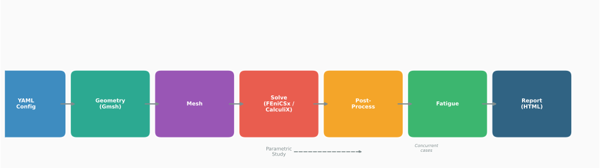

# feaweld

Finite element analysis toolkit for weld joint stress, fatigue life, and structural integrity assessment.

## Overview

feaweld is a Python package for engineers who need to evaluate welded connections in metal structures. It covers the full analysis workflow from parametric joint geometry and mesh generation through FEA solving, post-processing, fatigue assessment, and visualization — producing HTML reports with embedded engineering figures.

The package implements methods from major welding and pressure vessel codes (ASME VIII, IIW, DNV-RP-C203, AWS D1.1, BS 7910, API 579) and ships with a reference database of 49 materials, 80 IIW weld detail categories, S-N curves for three standards, CCT diagrams for 20 steel grades, and parametric SCF data for 10 weld geometries.

Analysis cases are defined in YAML and can be run individually or as concurrent parametric studies with automated comparison reporting.

Beyond conventional deterministic methods, feaweld includes:

- **Probabilistic fatigue** — Monte Carlo with Latin Hypercube Sampling, Sobol sensitivity, FORM reliability.
- **Machine learning** — Random Forest / XGBoost fatigue predictors with transfer learning.
- **Multi-scale modeling** — Hall-Petch, dislocation density, CCT interpolation.
- **Digital twin** — MQTT/OPC-UA sensor ingestion with Bayesian model updating.

## Where to start

-   **[Installation](installation.md)**

    Set up a virtual environment and install the right optional extras.

-   **[Quickstart](quickstart.md)**

    Run your first analysis from the CLI in under a minute.

-   **[Tutorials](tutorials/01_yaml_analysis.md)**

    Step-by-step walkthroughs of YAML cases, parametric studies, and custom post-processors.

-   **[API reference](api/core.md)**

    Auto-generated reference for all 13 sub-packages.

## Standards coverage

| Standard | Implementation |
|----------|----------------|
| ASME VIII Division 2 | Stress categorization, allowable checks, design fatigue curves |
| IIW-2006-09 / IIW-2008 | 14 FAT classes, 80 weld detail categories, hot-spot stress, effective notch stress |
| DNV-RP-C203 | 17 S-N curve categories (in-air and seawater) |
| ASME 2007 Annex 5-C | Battelle/Dong mesh-insensitive structural stress |
| ASTM E1049 | Rainflow cycle counting |
| BS 7910 / API 579 | Residual stress through-thickness profiles (Level 1 and 2) |
| AWS D1.1 | Weld joint efficiency factors, filler metal matching |
| Lazzarin (2001) | Strain energy density method with control volume |

## Project metrics

- 64 source modules, ~18,000 lines of code
- 332+ passing tests across 18 test modules
- 49 material databases with temperature-dependent properties
- 6 JSON reference datasets
- 5 joint geometry types, 2 solver backends, 8 post-processing methods
