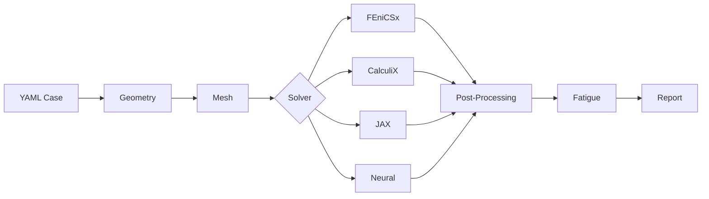

# feaweld

**Finite Element Analysis for weld joint stress, fatigue, and structural integrity.**

feaweld is a Python framework that provides a complete analysis pipeline for welded structures -- from geometry and meshing through finite element solving to fatigue life assessment. It is designed for engineers and researchers who need reliable, standards-compliant weld fatigue evaluation with minimal boilerplate.

## Key Features



- **Multi-solver backends** -- pluggable FEA solvers including FEniCSx, CalculiX, a differentiable JAX backend, and a neural surrogate backend. The `auto` selector tries each in order so analyses run on whatever is installed.
- **8 stress extraction methods** -- hot-spot (structural stress), Dong's equilibrium method, through-thickness linearization, nominal stress, Blodgett weld-group hand calculations, strain energy density (SED), notch stress, and multi-axial critical-plane criteria (Findley, Dang Van, Sines, Crossland, Fatemi-Socie, McDiarmid).
- **Standards-based fatigue assessment** -- S-N curve libraries from IIW, DNV, and ASME with rainflow cycle counting (ASTM E1049), Palmgren-Miner cumulative damage, and 80+ IIW weld detail FAT classifications.
- **Probabilistic analysis** -- Monte Carlo engine with Latin Hypercube Sampling, lognormal S-N scatter propagation, and ISO 5817 stochastic defect population modeling.
- **DAG pipeline** -- concurrent stage execution with dependency tracking, [checkpoint/restart](orchestration.md#checkpoint--restart) for crash recovery, and [pipeline hooks](orchestration.md#pipeline-hooks) for custom observability.
- **Parametric studies** -- grid and one-at-a-time sweeps with concurrent execution, [distributed scaling](orchestration.md#distributed-execution) via Dask or Ray clusters, and a persistent [job queue](orchestration.md#job-queue).
- **Digital twin integration** -- MQTT and OPC-UA sensor ingestion, Ensemble Kalman Filter crack-length assimilation, Bayesian model updating (emcee), and a [daemon mode](deployment.md#systemd-service) for continuous monitoring.
- **Deployment ready** -- [Docker and docker-compose](deployment.md#docker-deployment) with MQTT broker, [structured logging](deployment.md#logging-configuration) (text, JSON, systemd journal), resource monitoring, and signal handling.

## Quick Install

```bash
pip install feaweld
```

For solver backends and optional modules, see the [Getting Started](getting-started.md) guide.

## Usage Example

```python
from feaweld.pipeline.workflow import load_case, run_analysis

# Load a YAML case definition
case = load_case("my_joint.yaml")

# Run the full pipeline: geometry -> mesh -> solve -> postprocess -> fatigue
result = run_analysis(case)

# Inspect results
if result.fea_results and result.fea_results.stress:
    import numpy as np
    print(f"Max von Mises: {np.max(result.fea_results.stress.von_mises):.1f} MPa")

if result.fatigue_results:
    for method, data in result.fatigue_results.items():
        if isinstance(data, dict) and "life" in data:
            print(f"{method}: N = {data['life']:.0f} cycles")
```

Or from the command line:

```bash
feaweld run my_joint.yaml -o results/
```

## What Next?

- [Getting Started](getting-started.md) -- installation options and your first analysis
- [Concepts](CONCEPTS.md) -- architecture diagrams, advanced methods, and visualizations
- [Orchestration](orchestration.md) -- DAG pipeline, hooks, checkpoint, distributed execution, job queue
- [Deployment](deployment.md) -- Docker, systemd, logging, environment variables
- [CLI Reference](cli-reference.md) -- every command and its options
- [API Reference](api/index.md) -- module-level Python API documentation
