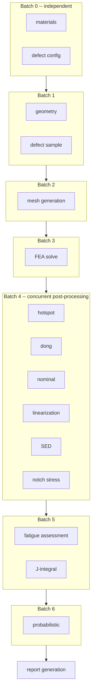
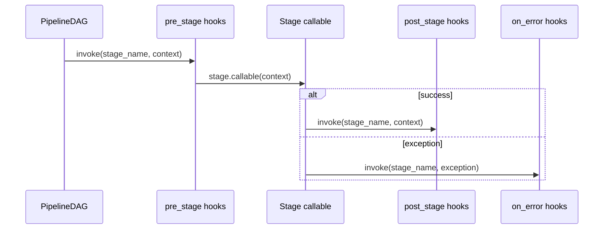
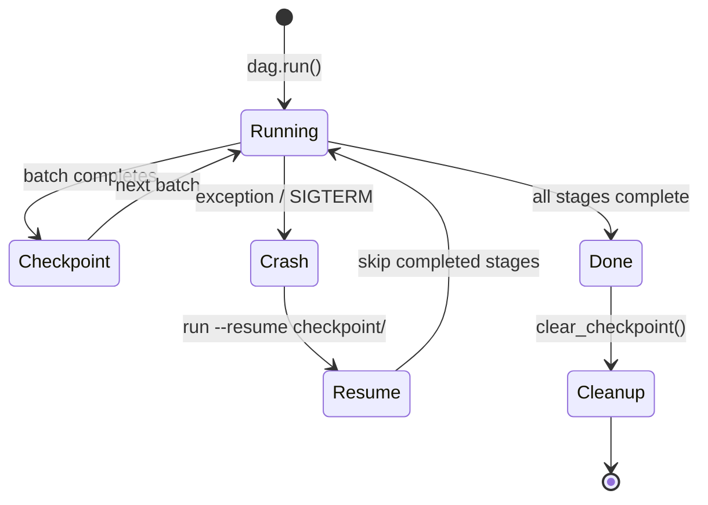
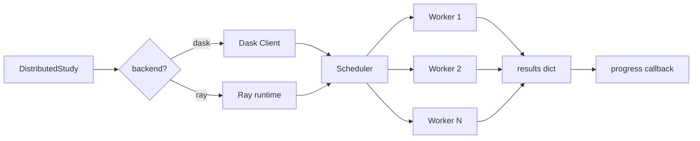
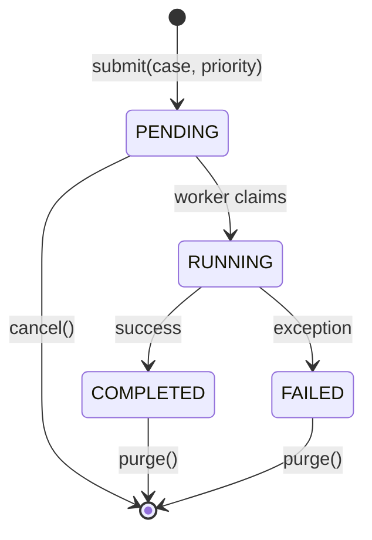
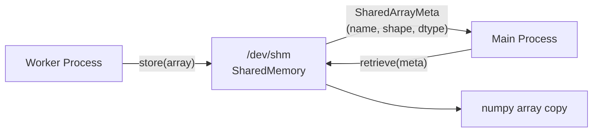

# Pipeline Orchestration

feaweld executes analysis cases through a DAG-based pipeline that supports concurrent stage execution, pre/post hooks, checkpoint/restart, distributed scaling, and a persistent job queue.

## DAG Pipeline

The pipeline is modeled as a directed acyclic graph of stages. Independent stages run concurrently in thread-pool batches while dependent stages wait for their inputs.



Each batch boundary is a checkpoint save point. If the process is interrupted (SIGTERM, crash), resuming from a checkpoint skips completed batches.

### Programmatic usage

```python
from feaweld.pipeline.dag import PipelineDAG, PipelineStage, PipelineContext

dag = PipelineDAG()
dag.add(PipelineStage("materials", load_materials))
dag.add(PipelineStage("geometry", build_geometry))
dag.add(PipelineStage("mesh", gen_mesh, depends_on=["geometry"]))
dag.add(PipelineStage("solve", run_solver, depends_on=["mesh", "materials"]))

ctx = PipelineContext(case=my_case)
dag.run(ctx, max_workers=4)
```

## Pipeline Hooks

Hooks let you inject custom logic before and after each stage, or on errors. The built-in `timing_hook()` and `memory_hook()` factories provide observability out of the box.



### Example: timing and memory hooks

```python
from feaweld.pipeline.hooks import PipelineHooks, timing_hook, memory_hook

hooks = timing_hook()
hooks.merge(memory_hook())

dag.run(ctx, hooks=hooks)

for stage, dt in hooks._timings.items():
    print(f"{stage}: {dt:.2f}s")
```

## Checkpoint / Restart

Long-running analyses can be checkpointed after each batch. If the process crashes or receives SIGTERM, the analysis resumes from the last completed batch.



The checkpoint directory contains:

| File | Content |
|------|---------|
| `meta.json` | Completed stage names, config SHA-256 hash, key-type map |
| `*.npz` | Large numpy arrays (mesh nodes, stress fields) |
| `*.pkl` | Non-array Python objects (configs, small results) |

### Usage

```python
from feaweld.pipeline.checkpoint import save_checkpoint, load_checkpoint

# Save after each batch (done automatically by the DAG executor)
save_checkpoint(ctx, Path("checkpoint/"), completed_stages=["materials", "geometry"])

# Resume from checkpoint
ctx, completed = load_checkpoint(Path("checkpoint/"))
dag.run(ctx, skip_stages=completed)
```

## Distributed Execution

Parametric studies can scale beyond a single machine using Dask or Ray clusters.



### Usage

```python
from feaweld.pipeline.distributed import DistributedStudy

ds = DistributedStudy(backend="dask")
results = ds.run(cases)  # dict[str, WorkflowResult]
```

Or via the CLI with the study backend option:

```bash
feaweld study run study.yaml -j 16 --backend dask
```

Install the distributed extra: `pip install feaweld[distributed]`

## Job Queue

The SQLite-backed job queue provides persistent, priority-based scheduling for analysis jobs. A worker loop claims and executes jobs atomically.



### CLI usage

```bash
# Submit jobs with priorities (lower = higher priority)
feaweld queue submit urgent_case.yaml -p 0
feaweld queue submit normal_case.yaml -p 5

# Check queue status
feaweld queue status

# Start a worker (blocks, processes jobs in priority order)
python -c "from feaweld.pipeline.queue import AnalysisJobQueue; AnalysisJobQueue().worker_loop()"
```

## Shared Memory IPC

When running parametric studies with `ProcessPoolExecutor`, large numpy arrays (stress fields, displacement vectors) are transferred between processes. The `SharedResultStore` uses `multiprocessing.shared_memory` for zero-copy transfer instead of pickle serialization.



This is automatic when shared memory is available and falls back to normal pickling on platforms that don't support it.
