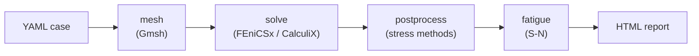

# Tutorial: YAML analysis case

This tutorial walks through defining a complete fatigue-assessment analysis case in YAML, running it from the CLI, and inspecting the HTML report that comes out.



See the [Architecture page](../architecture.md) for the full pipeline with every
decision branch.

## Prerequisites

- feaweld installed with visualization extras: `pip install -e ".[viz]"`
- At least one FEA backend: `pip install -e ".[fenics]"` **or** `pip install -e ".[calculix]"`

## The case file

Analysis cases are Pydantic models (see `feaweld.pipeline.workflow.AnalysisCase`) that serialize cleanly to YAML. Every field has a sensible default, so you only specify what differs from the defaults.

Save the following as `my_joint.yaml`:

```yaml
name: fillet_t_50kn
description: Fillet T-joint under 50 kN axial load, IIW hot-spot + Dong

material:
  base_metal: A36          # any key from `feaweld materials`
  weld_metal: E70XX
  haz: A36
  temperature: 20.0        # °C

geometry:
  joint_type: fillet_t     # fillet_t, butt, lap, corner, cruciform
  base_width: 200.0        # mm
  base_thickness: 20.0
  web_height: 100.0
  web_thickness: 10.0
  weld_leg_size: 8.0
  length: 1.0              # extrusion depth (1.0 = quasi-2D)

mesh:
  global_size: 2.0         # mm — background element size
  weld_toe_size: 0.2       # mm — refinement near the toe
  element_order: 2         # 1 = linear, 2 = quadratic
  element_type: tri        # tri | quad | tet | hex

solver:
  solver_type: linear_elastic  # linear_elastic, elastoplastic, thermal_steady, thermal_transient, thermomechanical, creep
  backend: auto                # auto | fenics | calculix

load:
  axial_force: 50000.0     # N
  bending_moment: 0.0      # N·mm
  shear_force: 0.0
  pressure: 0.0

postprocess:
  stress_methods:
    - hotspot_linear
    - structural_dong
    - blodgett
  sn_curve: IIW_FAT90
  fatigue_assessment: true

output_dir: results/fillet_t_50kn
```

A ready-made copy of a similar case ships with the package as `examples/fillet_t_joint.yaml`, so you can run `feaweld run examples/fillet_t_joint.yaml` without writing the file yourself.

### Field reference

| Section | Purpose | Where to look |
|---------|---------|---------------|
| `material` | Base / weld / HAZ metal and service temperature | `feaweld.core.materials` |
| `geometry` | Joint type + parametric dimensions | `feaweld.geometry.joints` |
| `mesh` | Gmsh sizing + element order | `feaweld.mesh.generator` |
| `solver` | Physics type + backend selection | `feaweld.solver.backend` |
| `load` | Mechanical + pressure + thermal delta | `feaweld.core.loads` |
| `postprocess` | Which stress methods to run + S-N curve | `feaweld.postprocess.*` |
| `thermal` | Welding heat input + PWHT (optional) | `feaweld.solver.thermal` |
| `probabilistic` | Monte Carlo / Sobol scatter (optional) | `feaweld.probabilistic.*` |

### Full field reference

Every field has a default, so specify only what differs. The complete set:

!!! note "Enum values are case-insensitive"
    Enum fields (`joint_type`, `solver_type`, `stress_methods`, …) accept any casing
    and the member name too — `fillet_t`, `FILLET_T`, and `SED` (for
    `strain_energy_density`) all validate. These docs use the canonical lowercase
    values, which is what `save_case` writes back.

`solver` — see the [Solvers guide](../guides/solvers.md):

| Field | Default | Meaning |
|-------|---------|---------|
| `solver_type` | `linear_elastic` | `linear_elastic`, `elastoplastic`, `thermal_steady`, `thermal_transient`, `thermomechanical`, `creep` |
| `backend` | `auto` | `auto`, `fenics`, `calculix` |
| `nonlinear` | `false` | Promotes `linear_elastic` → `elastoplastic` |
| `max_iterations` | `50` | Elastoplastic increment cap |
| `tolerance` | `1e-8` | Elastoplastic convergence flag |
| `time_end` | `100.0` | End time (s) for transient/coupled |
| `n_time_steps` | `50` | Steps over `[0, time_end]` |
| `creep_temperature` | `550.0` | Hold temperature (°C) for `creep` |
| `creep_time_hours` | `10.0` | Hold duration (h) for `creep` |

`load` — see [Loads & boundary conditions](../guides/loads_and_bcs.md):

| Field | Default | Meaning |
|-------|---------|---------|
| `axial_force` | `0.0` | N, along +y on the top set |
| `bending_moment` | `0.0` | N·mm, self-equilibrating couple |
| `shear_force` | `0.0` | N, along +x on the top set |
| `pressure` | `0.0` | MPa surface pressure |
| `temperature_delta` | `0.0` | °C uniform thermoelastic rise |

`postprocess` — see [Custom post-processing](03_custom_postprocessing.md) and [Convergence](../guides/convergence.md):

| Field | Default | Meaning |
|-------|---------|---------|
| `stress_methods` | `[hotspot_linear]` | Any of `nominal`, `hotspot_linear`, `hotspot_quadratic`, `structural_dong`, `notch_stress`, `strain_energy_density`, `linearization`, `blodgett` |
| `sn_curve` | `IIW_FAT90` | S-N curve name (`IIW_FAT*`, `DNV_*`, `ASME_*`) |
| `fatigue_assessment` | `true` | Run the fatigue stage |
| `singularity_check` | `true` | Coarse re-solve to flag mesh-driven peaks |
| `singularity_threshold` | `0.20` | Stress-rise fraction that flags a node |
| `singularity_coarsening` | `2.0` | Coarse-mesh size factor for the check |
| `notch_radius` | `1.0` | mm, IIW fictitious radius (effective notch) |
| `notch_nominal_stress` | `null` | MPa; `null` → computed from load/geometry |
| `sed_control_radius` | `0.28` | mm, SED control radius R₀ |
| `sed_w_ref` | `null` | MJ/m³ reference; `null` → skip SED life |
| `linearization_points` | `20` | Points through the linearization path |

`thermal` — see [Solvers](../guides/solvers.md) and [PWHT](../guides/pwht.md):

| Field | Default | Meaning |
|-------|---------|---------|
| `enabled` | `false` | Run a welding thermal pass |
| `voltage` / `current` | `25.0` / `250.0` | Arc voltage (V) / current (A) |
| `travel_speed` | `5.0` | mm/s |
| `efficiency` | `0.8` | Arc efficiency η |
| `ambient_temperature` | `20.0` | °C sink temperature |
| `film_coefficient` | `15.0` | W/(m²·K) convection to ambient |
| `pwht_enabled` | `false` | Run PWHT stress relaxation |
| `pwht_temperature` | `620.0` | °C hold temperature |
| `pwht_time_hours` | `2.0` | h hold time |
| `pwht_heating_rate` / `pwht_cooling_rate` | `55.0` / `55.0` | °C/h ramps |

`probabilistic` — see [Probabilistic & reliability](../guides/probabilistic.md):

| Field | Default | Meaning |
|-------|---------|---------|
| `enabled` | `false` | Run the Monte Carlo pass |
| `n_samples` | `1000` | Sample count |
| `method` | `lhs` | `lhs` or `random` |
| `include_material_scatter` | `true` | Material property random variables |
| `include_geometric_tolerance` | `true` | Geometric tolerance random variables |
| `seed` | `null` | RNG seed for reproducibility |
| `sobol` | `false` | Also compute Sobol indices |
| `sobol_n_base` | `256` | Sobol base sample size |

## Run it

```bash
feaweld run my_joint.yaml
```

Expected output:

```
Loading case: my_joint.yaml
Running analysis: fillet_t_50kn
  Joint: fillet_t
  Material: A36
  Solver: linear_elastic

Analysis completed successfully.

Max von Mises stress: 287.43 MPa

Fatigue results:
  hotspot_linear: N = 482133 cycles
  structural_dong: N = 515408 cycles

Report: results/fillet_t_50kn/report.html
```

## What's in the report

Open `results/fillet_t_50kn/report.html` in a browser. Each section is driven by one post-processing method:

- **Through-thickness linearization** — membrane / bending / peak decomposition per ASME VIII Div 2 (only if `LINEARIZATION` is in `stress_methods`).
- **Hot-spot extrapolation** — 0.4 t / 1.0 t reference stresses and σ<sub>hs</sub> (IIW).
- **Dong decomposition** — stacked membrane + bending + bending-ratio overlay.
- **S-N curve** — operating point plotted against the selected curve.
- **Blodgett summary** — weld-group geometry and LRFD / ASD capacities.

Figures are embedded as base64 PNGs — the report is a single self-contained HTML file you can email or archive.

## Generate interactive figures instead

Pass `--interactive` to replace the static PNGs with Plotly figures (hover to inspect exact stress values, toggle series, zoom in):

```bash
feaweld run my_joint.yaml --interactive
```

See [Visualization guide](../guides/visualization.md) for the full list of available plots.

## Programmatic equivalent

The same case, built from Python:

```python
from feaweld.pipeline.workflow import (
    AnalysisCase, MaterialConfig, GeometryConfig, MeshConfig,
    SolverConfig, LoadConfig, PostProcessConfig, run_analysis,
)
from feaweld.pipeline.report import generate_report
from feaweld.core.types import JointType, SolverType, StressMethod

case = AnalysisCase(
    name="fillet_t_50kn",
    material=MaterialConfig(base_metal="A36", weld_metal="E70XX"),
    geometry=GeometryConfig(joint_type=JointType.FILLET_T, weld_leg_size=8.0),
    solver=SolverConfig(solver_type=SolverType.LINEAR_ELASTIC),
    load=LoadConfig(axial_force=50000.0),
    postprocess=PostProcessConfig(
        stress_methods=[StressMethod.HOTSPOT_LINEAR, StressMethod.STRUCTURAL_DONG],
        sn_curve="IIW_FAT90",
    ),
)

result = run_analysis(case)
report_path = generate_report(result)
```

## Common extensions

- **Change the S-N curve** — set `postprocess.sn_curve` to any `IIW_FAT*`, `DNV_*`, or `ASME_*` name. Run `python -c "from feaweld.fatigue.sn_curves import list_curves; print(list_curves())"` for the full list.
- **Use a different joint** — swap `joint_type` and the matching `geometry` fields (e.g. `butt` uses `base_width` + `base_thickness` only; `lap` adds `web_height` as the overlap).
- **Add thermal welding simulation** — set `solver.solver_type: thermomechanical` and supply a `thermal:` section (see `ThermalConfig` in `workflow.py`).

## Next

- [Parametric study tutorial](02_parametric_study.md) — sweep weld-leg size or load and produce a comparison report.
- [Custom post-processing tutorial](03_custom_postprocessing.md) — add your own stress-extraction method.
